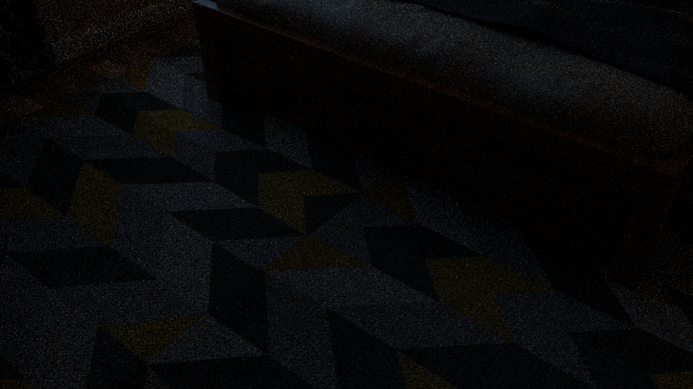

# Walkthrough Renderer — Bedroom Scene Results

**Date**: 2026-03-10
**Tool**: `genesis_tools.walkthrough_renderer` (GenesisTools commit `4001544`)
**Scene**: Benchmarks bedroom (`benchmarks/blender/bedroom.blend`, 27 MB)
**Environment**: Local WSL2, Intel Core + NVIDIA RTX 5090, CYCLES + CUDA

---

## 1. Input

| Field | Value |
|-------|-------|
| Scene file | `benchmarks/blender/bedroom.blend` |
| File size | 27 MB |
| Scene type | Indoor bedroom (small, bounded) |

**Call parameters used**:

```python
render_scene_walkthrough(
    blend_path  = "benchmarks/blender/bedroom.blend",
    output_dir  = "GenesisTools/outputs/bedroom_walkthrough",
    render_engine        = "CYCLES",
    num_waypoints        = 12,
    fps                  = 8,
    max_duration_seconds = 30.0,
    max_grid_cells_xy    = 80,
    max_grid_cells_z     = 40,
    grid_resolution      = 0.5,
    camera_height        = 1.7,
    blender_command      = "/home/kingy/blender/blender-wsl",
)
```

---

## 2. Voxel Grid & Path Planning

| Parameter | Value |
|-----------|-------|
| Grid dimensions | 80 × 80 × 40 cells (or fewer, bounded by room) |
| Solid voxels | 995 |
| Walkable (free floor) cells | 159 |
| Interesting look-at objects | 27 |
| Smooth path sample points | 281 |
| Auto-calculated duration (capped) | 30 s |

Small indoor scene → very few walkable cells (159 vs 10,458 for desert) — room interior only.

---

## 3. Render

| Metric | Value |
|--------|-------|
| Render engine | CYCLES (GPU, CUDA — RTX 5090) |
| Frame count | 179 |
| Frame rate | 8 fps |
| Resolution | 1280 × 720 |
| Frame size | ~2.0 MB each (vs 642 KB WORKBENCH) |
| GIF size | 55 MB |

**Sample frame (frame_0001)**:



**Walkthrough GIF** (179 frames, 8 fps, 55 MB):


---

## 4. Timing Breakdown

### Bedroom run (CYCLES, 27MB scene)

| Phase | Estimated Duration | Notes |
|-------|--------------------|-------|
| Blender file load | ~5 s | 27 MB — trivial vs 3.0 GB desert |
| BVH + depsgraph | ~10 s | Small indoor scene, low triangle count |
| Python voxel loop | <5 s | 159 walkable cells |
| CYCLES render (179 frames) | ~1 min | RTX 5090 CUDA, 1280×720 |
| GIF assembly | <5 s | Pillow |
| **Total** | **~1.4 min** | |

### Comparison: Desert vs Bedroom

| Metric | Desert (WORKBENCH) | Bedroom (CYCLES) |
|--------|-------------------|-----------------|
| File size | 3.0 GB | 27 MB |
| Object count | 1,380 | small |
| Triangle count | ~96 M | small |
| Walkable cells | 10,458 | 159 |
| Render engine | WORKBENCH (LLVMpipe) | CYCLES (CUDA) |
| Frame count | 240 | 179 |
| Frame size | ~642 KB | ~2.0 MB |
| GIF size | 4.9 MB | 55 MB |
| BVH build | ~40 min | ~10 s |
| **Total time** | **~51 min** | **~1.4 min** |

CYCLES produces full material + lighting quality frames (55 MB GIF vs 4.9 MB flat-grey WORKBENCH). BVH is the dominant cost only for large outdoor scenes.

---

## 5. Summary

### Output files

```
GenesisTools/outputs/bedroom_walkthrough/
├── bedroom_walkthrough.gif     (55 MB, 179 frames, 8 fps, CYCLES quality)
├── bedroom_walkthrough.blend   (26 MB, animated camera)
└── frames/
    ├── frame_0001.png … frame_0179.png   (1280×720, ~2.0 MB each)
```

### Pipeline config

| Key | Value |
|-----|-------|
| GenesisTools commit | `4001544` |
| Blender | 4.5.0 (`/home/kingy/blender/blender-wsl`) |
| GPU | RTX 5090, CUDA (WSL2 — OPTIX skipped, CUDA used directly) |
| Render engine | CYCLES + CUDA |
| Platform | WSL2, Linux 6.6.87.2 |

### Key Observations

- **CYCLES gives full material quality** — 55 MB GIF with textures and lighting vs 4.9 MB flat grey for desert
- **BVH is not a bottleneck for small scenes** — 10s vs 40min for 96M triangles
- **Indoor scenes render very fast** — 1.4 min total end-to-end including CYCLES GPU render
- **GIF is large** — 55 MB because CYCLES frames are ~2 MB each (rich colour/texture). Consider lower `fps` or reduced resolution for lighter output.

### Next Steps

- Reduce GIF size: lower `fps=4` or `gif_frame_duration=200` for bedroom-scale scenes
- Test CYCLES on the desert scene for material-quality output (expect ~3+ min for 240 frames)
