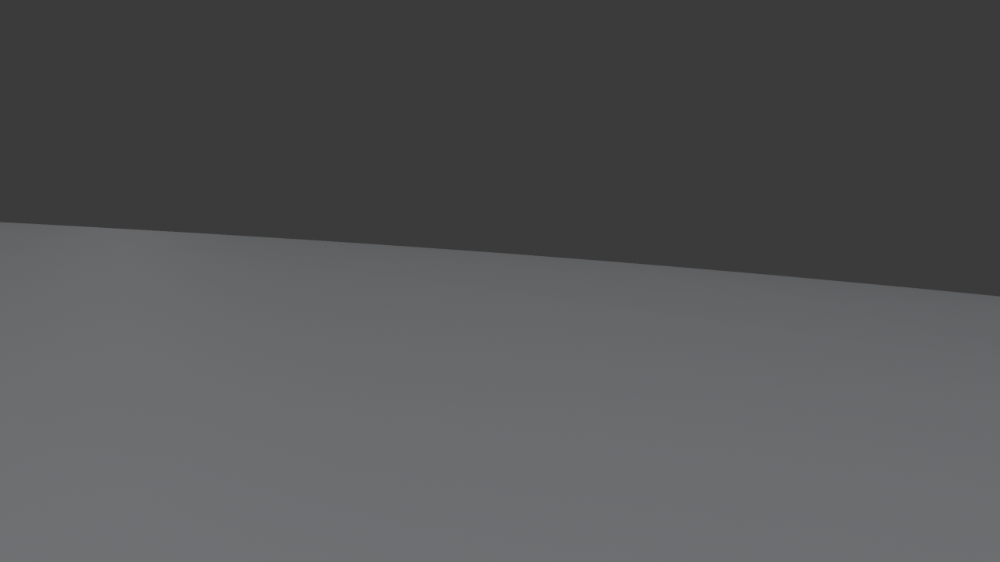
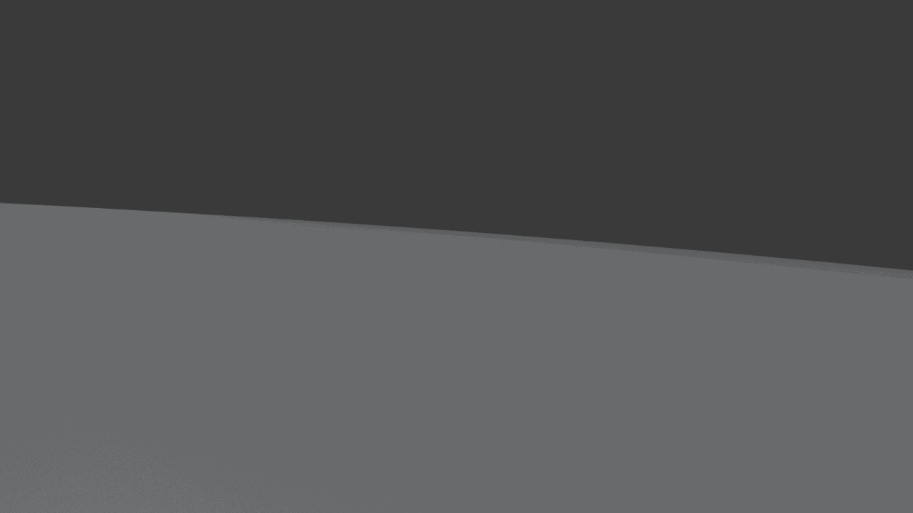

# Walkthrough Renderer — Desert Scene Results

**Date**: 2026-03-10
**Tool**: `genesis_tools.walkthrough_renderer` (GenesisTools commit `4001544`)
**Scene**: Code2Worlds Scene Stream — Desert (`scene_fine.blend`, 3.0 GB)
**Environment**: Local WSL2, Intel Core + NVIDIA RTX 5090 (headless, WORKBENCH = Mesa LLVMpipe)

---

## 1. Input

| Field | Value |
|-------|-------|
| Scene file | `GenesisExp/GenesisCode2Worlds/outputs/scene_desert/scene_fine.blend` |
| Scene size | 150 × 150 m footprint |
| Object count | 1,380 mesh objects |
| Triangle count | ~96 M triangles (avg 69K/object) |
| File size | 3.0 GB |
| Scene origin | Infinigen procedural generation (2026-03-09) |

**Call parameters used**:

```python
render_scene_walkthrough(
    blend_path  = "outputs/scene_desert/scene_fine.blend",
    output_dir  = "outputs/scene_desert/walkthrough",
    render_engine        = "WORKBENCH",
    num_waypoints        = 12,
    fps                  = 8,
    max_duration_seconds = 30.0,
    max_grid_cells_xy    = 80,
    max_grid_cells_z     = 40,
    grid_resolution      = 0.5,   # minimum voxel size (m); actual = 1.875 m after scale-up
    camera_height        = 1.7,
    blender_command      = "/home/kingy/blender/blender-wsl",
)
```

---

## 2. Voxel Grid & Path Planning

### Grid parameters

| Parameter | Value |
|-----------|-------|
| Requested grid resolution (min) | 0.5 m |
| Effective voxel size (after cap) | 1.875 m |
| Grid dimensions | 80 × 80 × 17 cells |
| Total raycasts | ~9,000 |
| Solid voxels | 16,282 |
| Walkable (free floor) cells | 10,458 |
| Interesting look-at objects | 1,356 |

**Before fix** (grid count scaled with scene): 299 × 300 × 67 = **~130,000 raycasts** (14× more).
**After fix**: capped at `max_grid_cells_xy=80`, voxel size scales up to fit — raycasts fixed at ~9K regardless of scene size.

### Path planning output

| Metric | Value |
|--------|-------|
| Waypoints requested | 12 |
| Smooth path sample points | 1,889 |
| Path length (estimated) | ~1,800 m |
| Auto-calculated duration | ~1,500 s (25 min) |
| Capped duration (`max_duration_seconds=30.0`) | 30 s |

---

## 3. Render

| Metric | Value |
|--------|-------|
| Render engine | WORKBENCH (Mesa LLVMpipe — no GPU in headless WSL2) |
| Frame count | 240 |
| Frame rate | 8 fps |
| Resolution | 1280 × 720 |
| Frame size | ~642 KB each |

**Sample frame (frame_0001)**:



**Walkthrough GIF** (240 frames, 8 fps, 4.9 MB):



---

## 4. Timing Breakdown

### Final successful run (with `max_duration_seconds=30.0`)

| Phase | Duration | CPU Cores | Root Cause |
|-------|----------|-----------|------------|
| Blender file load | ~5 min | 17 | `.blend` decompression — multi-threaded |
| BVH + depsgraph evaluation | ~40 min | 12 | Ray-cast BVH for 96M triangles — dominant cost |
| Python voxel loop | <1 min | 1 | GIL-bound; 9K rays after grid cap fix |
| WORKBENCH render (240 frames) | ~5 min | 5 | Mesa LLVMpipe software rasterizer |
| GIF assembly | <10 s | 1 | Pillow frame concatenation |
| **Total** | **~51 min** | | |

### Aborted run (before `max_duration_seconds` fix)

| Phase | Estimated Duration | Note |
|-------|-------------------|------|
| File load + BVH | ~45 min | Same as above |
| WORKBENCH render (13,000+ frames) | **~2.5 hours** | 1800m / 1.2 m·s⁻¹ = 1500s × 8fps |
| **Total (projected)** | **~3+ hours** | Killed manually |

---

## 5. Summary

### Output files

```
GenesisTools/results/scene_desert_walkthrough/
├── scene_fine_walkthrough.gif            (4.9 MB, 240 frames, 8 fps)
└── frames/
    └── frame_0001.png                    (sample, 1280×720)

GenesisExp/GenesisCode2Worlds/outputs/scene_desert/walkthrough/
├── scene_fine_walkthrough.gif            (4.9 MB — source)
├── scene_fine_walkthrough.blend          (3.0 GB — animated camera)
└── frames/
    ├── frame_0001.png … frame_0240.png   (1280×720, ~642 KB each)
```

### Pipeline config

| Key | Value |
|-----|-------|
| GenesisTools commit | `4001544` (feat: voxel grid + path improvements) |
| Blender | 4.5.0 (`/home/kingy/blender/blender-wsl`) |
| GPU | RTX 5090 (headless WSL2 — CUDA available but not used by WORKBENCH) |
| Render engine | WORKBENCH (LLVMpipe) |
| Platform | WSL2, Linux 6.6.87.2 |

### Bugs fixed during this session

| # | Bug | Fix |
|---|-----|-----|
| 1 | Grid voxel count scaled with scene size (130K → 9K raycasts) | Cap at `max_grid_cells_xy/z`; scale voxel *size* instead of count |
| 2 | Duration runaway: 150m scene → 13,000+ frames (2.5h render) | Add `max_duration_seconds=60.0` default; cap auto-calculated duration |

### Known Limitations

- **WORKBENCH renders flat grey geometry** — no materials, no lighting. Mesa LLVMpipe has no GPU OpenGL passthrough in headless WSL2. Use `render_engine="CYCLES"` + CUDA for material-quality frames (~1.1s/frame estimate).
- **BVH dominates runtime** (~40 min unavoidable for 96M triangles). Inherent to Blender's ray-cast on large outdoor scenes.
- **Voxel size = 1.875 m at 80-cell cap** — coarse for a 150m scene. Frame 240 shows slight camera clipping into terrain slope. Increase `max_grid_cells_xy` or reduce scene scale for better accuracy.
- **`libSM.so.6` / `libICE.so.6`** must be re-extracted to `/tmp/deb_extract/` after every WSL2 reboot.

### Next Steps

- Test with `render_engine="CYCLES"` for material-quality output (GPU required)
- Raise `camera_height=3.0` to reduce terrain clipping on large-voxel scenes
- Test on a smaller indoor scene (e.g., bedroom) where BVH build is fast and CYCLES quality is visible

---

## 6. Algorithm Reference

### 6.1 Voxel Grid Construction (Global Mode)

**Step 1 — Bounding box**

Compute `(min_x, min_y, min_z, max_x, max_y, max_z)` from all scene objects. This defines the region to voxelise.

**Step 2 — Voxel size**

```
res = max(grid_resolution, span_x / max_xy, span_y / max_xy, span_z / max_z)
```

The voxel size scales up so the grid never exceeds `max_grid_cells_xy × max_grid_cells_xy × max_grid_cells_z` cells. For a 150 m desert with defaults: `res = max(0.5, 150/80) = 1.875 m`.

**Step 3 — Tri-axial sweep**

Three independent sweeps mark voxels as **solid**. Each sweep covers one face of the bounding box and fires rays perpendicular to it, one ray per grid cell centre on that face:

| Sweep | Ray origin | Direction | Ray count | Detects |
|-------|-----------|-----------|-----------|---------|
| Z (top → down) | `(x, y, max_z + 1)` | `(0, 0, -1)` | `nx × ny` | floors, terrain, tabletops, ceilings |
| X (left → right) | `(min_x - 1, y, z)` | `(1, 0, 0)` | `ny × nz` | walls facing ±X |
| Y (front → back) | `(x, min_y - 1, z)` | `(0, 1, 0)` | `nx × nz` | walls facing ±Y |

Every ray travels from **1 unit outside** the bounding box all the way to **1 unit past the opposite side** — it penetrates the full depth of the scene. `_cast_all_hits` steps 5 cm past each surface hit and fires again, so one ray records every surface it passes through (mezzanines, furniture stacks, multi-layer terrain).

**Total ray count**: `nx·ny + ny·nz + nx·nz`. With `max_grid_cells_xy=80, max_grid_cells_z=40`: `80×80 + 80×40 + 80×40 = 9,600` initial rays, each spawning 2–10 `ray_cast()` calls depending on scene density.

Three sweeps are necessary because a single Z sweep misses vertical surfaces (walls), and a single X or Y sweep misses horizontal surfaces (floors). Together they cover all surface orientations.

### 6.2 Walkable Voxel Detection

After sweeping, determine which voxels a camera can stand in. A voxel `(ix, iy, iz)` is **walkable** when both conditions hold:

1. **Floor below**: `(ix, iy, iz-1)` is solid — there is a surface to stand on
2. **Headroom above**: `(ix, iy, iz)` through `(ix, iy, iz + ceil(camera_height/res) - 1)` are all **not** solid — enough vertical clearance for the camera

```
         iz + N  ┤  free  ┐
                 ┤  free  │ camera_height clearance
         iz + 1  ┤  free  ┘
         iz      ┤  free  ← walkable voxel (camera feet here)
         iz - 1  ┤  SOLID ← floor
```

World-space position: `floor_z = min_z + iz * res`, camera eye at `floor_z + camera_height`.

### 6.3 Walk Start Point

**Global mode**: `_bfs_largest_component()` — take the largest 4-connected group of walkable voxels (±1 Z allowed for terrain slopes). This discards small isolated pockets and ensures a contiguous traversable region.

**Local mode**: flood fill BFS from a **camera seed** — the nearest walkable voxel to the active camera's position. This guarantees the walk starts at the camera's actual location rather than the geometrically largest region, which may be elsewhere in the scene.

### 6.4 Coverage Path Generation

Starting from the walkable set, the path is built in four stages:

```
walkable cells
    │
    ├── 1. _farthest_point_sample(n)  — spread n waypoints maximally apart (XY distance)
    ├── 2. _greedy_tsp_tour()         — nearest-neighbour tour, closes the loop
    ├── 3. _bfs_path() per segment    — wall-free shortest BFS path between each pair
    ├── 4. Laplacian smooth (5 passes)— XY only; Z re-snapped to floor after each pass
    └──    4× linear upsample         — dense per-frame samples for smooth camera motion
```

**Farthest-point sampling** uses **Euclidean (physical) XY distance**, not graph distance:

```python
# 1. Pick a random first waypoint
# 2. dist[c] = squared XY distance from c to nearest already-selected waypoint
# 3. Pick the cell with the largest dist[c] as the next waypoint
# 4. Update dist[c] = min(dist[c], distance to new waypoint)
# 5. Repeat until N waypoints selected

dist[c] = (c[0] - farthest[0]) ** 2 + (c[1] - farthest[1]) ** 2
```

Using straight-line distance means waypoints spread evenly across space, but does **not** guarantee a walkable path between them — walls may block direct travel. That is handled by the BFS step below.

**Greedy TSP**: nearest-neighbour heuristic starting from waypoint[0], closes back to the start. Not globally optimal but fast (O(n²)) and avoids extreme backtracking.

**BFS per segment**: shortest path through the walkable voxel **graph** between consecutive waypoints. This is where walls are respected — the camera never clips through geometry. If two waypoints have no BFS path (completely disconnected), that segment is skipped.

**Constrained Laplacian**: smooths XY coordinates independently from Z. After each XY move, Z is re-resolved by looking up `walkable_xy[(ix, iy)]` — the floor level at the new XY position. This prevents the path from floating above or sinking below uneven terrain.

**4× upsample**: linear interpolation produces one sample point per rendered frame, giving smooth per-frame camera positions without jarring jumps.

### 6.5 Trajectory Duration and End Condition

```
estimated_duration = path_length_m / walk_speed_m_per_s
capped_duration    = min(estimated_duration, max_duration_seconds)
frame_count        = round(capped_duration × fps)
```

The dense path is sampled uniformly at `frame_count` points. Everything beyond `max_duration_seconds` is discarded. Default `max_duration_seconds=60` prevents runaway renders on large scenes (a 150 m desert path uncapped → 1,500 s → 12,000 frames at 8 fps).

### 6.6 Camera Steering

**Rotation mode**: `QUATERNION` — avoids gimbal lock that occurs with Euler angles when the camera pitches near vertical.

Each frame computes a `look_target` point then converts it to a quaternion:

```python
target_quat = direction.to_track_quat("-Z", "Y")   # camera -Z axis points at look_target
```

**Gaze state machine** (per-frame):

```
State: FORWARD
  │  no eligible object nearby → look_target = path point at t + 0.15 (slightly ahead)
  │
  └─→ found interesting object within look_range AND LOS is clear
        │
        └─→ State: GLANCING (hold for glance_duration = fps × 3 frames)
            look_target = object centre (world space origin of the Blender object)
                  │
                  └─→ cooldown[object] = 4 × glance_duration
                      (prevents re-visiting same object too soon)
                      → back to FORWARD
```

**Interesting object criteria** — an object qualifies as a gaze candidate only if:
- It is a MESH object
- Its name does not contain keywords: `floor, ground, terrain, sky, plane, landscape, ceiling, wall, room, baseboard, trim`
- No single dimension exceeds 30 m (filters out whole-scene meshes, terrain, skyboxes)
- Volume > 0.001 m³ (filters out degenerate/invisible objects)

The look target is the **object's world-space origin** (not the nearest surface point). If an entire scene is one merged object, it will be filtered out by the 30 m dimension check, and the camera stays in FORWARD state for the whole walk.

**Line-of-sight (LOS)**: a ray is cast from the camera eye to the object origin. If any geometry is intersected before reaching the target, LOS is blocked and the object is skipped. Uses local BVHTree in local mode, `scene.ray_cast(depsgraph)` in global mode.

**Rotation smoothing**: first-order low-pass SLERP filter applied every frame:
```
α = 1 - exp(-1 / (fps × rotation_smooth_seconds))
q_current = SLERP(q_prev, q_target, α)
```
With `rotation_smooth_seconds=2.0` at `fps=8`: `α ≈ 0.06` — the camera moves only 6% toward the target each frame, reaching 63% of the target rotation after 2 s. This makes head turns slow and cinematic.

**F-curves**: all keyframes set to `LINEAR` interpolation. Combined with the per-frame SLERP smoothing, this gives smooth motion without Blender's default Bezier overshooting.
