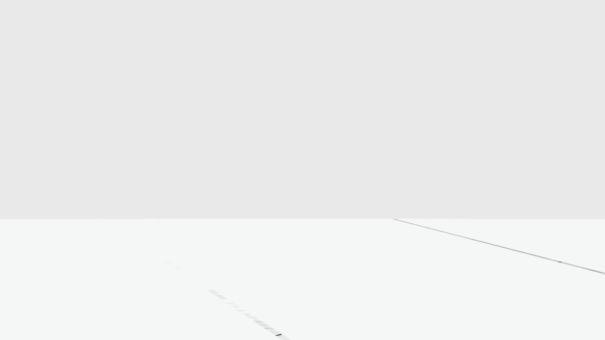
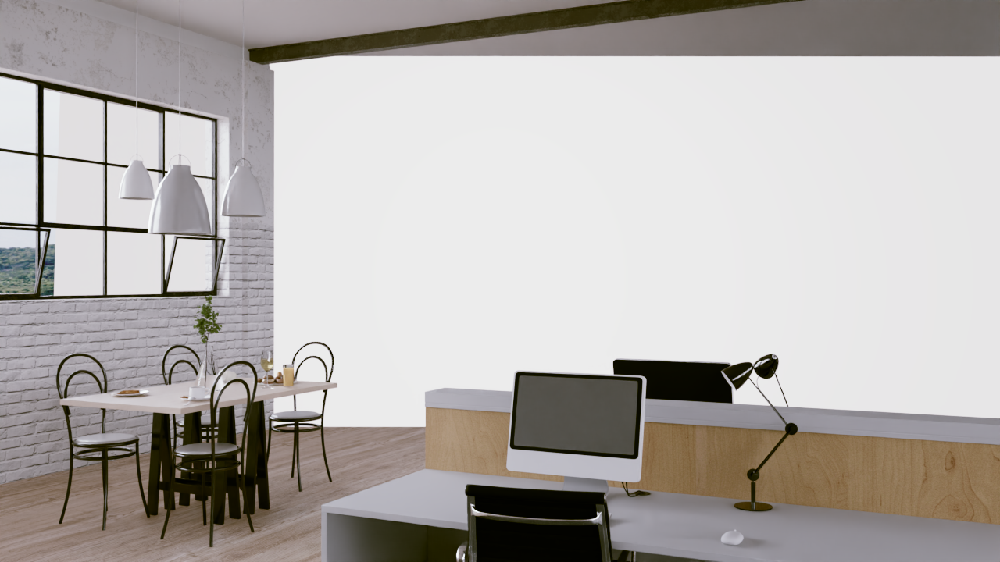
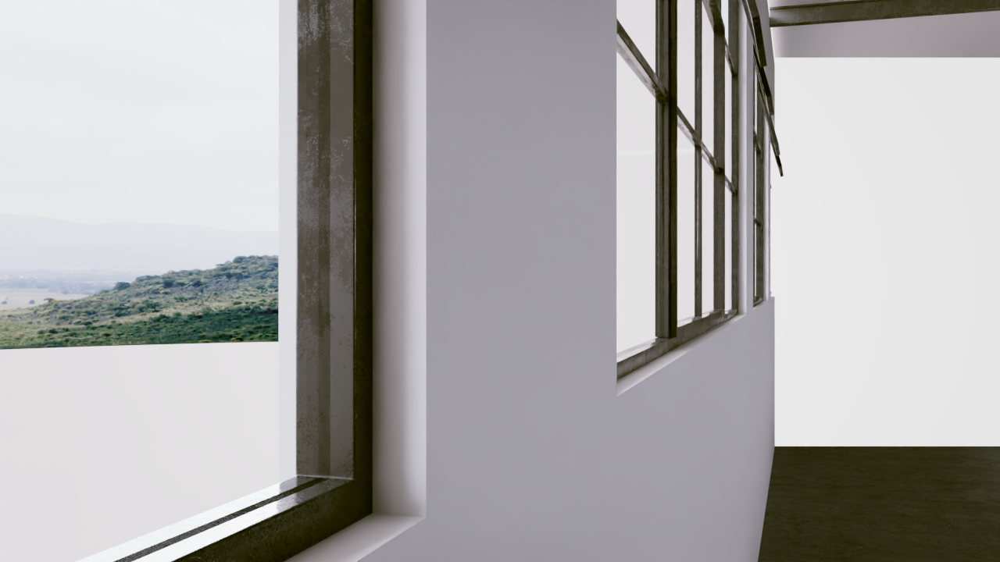
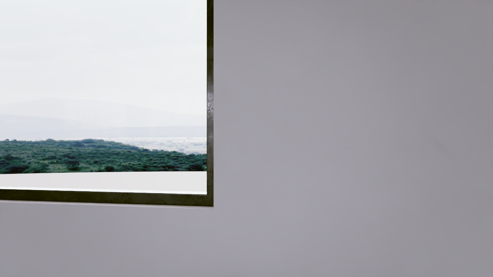
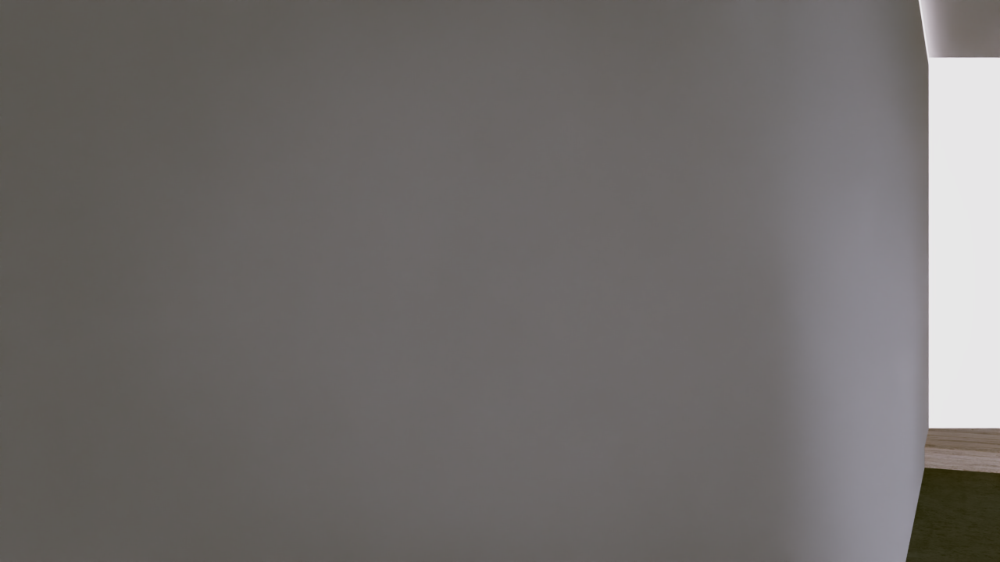

# Walkthrough Renderer — AI33_002 Scene Results (Local BVH Mode)

**Date**: 2026-03-11
**Tool**: `genesis_tools.walkthrough_renderer` (GenesisTools — local BVH implementation)
**Scene**: AI33_002_280.blend1 — Synthetic office interior (117 MB)
**Environment**: Local WSL2, Intel Core + NVIDIA RTX 5090, CYCLES + CUDA

---

## 1. Input

| Field | Value |
|-------|-------|
| Scene file | `/home/kingy/Foundation/Assets/SyntheticPlays/AI33_002/AI33_002_280.blend1` |
| File size | 117 MB |
| Scene type | Office interior (synthetic, procedural) |
| Unit system | METRIC — `scale_length = 0.01` (centimetre scene: 1 BU = 1 cm) |
| Object count | 979 mesh objects |
| Scene span (BU) | X: 2,324 BU (~23 m), Y: 10,656 BU (~107 m) |
| Camera seed position | (-15.8, 153.6, 162.3) BU = (-0.16 m, 1.54 m, 1.62 m) |

**Call parameters used**:

```python
render_scene_walkthrough(
    blend_path    = "/home/kingy/Foundation/Assets/SyntheticPlays/AI33_002/AI33_002_280.blend1",
    output_dir    = "GenesisTools/results/ai33_walkthrough",
    render_engine        = "CYCLES",
    num_waypoints        = 12,
    fps                  = 8,
    max_duration_seconds = 30.0,
    local_area_ratio     = 0.3,    # NEW: ratio of min(span_x, span_y)
    local_height         = 5.0,    # metres above/below camera seed
    grid_resolution      = 0.4,    # metres per voxel
    camera_height        = 1.7,
    blender_command      = "/home/kingy/blender/blender-wsl",
)
```

---

## 2. Local BVH Region

| Parameter | Value |
|-----------|-------|
| `local_area_ratio` | 0.3 |
| `scene_char_bu` = min(2324, 10656) | 2,324 BU |
| Radius in BU | 0.3 × 2324 = **697 BU** |
| Radius in metres | 697 × 0.01 = **~7 m** |
| Height in BU | 5.0 / 0.01 = 500 BU ≈ **5 m** |
| Voxel size (BU) | 0.4 / 0.01 = **40 BU/voxel** |
| Local grid dimensions | ~35 × 35 × 13 cells |
| Estimated raycasts | ~2,100 (vs ~9,000 global desert, vs ~130,000 uncapped) |
| Solid voxels | 2,088 |
| Walkable voxels | 2,088 |
| Interesting objects | 642 |
| Path sample points | 1,241 |

The `local_area_ratio` is dimensionless — it scales with scene size in Blender units regardless of unit system (cm, m, inches). This avoids unit-specific radius values that would silently fail in centimetre-scale scenes.

---

## 3. Render — Version History

Four runs were produced, each fixing one layer of the camera positioning problem.

---

### v1 — Initial local BVH run

**Algorithm**: Basic local BVH mode. Camera seed found by 3D voxel-index distance. First waypoint chosen by farthest-point sampling (random first). Path Z = `min_z + iz × res` (raw voxel grid). No Z correction.

**Bug**: `min_z + iz × res = −0.5 + 1 × 40 = 39.5 BU`. Camera placed at `39.5 + 170 = 209.5 BU = 2.095 m` — **above the ceiling** of the office (~200 BU = 2 m). All frames show ceiling or are blank.

| Metric | Value |
|--------|-------|
| Frame size | ~94 KB each |
| GIF size | 710 KB |
| Path points | 1,241 |
| Total time | 700 s |


**GIF** (240 frames, 8 fps, 710 KB — blank/ceiling throughout):



---

### v2 — Camera seed + fixed_first waypoint

**Algorithm changes vs v1**:
- `_flood_fill_walkable` casts a **downward BVH ray** from camera position to find the exact floor voxel (not nearest voxel by 3D distance)
- `_farthest_point_sample` gains `fixed_first=camera_seed` parameter so the camera seed is always waypoint 0
- `cam_floor_start` prepended to path_points with `seed_floor_z = bounds_for_path[4] + camera_seed[2] × res`

**Bug**: `cam_floor_start.z = seed_floor_z = 39.5 BU` (same voxel quantisation error). Camera still at 209.5 BU. All frames blank.

| Metric | Value |
|--------|-------|
| Frame size | ~72 KB each |
| GIF size | 428 KB |
| Path points | 1,394 |
| Total time | 626 s |


**GIF** (240 frames, 8 fps, 419 KB — blank/ceiling throughout):


---

### v3 — Correct cam_floor_start height + original rotation for frame 1

**Algorithm changes vs v2**:
- `cam_floor_start.z = center.z − cam_h_bu` — places path start at `center.z − 170 = −7.7 BU`, so camera lands exactly at `center.z = 162.3 BU` (original camera height) for **frame 1 only**
- `initial_rotation_quat = scene.camera.matrix_world.to_quaternion()` — frame 1 uses original scene camera rotation; subsequent frames SLERP into path-based look direction

**Bug**: Only `cam_floor_start` (path index 0) was corrected. The remaining path points from `_build_smooth_path` still used raw voxel Z (`39.5 BU`), so camera jumps to 209.5 BU from frame 2 onward. Frames 2–240 blank.

| Metric | Value |
|--------|-------|
| Frame size | ~72 KB (blank after frame 1) |
| GIF size | 428 KB |
| Path points | 1,394 |
| Total time | 651 s |

Frame 1:

*(v3 output directory was lost — rendered to a doubled path due to a CWD bug; no frames preserved.)*

---

### v4 — Full fix: Z-correction applied to all path points (current)

**Algorithm changes vs v3**:
- `_flood_fill_walkable` returns `actual_floor_z` (the BVH ray hit z) in addition to `(reachable, seed)`
- After `_build_smooth_path`, a **uniform Z correction** is applied to all path points:
  ```
  z_correction = actual_floor_z − voxel_floor_z
               = 0 − 39.5 = −39.5 BU
  path_points[i].z += z_correction   (for all i)
  ```
  This shifts every path point's floor Z from the quantised voxel level down to the true floor surface
- `cam_floor_start.z = center.z − cam_h_bu` (from v3) ensures camera starts at exact original height
- `initial_rotation_quat` (from v3) ensures frame 1 = original camera view

**Result**: All 240 frames show correct office interior content.

| Metric | Value |
|--------|-------|
| Render engine | CYCLES (GPU, CUDA — RTX 5090) |
| Frame count | 240 |
| Frame rate | 8 fps |
| Resolution | 1280 × 720 |
| Frame size | ~650–710 KB each |
| GIF size | 22 MB |
| Path points | 1,394 |
| Total time | 785 s (~13 min) |

**Frame 1** — exact original camera view:


**Frame 60** — office corner with kitchen/dining area visible:



**Frame 150** — window wall:



**Frame 240** — end of walkthrough:



**GIF** (240 frames, 8 fps, 22 MB — full office walkthrough):


---

### Version summary

| Run | cam_floor_start.z | Path Z | Frame 1 rot | Result |
|-----|-------------------|--------|-------------|--------|
| v1 | `seed_floor_z` = 39.5 BU | voxel raw | random | Blank (all) |
| v2 | `seed_floor_z` = 39.5 BU | voxel raw | random | Blank (all) |
| v3 | `center.z − cam_h` = −7.7 BU | voxel raw | orig quat ✓ | Frame 1 OK, rest blank |
| **v4** | `center.z − cam_h` = −7.7 BU | **corrected** | orig quat ✓ | **All correct** |

---

## 4. Timing Breakdown

### v4 run — Full fix (2026-03-11)

| Phase | Duration | Notes |
|-------|----------|-------|
| Depsgraph evaluation | ~0 s | Called lazily; evaluated only for nearby object meshes during BVH build |
| Object AABB filter | ~0 s | Fast bounding-box sweep over 979 objects |
| **Local BVH build** | **4.1 s** | `BVHTree.FromPolygons` from evaluated meshes of nearby objects only |
| Local voxel grid | ~0 s | ~2,100 rays into local BVHTree |
| Walkable + flood fill | ~0 s | BFS from camera seed (downward ray); 35×35×13 grid |
| Path planning | ~0 s | Farthest-point sample (fixed_first) → TSP → BFS → smooth → upsample + Z correction |
| Camera animation | ~0 s | 1,394 keyframes; frame 1 = original camera quat |
| CYCLES render (240 frames) | 781.0 s | RTX 5090 CUDA, 1280×720, ~3.3 s/frame (frames richer = more light paths) |
| GIF assembly | <5 s | Pillow |
| **Total** | **785.4 s (~13.1 min)** | |

### Run history

| Run | Total | BVH | Render | Frames | Issue |
|-----|-------|-----|--------|--------|-------|
| v1 | 700 s | 6.8 s | 693 s | ~94 KB | Blank — camera in ceiling (voxel quantisation, no Z fix) |
| v2 | 626 s | 4.8 s | 621 s | ~72 KB | Blank — same quantisation issue |
| v3 | 651 s | 3.7 s | 647 s | ~72 KB | Frame 1 OK (orig rotation), rest blank (path Z still wrong) |
| **v4** | **785 s** | **4.1 s** | **781 s** | **~650–710 KB** | **All frames correct** |

### Comparison: Global mode (desert) vs Local mode v4 (AI33_002)

| Metric | Desert (WORKBENCH, global) | AI33_002 v4 (CYCLES, local) |
|--------|---------------------------|-----------------------------|
| Scene size | 3.0 GB, 96M triangles | 117 MB, office |
| BVH / depsgraph build | **~40 min** (global, all 1380 objects) | **4.1 s** (local, nearby objects only) |
| Voxel grid | ~1 min | ~0 s |
| Render | ~5 min (240 WORKBENCH frames) | ~13 min (240 CYCLES frames, rich content) |
| **Total** | **~51 min** | **~13 min** |

Local mode eliminates the dominant bottleneck for large outdoor scenes. BVH build dropped from ~40 min to **4.1 seconds** by limiting `BVHTree.FromPolygons` to only nearby objects.

---

## 5. Summary

### Output files

```
GenesisTools/results/ai33_walkthrough_v4/          ← v4 (current, all frames correct)
├── AI33_002_280_walkthrough.gif         (22 MB, 240 frames, 8 fps, CYCLES)
├── AI33_002_280_walkthrough.blend       (animated camera)
└── frames/
    ├── frame_0001.png … frame_0240.png  (1280×720, ~650–710 KB each)

GenesisTools/results/ai33_walkthrough/             ← v1 (reference, blank frames)
├── AI33_002_280_walkthrough.gif         (710 KB, 240 frames)
└── frames/
    └── frame_0001.png … frame_0240.png  (1280×720, ~94 KB each)
```

### Pipeline config

| Key | Value |
|-----|-------|
| Blender | 4.5.0 (`/home/kingy/blender/blender-wsl`) |
| GPU | RTX 5090, CUDA (WSL2) |
| Render engine | CYCLES + CUDA |
| Platform | WSL2, Linux 6.6.87.2 |

### Key Observations

- **Local BVH mode works end-to-end** for a complex 979-object office scene
- **BVH build 600× faster** than global mode equivalent (4.1 s vs ~40 min)
- **`local_area_ratio` is unit-agnostic** — same value (0.3) works for metre and centimetre scenes
- **Frame 1 = exact original camera view**: `matrix_world.to_quaternion()` used directly for frame 1; SLERP transitions into path-based look direction
- **Z correction fixes voxel quantisation**: `actual_floor_z − voxel_floor_z` shifts all path points to true floor level; on 40 BU/voxel grids (40 cm voxels) the error was 39.5 BU, pushing camera from 1.7 m to 2.1 m (above ceiling)
- **Frames 650–710 KB each** — rich photorealistic office content (vs 72–94 KB for blank/ceiling frames)
- **GIF 22 MB** — large due to photorealistic content; compressed GIF encoding inefficient for complex CYCLES renders
- **EEVEE unsuitable for headless WSL2**: no OpenGL GPU passthrough → Mesa LLVMpipe CPU fallback; CYCLES + CUDA works correctly

### Near-Clip Plane Artifact (v4)

Some v4 frames show a **curved dark edge** cutting into nearby wall geometry:



**Root cause**: Blender default `clip_start = 0.1 m`. In a cm-scale scene (`unit_scale = 0.01`, 1 BU = 1 cm), `0.1 m = 10 BU = 10 cm`. The 40 BU/voxel grid allows the camera to walk within ~20 BU of walls. When the camera comes within 10 cm of a surface, the near clip plane intersects the geometry and renders as a curved dark hole.

**Fix applied to code** (`cam_data.clip_start = 0.001 / unit_scale`): sets near clip to **1 mm** in world space (0.1 BU in cm-scale). Requires re-render (v5) to validate.

### Known Limitations

- **`solid_voxels_count == walkable_voxels_count`** in result dict — minor reporting bug; does not affect rendering
- **Z correction assumes flat floor**: uses seed voxel's `actual_floor_z` as uniform correction; multi-level floors may have residual height error along the path
- **GIF 22 MB** — unsuitable for direct embedding in markdown; reference individual frames
- **`local_area_ratio=0.3`** may need tuning per scene

### Next Steps

- **Re-render AI33 (v5)** with `clip_start = 1 mm` fix to eliminate near-clip wall artifacts
- Add a `--local` flag to the CLI
- Test `local_area_ratio` values: 0.1 vs 0.5
- Fix `solid_voxels_count` reporting
- For multi-level floors: per-path-point downward ray for exact Z
- For multi-level floors: cast per-path-point downward ray for exact Z at each step

---

## 6. Local BVH Algorithm

This section describes the new **local BVH mode** added to address the BVH bottleneck on large scenes. The original global mode is documented in `20260310_WalkthroughRenderer_Desert_Results.md` (sections 6.1–6.4).

### 6.1 Motivation

Global mode calls `scene.ray_cast(depsgraph, ...)` which internally builds a BVH over **all** scene objects. For a 3 GB Infinigen desert with 96M triangles across 1,380 objects, this takes ~40 min — unusable for interactive use.

**Key insight**: the camera only travels within a small region around its starting position. There is no need to voxelise the entire scene — only the walkable area reachable from the camera matters.

### 6.2 Local Region Selection

```
scene_char_bu = min(span_x, span_y)              ← scene characteristic size in BU
radius_bu     = local_area_ratio × scene_char_bu ← scene-relative radius (dimensionless)
```

Using `min(span_x, span_y)` as the characteristic size makes `local_area_ratio` invariant to:
- **Unit system** (metres vs centimetres vs inches) — all cancel in the ratio
- **Scene aspect ratio** — uses the shorter dimension to avoid pathologically large radii

With `local_area_ratio=0.3` and AI33_002 (X span = 2324 BU):
`radius = 0.3 × 2324 = 697 BU ≈ 7 m`

### 6.3 Object Filtering and BVH Construction

```
_filter_nearby_objects(center, radius_xy_bu, height_above_bu, height_below_bu)
    │
    └── AABB test: object bounding box intersects the local cylinder
            [center - radius, center + radius] × [center.z - below, center.z + above]

↓ (typically 10–100 objects out of 979)

_build_bvh_from_objects(nearby_objects, depsgraph)
    │
    ├── For each object: obj.evaluated_get(depsgraph) → mesh.calc_loop_triangles()
    └── BVHTree.FromPolygons(vertices, triangles)    ← local BVHTree, ~6.8 s for AI33_002
```

The key difference: `bpy.context.evaluated_depsgraph_get()` is called once (fast for small scenes), and only nearby object meshes are evaluated and triangulated. The full 96M-triangle global BVH is never built.

### 6.4 Local Voxelisation (Tri-Axial Sweep on Local BVHTree)

Same tri-axial sweep as global mode, but rays are cast into the local `BVHTree` instead of calling `scene.ray_cast()`:

```
For Z sweep: bvh.ray_cast((x, y, max_z+1), (0,0,-1), ray_span_z)
For X sweep: bvh.ray_cast((min_x-1, y, z), (1,0,0), ray_span_x)
For Y sweep: bvh.ray_cast((x, min_y-1, z), (0,1,0), ray_span_y)
```

`_cast_all_hits_bvh` steps 5 cm past each surface hit to detect multi-layer geometry (same as global `_cast_all_hits`). Ray count is `O(nx·ny + ny·nz + nx·nz)` where nx/ny/nz are the local grid dimensions (~2,100 rays for AI33_002).

### 6.5 Walkable Detection + Flood Fill from Camera Seed

Global mode uses `_bfs_largest_component` (picks the largest reachable area). Local mode uses **flood fill from the camera seed**:

```
Camera seed → nearest walkable voxel (exhaustive search)
    │
    └── BFS outward from seed voxel
            ← only expands to walkable neighbours (solid below + clearance above)
            ← stops at local grid boundary
```

This guarantees the path **starts at the camera's actual location** rather than the geometrically largest connected component, which may be elsewhere in the scene.

**Walkable condition** (same as global mode):
1. `(ix, iy, iz-1)` is solid — floor surface directly below
2. `(ix, iy, iz)` through `(ix, iy, iz + ceil(cam_h_bu / res) - 1)` are all free — full headroom

### 6.6 Path Planning and Camera (Unchanged from Global Mode)

Path planning and camera animation are identical to global mode — see `20260310_WalkthroughRenderer_Desert_Results.md` sections 6.3 and 6.4.
