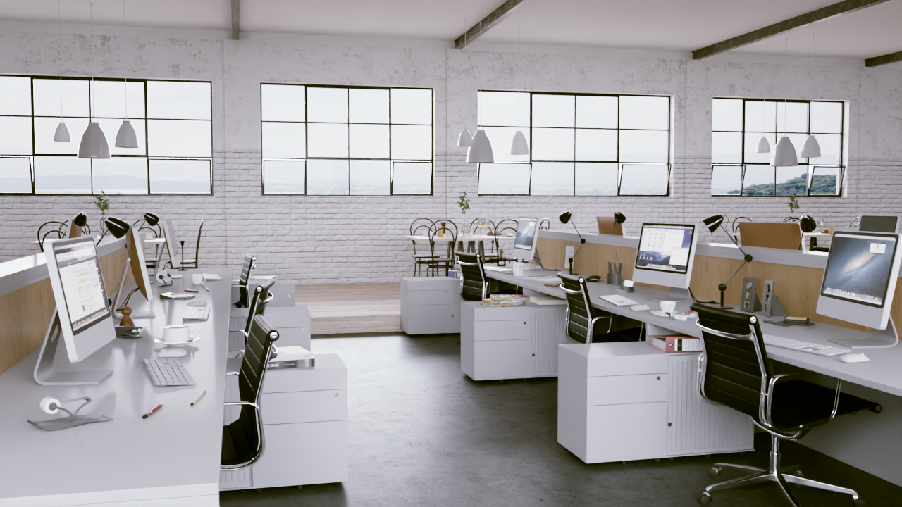
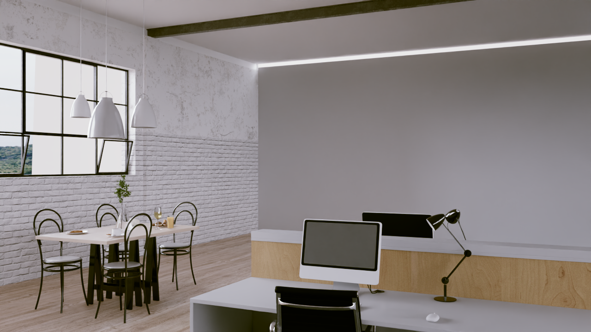
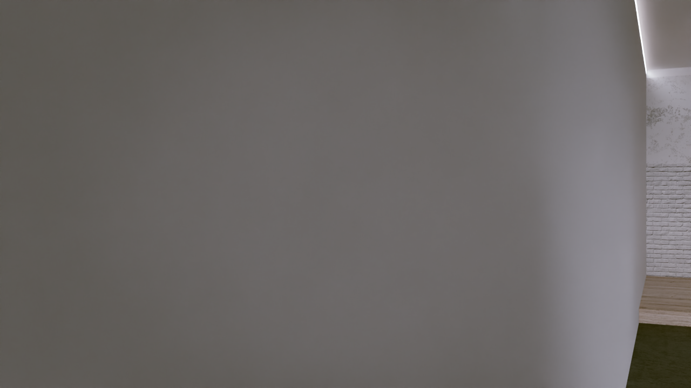
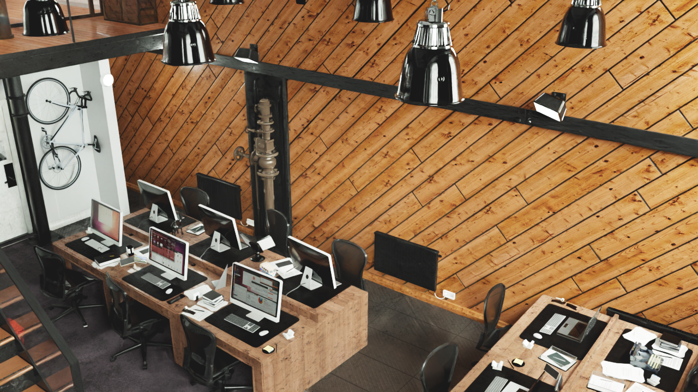
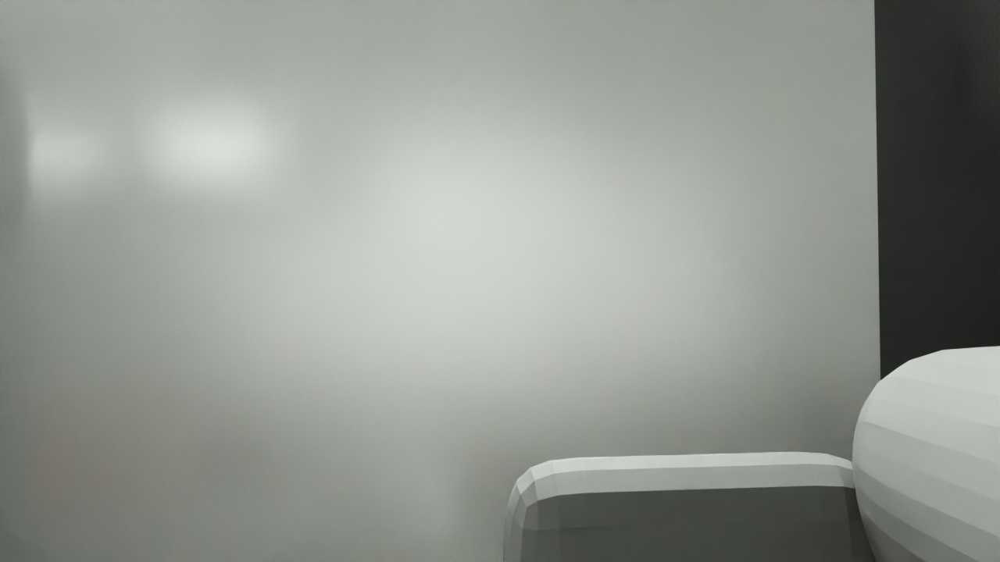
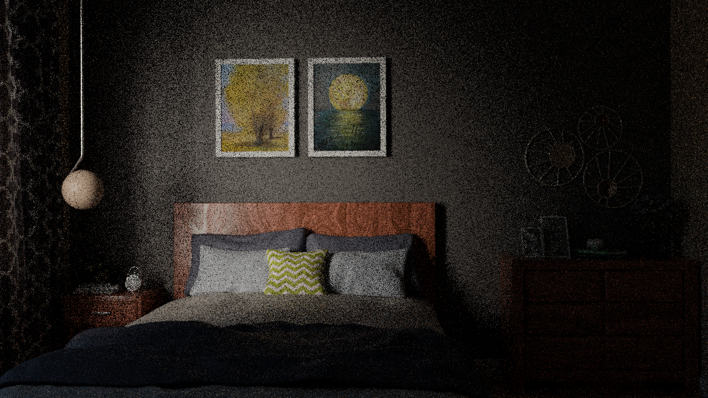
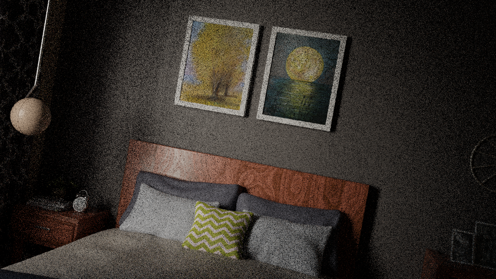

# Walkthrough Renderer — Clip Fix Results

**Date**: 2026-03-11
**Tool**: `genesis_tools.walkthrough_renderer` (local BVH mode)
**Commit**: e629f01
**Environment**: Local WSL2, Intel Core + NVIDIA RTX 5090, CYCLES + CUDA

---

## 1. Background

This document records the re-renders after fixing two camera clipping bugs identified
during the AI33_002 v4 run (see `20260311_WalkthroughRenderer_AI33_Results.md`).

### Bugs Fixed

| Bug | Root Cause | Fix |
|-----|-----------|-----|
| **Near-clip wall artifact** | Blender default `clip_start = 0.1 m = 10 BU` in cm-scale scenes. Camera within 10 cm of any surface → curved dark hole in frame. | `cam_data.clip_start = 0.001 / unit_scale` (1 mm world-space) |
| **Far-clip white blank areas** | Blender default `clip_end = 1000 BU = 10 m` in cm-scale scenes. Any geometry beyond 10 m → invisible white void. Long corridors and open-plan offices commonly exceed 10 m. | `cam_data.clip_end = 100.0 / unit_scale` (100 m world-space) |

Both values are expressed as `world_metres / unit_scale` so they work correctly in any
unit system (cm-scale `unit_scale=0.01` or m-scale `unit_scale=1.0`).

**clip_end / clip_start ratio = 100 m / 1 mm = 100,000** — within the safe z-fighting range.

---

## 2. Scenes

Three scenes re-rendered with both fixes applied.

---

### 2.1 AI33_002 (v5) — Office, cm-scale

**Scene**: `AI33_002_280.blend1` — 117 MB, 979 objects, cm-scale (`unit_scale=0.01`)
**Output**: `results/ai33_002_walkthrough_v5/`

| Metric | Value |
|--------|-------|
| Path points | 1,394 |
| Walkable voxels | 2,088 |
| Frame count | 240 |
| Total time | 821 s (~14 min) |
| Render time | 816 s |

**Frame 1** — original camera view:

**Frame 60** — office + dining area:

**Frame 180** — close to wall (near-clip artifact check):

**Near-clip result**: No curved dark edge. Wall fills frame naturally. Fix confirmed ✅

**Far-clip result**: No white blank areas in corridors. Fix confirmed ✅

---

### 2.2 AI33_001 (v2) — Workshop office, cm-scale

**Scene**: `AI33_001_280.blend` — 1.3 GB, cm-scale
**Output**: `results/ai33_001_walkthrough_v2/`

| Metric | Value |
|--------|-------|
| Path points | 386 |
| Walkable voxels | 256 |
| Frame count | 240 |
| Total time | 536 s (~9 min) |
| Render time | 534 s |

**Frame 1** — original camera view (elevated, angled):

**Frame 60** — camera inside geometry (wall-penetration issue):

**Known issue**: Scene camera in AI33_001 is positioned at an elevated, angled view
(~45° downward). After frame 1, the path moves away from the seed and some frames show
the camera inside wall geometry — confirmed wall-penetration from path smoothing cutting
through surfaces. Requires LOS fix (v3 re-render).

---

### 2.3 Bedroom (v2) — Residential, m-scale

**Scene**: `bedroom.blend` — 27 MB, m-scale (`unit_scale=1.0`)
**Output**: `results/others_bedroom_walkthrough_v2/`

| Metric | Value |
|--------|-------|
| Path points | 242 |
| Walkable voxels | 90 |
| Frame count | 122 |
| Total time | 52 s |
| Render time | 52 s |

**Frame 1**:

**Frame 60**:

**Result**: Clean render, no clipping artifacts ✅

---

## 3. Clip Parameter Summary

| Scene | unit_scale | clip_start (BU) | clip_start (world) | clip_end (BU) | clip_end (world) |
|-------|-----------|-----------------|-------------------|---------------|-----------------|
| AI33_002 (cm) | 0.01 | 0.1 | 1 mm | 10,000 | 100 m |
| AI33_001 (cm) | 0.01 | 0.1 | 1 mm | 10,000 | 100 m |
| bedroom (m) | 1.0 | 0.001 | 1 mm | 100 | 100 m |

Formula: `clip_start = 0.001 / unit_scale`, `clip_end = 100.0 / unit_scale`

---

## 4. Remaining Issue: Path Smoothing Wall Penetration

Clip fixes resolve rendering artifacts but do not fix the underlying path planning issue:
the camera can still walk through walls when the **Laplacian smoothing** or **4× linear
upsample** moves a path point through thin geometry.

**Root cause**: Laplacian smooth checks only that the smoothed XY cell is walkable (voxel
grid check), but does not cast a 3D ray to verify the segment is unobstructed. Similarly,
the linear upsample between two walkable points does not check if the straight-line
interpolation passes through a wall.

**Fix implemented** (not yet validated): `_build_smooth_path` now accepts a `bvh` parameter.
For each Laplacian candidate move and each upsample segment, a `bvh.ray_cast` at camera
height is performed. Blocked segments revert to the unsmoothed voxel-centre path.

**Validation run**: v6 (AI33_002), v3 (AI33_001, bedroom) — currently rendering.

---

## 5. Next Steps

- Review v6/v3 frames to confirm LOS fix eliminates wall-penetration frames
- Re-run Castle and GL-DM-001 (separate scene-specific issues — see AI33_002 results doc)
