# 3D Active Contour (Snake) — Implementation & Results

**Date**: 2026-04-24
**Module**: `genesis_tools/active_contour/`
**Scenes tested**: `bedroom.blend`, `AI33_001_280.blend`

---

## 1. Overview

3D Active Contour (Snake) fits a smooth closed surface to the geometry of a Blender scene.
The surface starts as the convex hull of a sampled point cloud and contracts toward the
actual mesh surfaces under two competing energy terms.

**Primary use**: determine the valid interior region for walkthrough rendering — the camera
path must stay inside the contour. Small protrusions (furniture legs, window frames, bolts)
are bypassed; large dominant surfaces (walls, floors, ceilings) are tightly enclosed.

---

## 2. Algorithm

### Energy decomposition

```
E_total = α · E_internal  +  β · E_external
```

| Term | Force | Effect |
|------|-------|--------|
| `α · E_internal` | Laplacian — each vertex pulled toward its mesh neighbours' mean | High α → smooth surface, bypasses small protrusions |
| `β · E_external` | Nearest-point — each vertex pulled toward closest sampled surface point | High β → tight fit to all surface detail |

### Pipeline

```
Blender scene (.blend)
  → extract_scene_meshes.py  [Blender subprocess]
      foreach mesh object: triangulate, apply world matrix → NPZ
  → sample_mesh_surface()
      area-weighted barycentric sampling at resolution r
      counts = (face_area / r²).astype(int)   # skip faces smaller than one sample
      → (K, 3) point cloud
  → Snake3D.__init__()
      ConvexHull(point_cloud) → subdivide(levels=2) → initial mesh
  → Snake3D.fit()
      repeat:
        disp = dt × (α × laplacian_force() + β × external_force())
        vertices += disp
      until: max_displacement < 1e-4  OR  plateau detected (20-iter moving avg)
  → snake_mesh.npz  {vertices, faces}
```

### Key implementation details

**Vectorised face sampling** (`sample_mesh_surface`): replaced Python loop with numpy
broadcasting. `counts = (areas / res²).astype(int64)` — faces smaller than one sample
cell are skipped entirely (no forced minimum of 1). Result: 166× speedup on AI33
(143s → 0.7s for 753k points from 186 objects with 9M triangles).

**Vectorised ray-triangle test** (`_ray_hits_count`): Möller–Trumbore over all faces
simultaneously using `np.einsum`. ~100× faster than a per-face Python loop. Used in
`contains()` (3-ray majority vote) and the batched voxel inside test.

**Plateau detection**: compares two consecutive 20-iteration moving averages of
max-displacement; stops when relative change < 2%. Prevents unnecessary iterations
when the snake reaches equilibrium above the 1e-4 threshold (common in real scenes
where smoothness and attraction forces balance out).

---

## 3. Algorithm Figures

### Figure 1 — Surface Sampling

Compares sparse mesh vertices vs area-weighted face sampling.

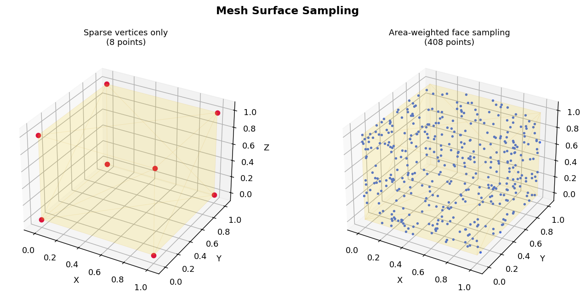

### Figure 2 — Snake Evolution

Snake contracting from convex hull to unit cube in 4 stages.

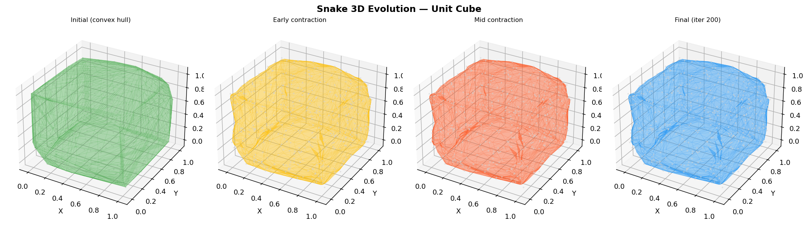

### Figure 3 — Protrusion Bypass

High α bypasses the spike (tip outside contour); low α wraps it (tip inside).
Geometry: unit cube [0,1]³ with a pyramid (height 0.2, base 0.12) on the top face.
Test point at z=1.15 (inside spike region).

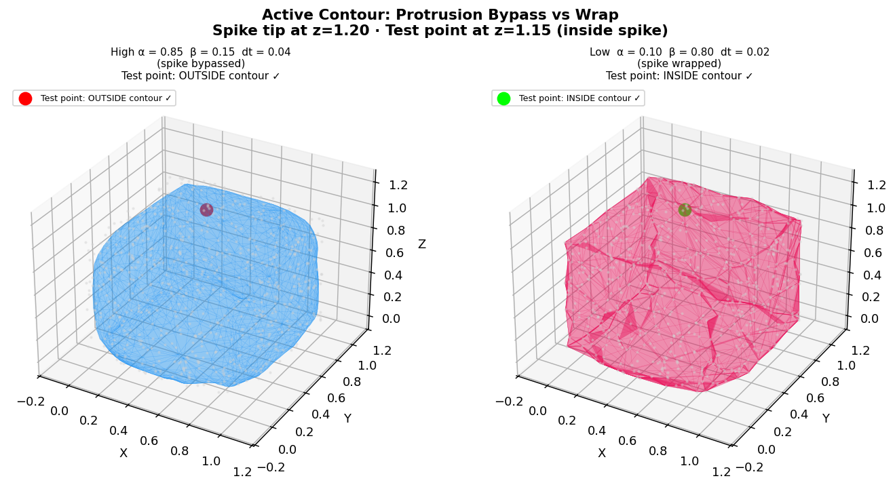

### Figure 4 — Convergence Curves

Max vertex displacement (log scale) over iterations for three α/β configurations.

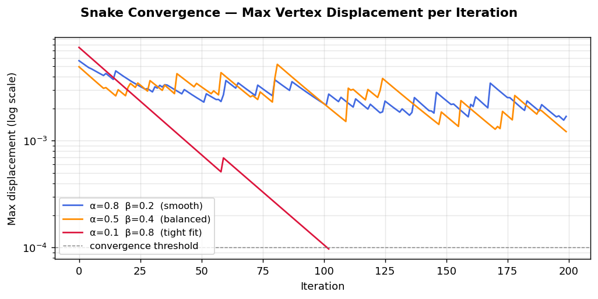

---

## 4. Scene Results — Bedroom

**File**: `benchmarks/blender/bedroom.blend`
**Objects**: 30 mesh objects
**Sampling resolution**: 0.3 m

| Parameter | Value |
|-----------|-------|
| α (smoothness) | 0.7 |
| β (attraction) | 0.25 |
| dt | 0.15 |
| Iterations | 114 (plateau stop) |
| Fit time | ~12s |
| Snake vertices | 1,650 |
| Snake faces | 3,296 |

### Point cloud & contour fit

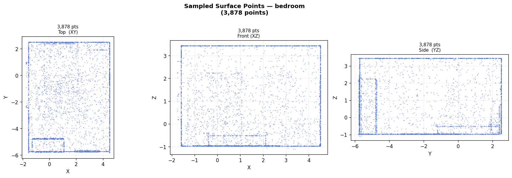

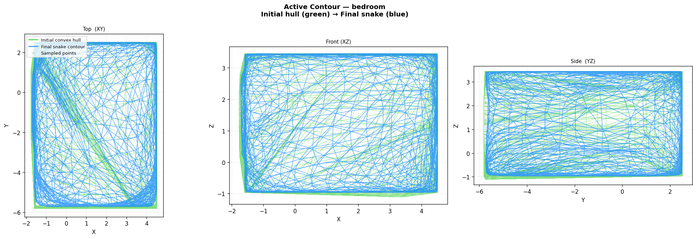

### Z-slice cross-sections

5 horizontal cross-sections showing inside (blue) vs outside (gray) classification.
The snake tightly follows the room walls; small furnishings are excluded.

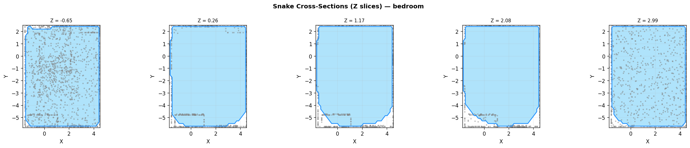

### Convergence

Snake reaches plateau around 3×10⁻² displacement — normal for indoor scenes where
smoothness and attraction forces balance without reaching the 1e-4 threshold.

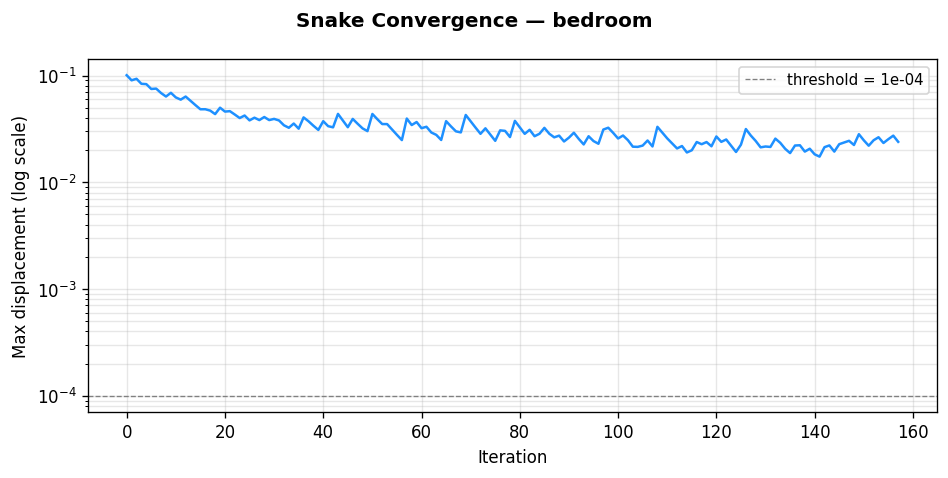

### Blender overlay — 2D convex hull projection

Snake mesh added to scene as hidden render object. After rendering, the 2D convex hull
of projected vertices is drawn as a cyan outline using PIL (no scipy — gift-wrapping
Jarvis march, pure Python).

| View | Result |
|------|--------|
| Top | 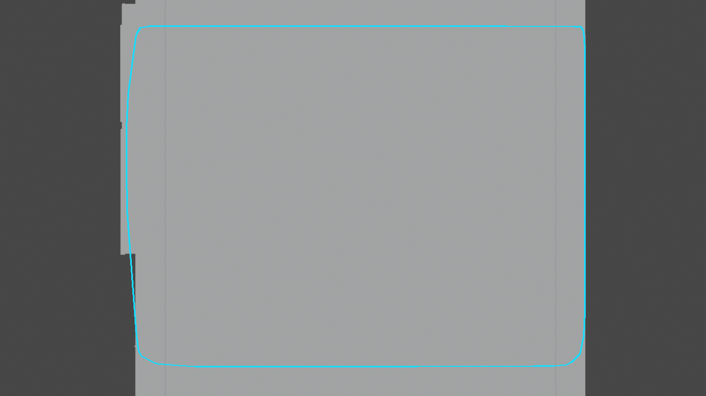 |
| Front | 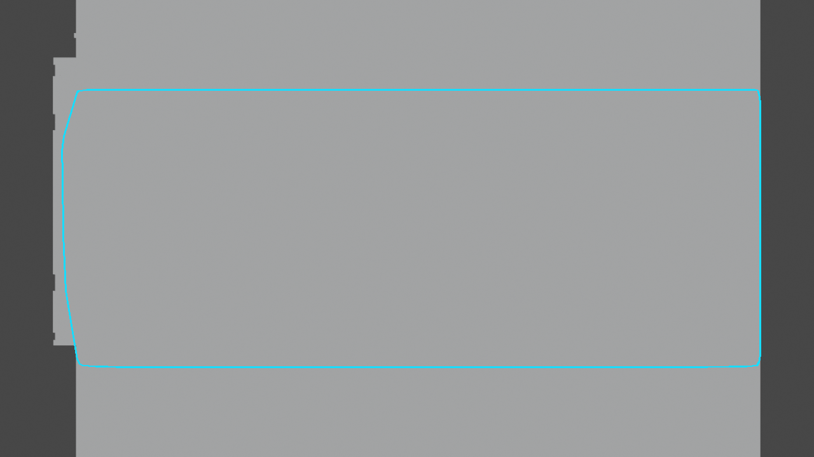 |
| Side | 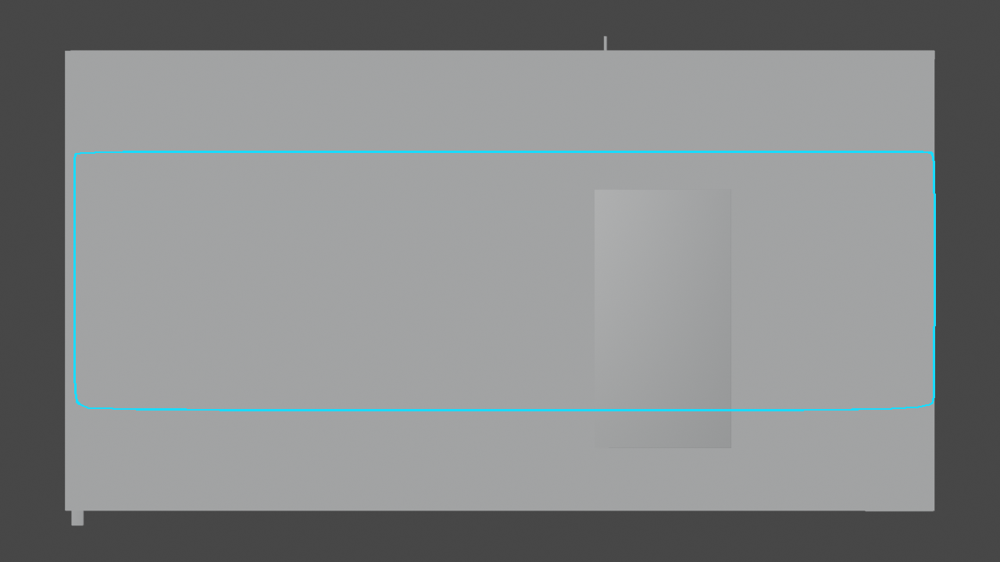 |
| Camera | 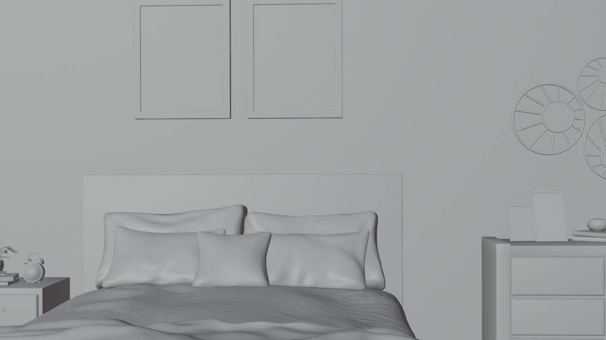 |

Camera view: camera is inside the snake (indoor scene), so the hull projects to the full
frame boundary — correct behaviour.

---

## 5. Scene Results — AI33_001_280

**File**: `AI33_001_280.blend` (restaurant interior, cm-scale, unit_scale=0.01)
**Objects**: 186 mesh objects, 9.17M triangles
**Sampling resolution**: 5.0 units (50 mm), subsampled to 500k triangles per object

| Parameter | Value |
|-----------|-------|
| α (smoothness) | 0.7 |
| β (attraction) | 0.25 |
| dt | 0.15 |
| Iterations | 55 (plateau stop) |
| Fit time | 1.6s |
| Sampled points | 753,290 |
| Snake vertices | 3,058 |
| Snake faces | 6,112 |

### Point cloud & contour fit

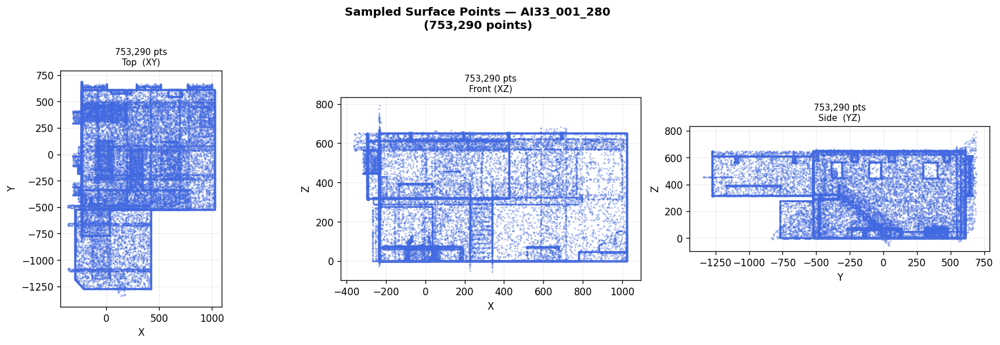

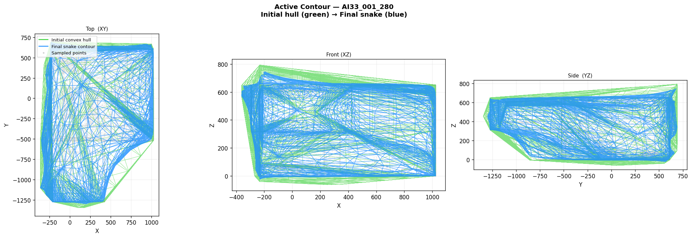

### Z-slice cross-sections

Complex non-convex scene — snake captures the main floor plan including staircase
recess on the left side.

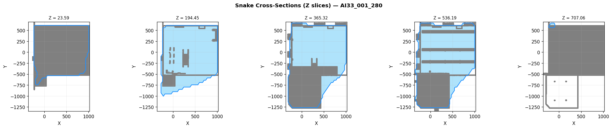

### Convergence

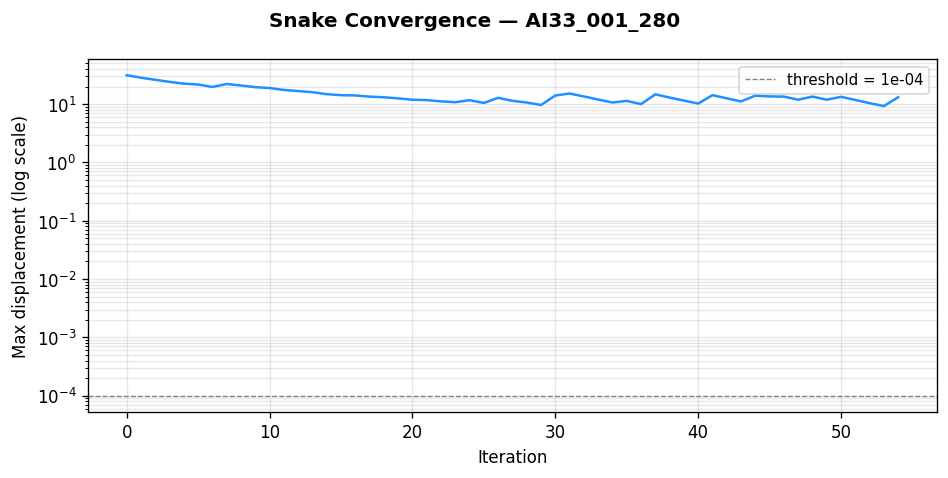

### Blender overlay

| View | Result |
|------|--------|
| Top | 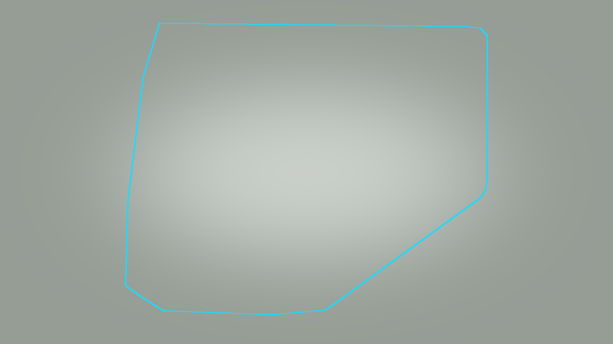 |
| Front | 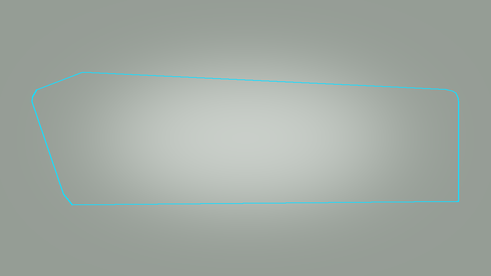 |
| Side | 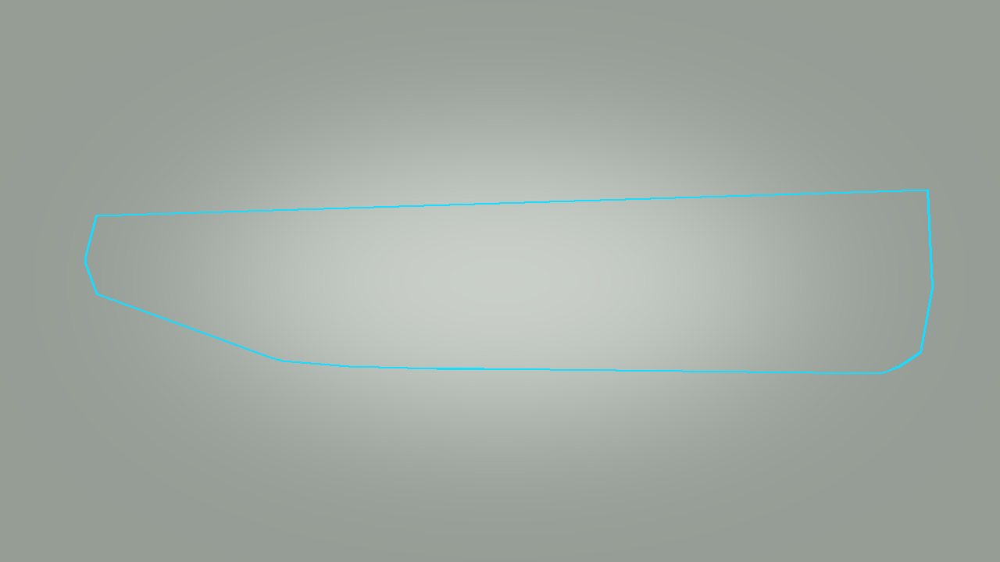 |
| Camera | 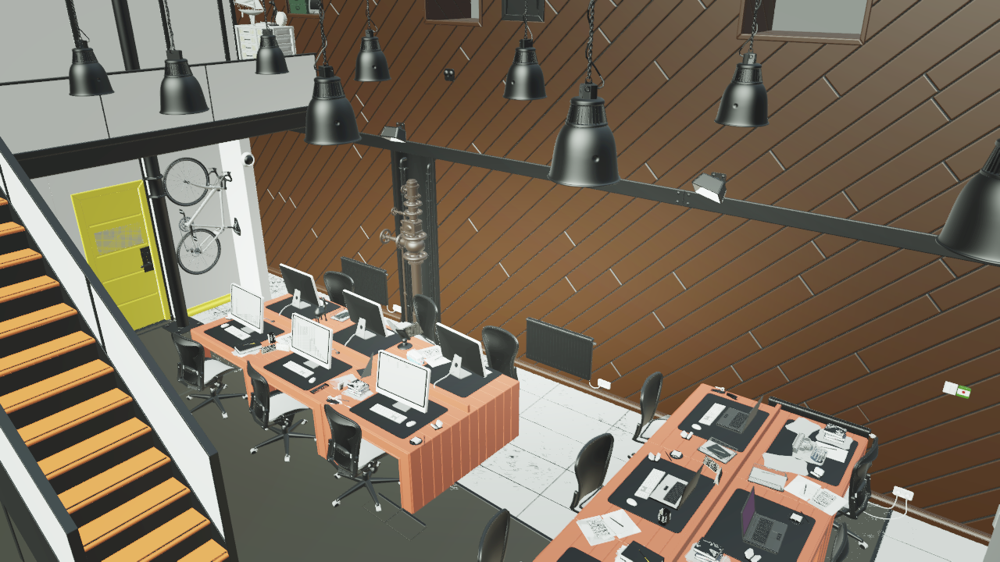 |

Top view clearly shows the non-rectangular footprint of the restaurant floor plan.

---

## 6. Alpha/Beta Parameter Study

Re-run on both scenes with **high α=0.85, high β=0.70** (vs default α=0.7, β=0.25).

| | Default (α=0.7, β=0.25) | High (α=0.85, β=0.70) |
|-|------------------------|----------------------|
| Bedroom iterations | 114 | 67 |
| AI33 iterations | 55 | 74 |
| Bedroom fit time | ~12s | 0.4s |
| AI33 fit time | 1.6s | 1.5s |

**Interpretation**: High α + high β creates competing forces — smoothness resists
bending while attraction pulls toward surface detail. The snake converges faster
(fewer iterations) because the two strong forces reach equilibrium quickly. The
resulting surface sits between the two extremes: tighter than high-α-only, smoother
than high-β-only.

---

## 7. VoxelGrid — Target-N Constrained Voxels

`genesis_tools/active_contour/voxel_grid.py` generates a regular 3D grid of voxel
centres, all guaranteed inside the snake contour, with approximately `target_voxels`
cells.

### Algorithm

```
1. Coarse pre-pass (20³ = 8000 points):
   fill_ratio = inside_count / 8000
   snake_volume = AABB_volume × fill_ratio

2. Derive voxel size:
   voxel_size = (snake_volume / target_voxels)^(1/3)

3. Full grid:
   generate all AABB voxel centres at voxel_size spacing
   test each centre with batched (N×F) ray casting
   keep only inside voxels
```

**Why not divergence theorem?** ConvexHull simplices from scipy are not guaranteed
to be consistently outward-wound; partial sign cancellation in the divergence sum
gives volumes 20–25× too small. The coarse-grid fill-ratio estimate is always correct.

**Batched ray casting**: (N_chunk × F_faces) Möller–Trumbore in numpy — processes
2048 points × all faces per batch, memory ~50 MB per batch.

### Results

| Scene | Target | Actual | Accuracy | voxel_size | Grid shape | Time |
|-------|--------|--------|----------|-----------|-----------|------|
| Bedroom | 15,000 | 14,274 | 95.2% | 0.245 m | 25×34×18 | 24.5s |
| AI33 | 15,000 | 13,267 | 88.4% | 45.7 units | 30×43×17 | 58.4s |

### Usage

```python
from genesis_tools.active_contour.snake_3d import Snake3D
from genesis_tools.active_contour.voxel_grid import VoxelGrid

snake = Snake3D(pts, alpha=0.7, beta=0.25).fit()
grid  = VoxelGrid(snake, target_voxels=15_000)

print(grid.count)       # actual count inside contour
print(grid.voxel_size)  # derived edge length
grid.save("voxels.npz") # centers (K,3) + metadata
```

---

## 8. File Structure

```
genesis_tools/active_contour/
├── snake_3d.py               — Snake3D class, sample_mesh_surface, subdivide_mesh
├── voxel_grid.py             — VoxelGrid class (target-N constrained)
├── fit_scene_contour.py      — end-to-end pipeline (extract → fit → visualise)
├── extract_scene_meshes.py   — Blender subprocess: export world-space triangles
├── overlay_snake_in_blend.py — Blender subprocess: render + hull overlay
├── visualize.py              — standalone algorithm figures (no Blender)
└── tests/
    └── test_active_contour.py
```

### Key outputs (per scene)

```
results/active_contour/{scene}/
├── meshes.npz                      — extracted world-space mesh triangles
├── snake_mesh.npz                  — fitted snake {vertices, faces}
├── voxel_grid.npz                  — voxel centres {centers, voxel_size, ...}
├── {scene}_with_contour.blend      — original scene + snake mesh object
├── figure_1_pointcloud.png
├── figure_2_contour.png
├── figure_3_slices.png
├── figure_4_convergence.png
└── renders/                        — view_top/front/side/camera with hull overlay
```

---

## 9. Known Issues / Limitations

- **Voxel accuracy ~88–95%**: fill-ratio pre-pass uses 20³ = 8000 samples. Increasing
  `coarse_n` to 30 (27k samples) improves accuracy at the cost of ~3× longer pre-pass.

- **VoxelGrid runtime**: 24–58s for 15k target. Bottleneck is the batched contains test
  (3 rays × all faces × all candidates). Can be reduced by increasing `chunk_size`
  (trades memory for speed) or by reducing target.

- **ConvexHull winding**: divergence theorem cannot be used for snake volume because
  scipy's ConvexHull simplices are not consistently outward-wound after remapping
  through `hull.vertices`. Fix: always use the fill-ratio pre-pass.

- **Camera inside snake**: for indoor scenes, the 2D hull overlay on the camera view
  projects to the full frame boundary (snake wraps around camera). This is correct
  but provides no visible boundary in the rendered image.
