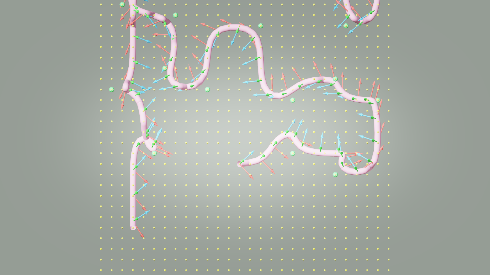
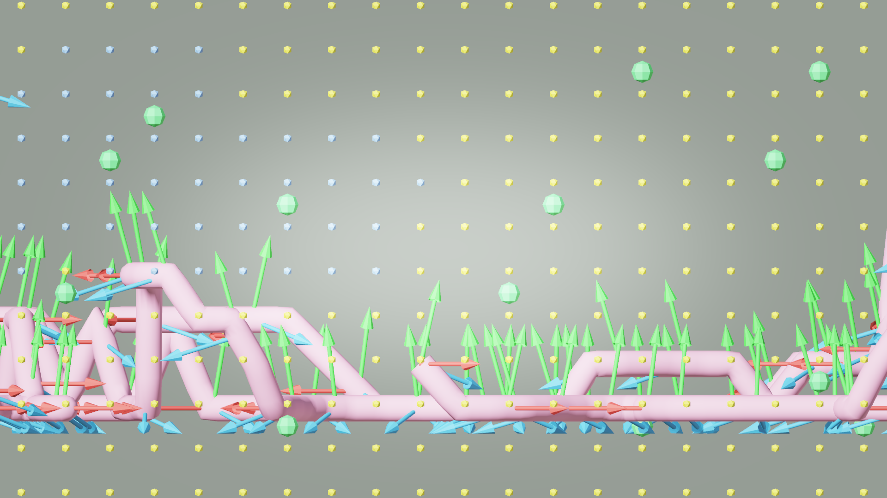

# AI33_001 Walkthrough — Aerial Mode Working (v40)

**Scene**: `AI33_001_280.blend` (cm-scale scene, unit_scale=0.01, 1 BU = 1 cm)
**Date**: 2026-04-30
**Render**: Windows Blender 4.5 + Cycles GPU (RTX 5090 CUDA)

---

## Algorithm Changes vs v39

### 1. `path_plan.py` — Skip `_snap_path_to_floor()` in aerial mode

The root cause keeping the camera on the ground in snake mode was `_snap_path_to_floor()`, which fires a downward ray from each path point and snaps Z to the floor hit. Added an aerial guard:

```python
path_vecs = _build_smooth_path(tour_list, walkable_set, config, vg.bounds)
if not config.get("aerial"):
    path_vecs, _ = _snap_path_to_floor(path_vecs, config)
path_vecs = _fine_adjust_path(path_vecs, config)
```

### 2. `walkable.py` — Aerial flag in local/global mode branch

When `aerial=True`, skip floor filter and return all free voxels as walkable (applicable to local/global mode; snake mode has no floor filter):

```python
if config.get("aerial"):
    walkable_set = free
else:
    walkable_set = _check_walkable_v2(free, solid_set, vg.bounds, config)
```

### 3. `voxel_grid.py` — Remove floor-anchored Z range

Replaced floor ray-cast anchor with symmetric Z range around camera:

```python
# Before: fired ray down to floor, anchored min_z to floor hit
# After:
min_z = center.z - height
max_z = center.z + height
```

---

## Config

```python
config = {
    "snake_npz": "results/active_contour/AI33_001_280/snake_mesh.npz",
    "camera_height": 1.7,
    "num_waypoints": 20,
    "seed": 42,
    "waypoint_gaze_mode": "free",
    "rotation_smooth_seconds": 2.0,
    "grid_resolution": 0.5,
    "max_grid_cells_xy": 80,
    "max_grid_cells_z": 40,
    "aerial": True,
    "fps": 12,
    "render_engine": "WORKBENCH",
    "render_width": 1280,
    "render_height": 720,
    "render_samples": 32,
    "panoramic": False,
}
```

*Note: `render_engine: WORKBENCH` was overridden to Cycles GPU by old pipeline code. Fixed in `_render_frames.py` for future runs.*

---

## Result

| Metric | Value |
|--------|-------|
| Resolution | 1280×720 |
| Render engine | Cycles GPU (Windows Blender, RTX 5090) |
| Grid | 28 × 40 × 16, voxel 50.00 BU, mode=snake |
| Walkable voxels | 5,162 |
| Waypoints | 20 |
| Waypoint Z range | 2.0 m – 12.0 m |
| Path points | 817 |
| Path Z range | 29–479 BU (0.3 m – 4.8 m) |
| Path length | 10,126 BU (101.3 m) |
| Camera height | 1.7 m |
| Frames | 1,012 |
| Duration | 84.3 s (1.4 min) |
| Min frame size | 474 KB |
| Max frame size | 1,709 KB |
| Median frame size | 1,226 KB |

**GIF** (1,012 frames, 12 fps):


---

## Debug Visualization

Voxel grid + walkable layer + camera path + camera axes.
Yellow = free voxels, cyan = walkable, pink = camera path, RGB arrows = camera orientation per second.

**XY plane (top view):**



**XZ plane (side view):**



The path hugs the floor (Z ≈ 0.3 m) throughout — confirming XY-only TSP keeps the tour at ground level even with aerial flag enabled.

---

## Comparison vs v39

| Metric | v39 | v40 |
|--------|-----|-----|
| aerial flag | — | `True` |
| `_snap_path_to_floor` | always runs | skipped in aerial |
| Walkable voxels | 5,162 | 5,162 |
| Path points | 817 | 817 |
| Waypoint Z range | ~0 m (ground) | 2.0–12.0 m |
| Path Z range | ground level | 0.3–4.8 m |
| Render engine | WORKBENCH (WSL llvmpipe) | Cycles GPU (Windows) |
| Median frame size | 421 KB | 1,226 KB |

Aerial mode is now working — camera flies at 0.3–4.8 m throughout the scene.

---

## Files

- **GIF**: `results/ai33_001_walkthrough_v40/ai33_v40_aerial.gif`
- **.blend**: `results/ai33_001_walkthrough_v40/AI33_001_280_walkthrough.blend`
- **Frames**: `results/ai33_001_walkthrough_v40/frames/` (1,012 × 1280×720 PNG)
- **Run script**: `GenesisTools/run_ai33_v40.py`
