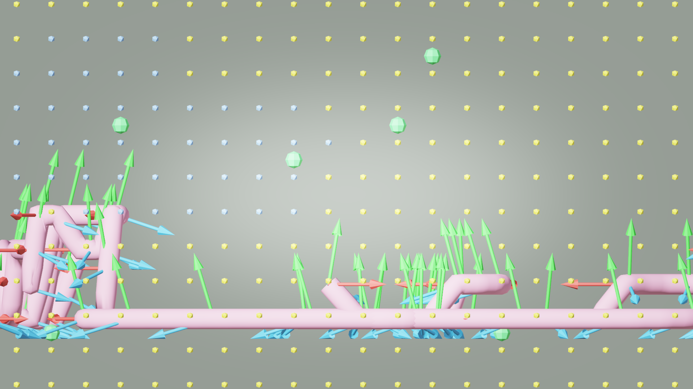
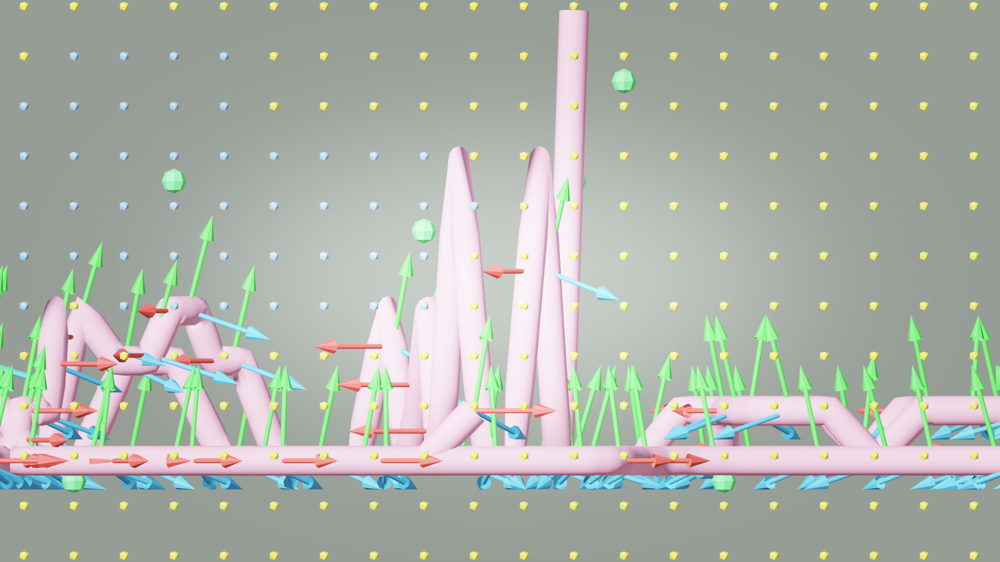

# AI33_001 Walkthrough — Aerial Mode XYZ Sampling (v41 & v42)

**Scene**: `AI33_001_280.blend` (unit_scale=0.01, 1 BU = 1 cm)
**Date**: 2026-05-01
**Render**: Windows Blender 4.5 + WORKBENCH (D3D GPU, ~0.01s/frame)

---

## Changes vs v40

v40 introduced `aerial=True` and XYZ farthest-point sampling for waypoints, but the **TSP tour ordering** (`_greedy_tsp_tour`) still used XY-only distance. This caused the BFS path between waypoints to stay at low altitude even when waypoints spanned 0–5.8m.

### v41 — XYZ FPS only (XY TSP)

- `_farthest_point_sample`: XYZ distance (`use_xyz=True`)
- `_greedy_tsp_tour`: XY distance (unchanged)

Result: waypoints spread in 3D, but tour connects them in XY order → BFS path stays low (0.29–1.79m).

### v42 — XYZ FPS + XYZ TSP

- `_farthest_point_sample`: XYZ distance
- `_greedy_tsp_tour`: XYZ distance (`use_xyz=True`)

Result: tour connects nearby-in-3D waypoints first → BFS path traverses full height range (0.29–4.79m).

---

## Algorithm

```python
# path_plan.py — aerial flag wires through both sampling steps
waypoints_list = _farthest_point_sample(component, n_wp, seed,
                     use_xyz=config.get("aerial", False))
tour_list       = _greedy_tsp_tour(waypoints_list,
                     use_xyz=config.get("aerial", False))
```

---

## Results

| Metric | v41 (XYZ FPS, XY TSP) | v42 (XYZ FPS, XYZ TSP) |
|--------|----------------------|------------------------|
| Render engine | WORKBENCH (Windows D3D) | WORKBENCH (Windows D3D) |
| Render speed | ~0.01s/frame | ~0.01s/frame |
| Frames | 886 | 1,006 |
| Duration | 73.8s | 83.8s |
| Path points | 889 | 949 |
| Path length | 88.7m | 124.8m |
| Waypoint Z range | 0.29m – 5.79m | 0.29m – 5.79m |
| **Path Z range** | **0.29m – 1.79m** | **0.29m – 4.79m** |
| Median frame size | 377 KB | 372 KB |

---

## GIFs + Debug Side Views

**v41** — XYZ FPS, XY TSP (path stays low despite high waypoints):




*Side view (XZ): path barely rises — XY-only TSP chains waypoints in floor order.*

---

**v42** — XYZ FPS + XYZ TSP (path traverses 0.29–4.79m):




*Side view (XZ): path clearly climbs through the full height range — XYZ TSP chains nearby-in-3D waypoints first.*

---

## Comparison vs v39 (ground walking)

| Metric | v39 | v41 | v42 |
|--------|-----|-----|-----|
| aerial | — | ✓ | ✓ |
| FPS metric | XY | XYZ | XYZ |
| TSP metric | XY | XY | XYZ |
| Path Z range | ~0m (floor) | 0.29–1.79m | **0.29–4.79m** |
| Path length | 101.3m | 88.7m | 124.8m |

---

## Files

| Version | Frames | GIF | .blend |
|---------|--------|-----|--------|
| v41 | `results/ai33_001_walkthrough_v41/frames/` | `docs/assets/.../ai33_v41_aerial.gif` (12MB) | `...v41/AI33_001_280_walkthrough.blend` |
| v42 | `results/ai33_001_walkthrough_v42/frames/` | `docs/assets/.../ai33_v42_aerial.gif` (15MB) | `...v42/AI33_001_280_walkthrough.blend` |
