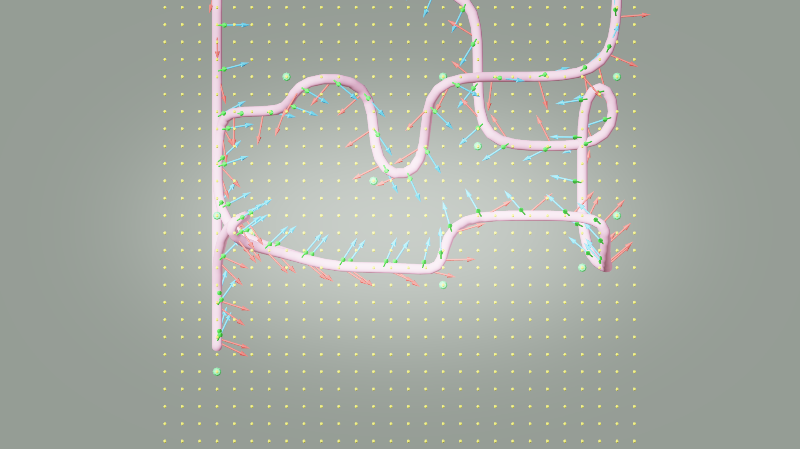
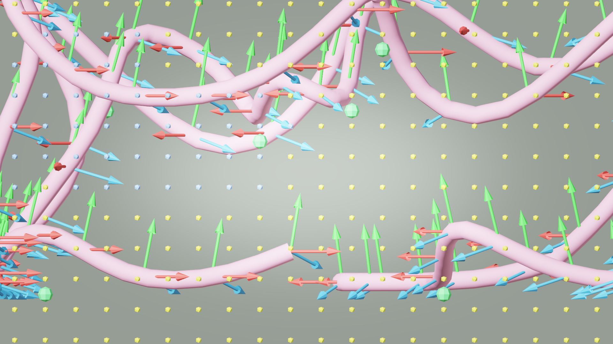

# AI33_001 Walkthrough — v43: Fixed Laplacian Smoothing (XYZ)

**Scene**: `AI33_001_280.blend` (unit_scale=0.01, 1 BU = 1 cm)
**Date**: 2026-05-01
**Render**: Windows Blender 4.5 + WORKBENCH (D3D GPU, ~0.01s/frame)

---

## Change vs v42

v42 had a bug in `_build_smooth_path`: Laplacian smoothing averaged XY but **snapped Z to the lowest walkable voxel floor on every iteration**.

```python
# v42 — BUGGY
sx = (points[i-1][0]+points[i][0]+points[i+1][0])/3.0
sy = (points[i-1][1]+points[i][1]+points[i+1][1])/3.0
ix = int((sx-min_x)/res); iy = int((sy-min_y)/res)
if (ix, iy) in walkable_xy:
    sz = min_z + walkable_xy[(ix,iy)] * res   # floor snap every iteration
    candidate = [sx, sy, sz]
```

This caused Z to collapse to the floor after just a few iterations, while XY smoothed normally. Result: path had near-zero Z variation in XY-smoothed segments, but sudden 37.5 BU Z jumps at waypoints — visible as camera teleport spikes in the rendered video.

### Fix

```python
# v43 — FIXED
sx = (points[i-1][0]+points[i][0]+points[i+1][0])/3.0
sy = (points[i-1][1]+points[i][1]+points[i+1][1])/3.0
sz = (points[i-1][2]+points[i][2]+points[i+1][2])/3.0   # Z also averaged
ix = int((sx-min_x)/res); iy = int((sy-min_y)/res)
if (ix, iy) in walkable_xy:
    candidate = [sx, sy, sz]   # no floor snap
```

`walkable_xy` is kept for XY reachability checks only. Z is now a free coordinate in the smoothed path, controlled solely by the BFS tour and Laplacian averaging.

---

## Segment Length Distribution

| Metric | v42 (XY Laplacian, Z floor-snap) | v43 (XYZ Laplacian) |
|--------|----------------------------------|----------------------|
| min segment (BU) | 0.12 | 3.04 |
| max segment (BU) | 39.53 | 17.14 |
| **max/min ratio** | **330×** | **5.6×** |
| dZ max (BU) | 37.5 | 12.5 |
| Segments > 20 BU | many | **0** |

The 330× ratio in v42 directly caused camera speed spikes: the camera traverses a 39.53 BU segment in the same number of frames as a 0.12 BU segment (index-based sampling), producing a 330× speed difference.

---

## Results

| Metric | v42 (buggy Laplacian) | v43 (fixed Laplacian) |
|--------|----------------------|----------------------|
| Render engine | WORKBENCH (D3D) | WORKBENCH (D3D) |
| Render speed | ~0.01s/frame | ~0.01s/frame |
| Frames | 1,006 | **1,078** |
| Duration | 83.8s | **89.8s** |
| Path points | 949 | 949 |
| Path length | 124.8m | **107.8m** |
| Waypoint Z range | 0.29m – 5.79m | 0.29m – 5.79m |
| Path Z range | 0.29m – 4.79m | **0.29m – 5.07m** |
| Median frame size | 372 KB | ~370 KB |

---

## GIF


---

## Debug Visualization

**XY plane (top view):**



**XZ plane (side view):**



*Side view (XZ): path climbs smoothly through full Z range. No sharp floor-snap spikes.*

---

## Comparison: v41 → v42 → v43

| Metric | v41 | v42 | v43 |
|--------|-----|-----|-----|
| FPS metric | XYZ | XYZ | XYZ |
| TSP metric | XY | XYZ | XYZ |
| Laplacian Z | floor-snap | floor-snap | **XYZ average** |
| Path Z range | 0.29–1.79m | 0.29–4.79m | **0.29–5.07m** |
| Seg ratio max/min | — | 330× | **5.6×** |
| Camera speed uniform | no | no | **yes** |

---

## Files

| Item | Path |
|------|------|
| GIF | `docs/assets/ai33_001_walkthrough_v43/ai33_v43_aerial.gif` |
| Debug top | `docs/assets/ai33_001_walkthrough_v43/debug_top.png` |
| Debug side | `docs/assets/ai33_001_walkthrough_v43/debug_side.png` |
| Frames | `results/ai33_001_walkthrough_v43/frames/` (1,078 × 1280×720 PNG) |
| .blend | `results/ai33_001_walkthrough_v43/AI33_001_280_walkthrough.blend` |
| Run script | `run_ai33_v43.py` |
