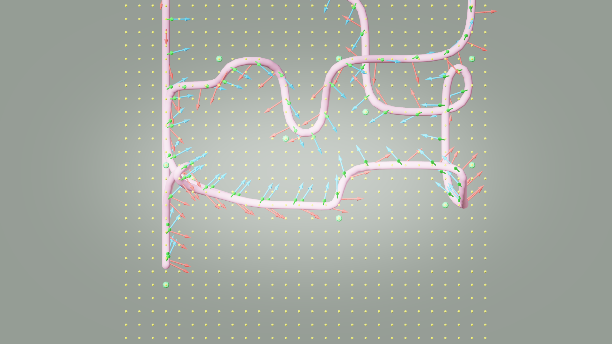
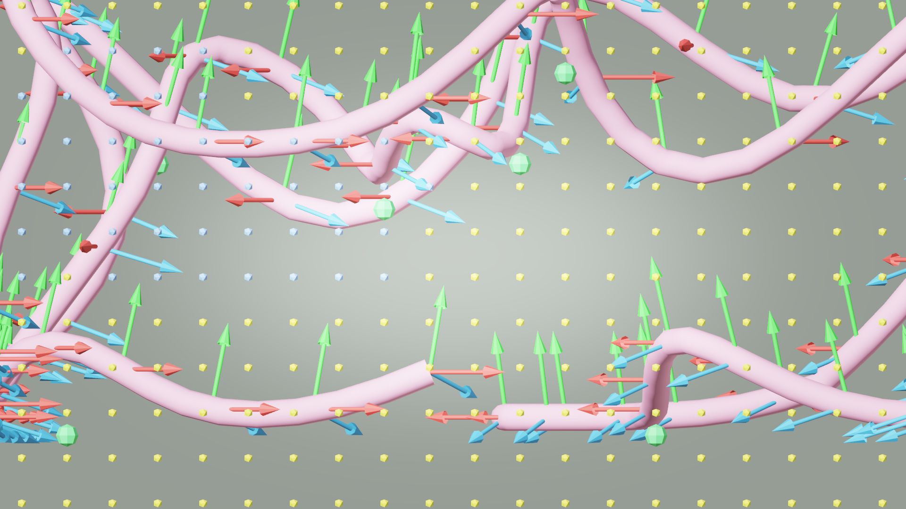

# AI33_001 Walkthrough — v44: XYZ Laplacian Smoothing Fix

**Scene**: `AI33_001_280.blend` (unit_scale=0.01, 1 BU = 1 cm)
**Date**: 2026-05-01
**Render**: Windows Blender 4.5 + WORKBENCH (D3D GPU, ~0.01s/frame)

---

## 问题背景

在 aerial 模式下（摄像机在空间中自由飞行），v42 渲染出现明显的**摄像机瞬间跳跃**：在大部分帧里摄像机运动平稳，但偶尔会在一帧内发生大幅度的垂直位移，视觉上像是"传送"。

根本原因在 `path_plan.py` 的 Laplacian smoothing 函数 `_build_smooth_path` 里。

---

## Laplacian Smoothing 原理

Laplacian smoothing 是一种路径平滑算法。基本思路是对路径上的每个点，用它与相邻两个点的平均值来替代当前点，重复若干次迭代。

```
对于路径中第 i 个点：
    new_point[i] = (point[i-1] + point[i] + point[i+1]) / 3
```

每次迭代后路径整体变得更平滑，尖锐的转弯被消除。这里用了 5 次迭代，并配合 LOS（视线检测）确保平滑后的路径仍在可行走空间内。

---

## Bug：Z 轴被强制贴回地面

v42 的实现只对 XY 做了平均，**Z 轴在每次迭代后直接 snap 到地面**：

```python
# v42 — BUG
for _ in range(5):      # 5 次迭代
    for i in range(1, len(points) - 1):
        sx = (points[i-1][0] + points[i][0] + points[i+1][0]) / 3.0
        sy = (points[i-1][1] + points[i][1] + points[i+1][1]) / 3.0
        ix = int((sx - min_x) / res)
        iy = int((sy - min_y) / res)
        if (ix, iy) in walkable_xy:
            sz = min_z + walkable_xy[(ix, iy)] * res   # ← Z 强制贴回地面
            candidate = [sx, sy, sz]
```

`walkable_xy` 存储的是每个 XY 格子中**最低的**可行走 voxel 的 Z 坐标。每次迭代 Z 都被拉回到地面高度，导致：

1. XY 方向经过 5 次平均后非常平滑，相邻点距离很小（近似连续）
2. Z 方向每次迭代都 snap 到地面，但 BFS 路径的 waypoint 在空中，所以到了 waypoint 附近 Z 会突然跳到空中高度
3. 结果：路径上出现**极短的 XY 段配极大的 Z 跳跃**，segment 长度差异达 115×

---

## Fix：Z 轴同样做 Laplacian 平均

```python
# v44 — 修复后
for _ in range(5):      # 5 次迭代
    for i in range(1, len(points) - 1):
        sx = (points[i-1][0] + points[i][0] + points[i+1][0]) / 3.0
        sy = (points[i-1][1] + points[i][1] + points[i+1][1]) / 3.0
        sz = (points[i-1][2] + points[i][2] + points[i+1][2]) / 3.0   # ← Z 也做平均
        ix = int((sx - min_x) / res)
        iy = int((sy - min_y) / res)
        if (ix, iy) in walkable_xy:
            candidate = [sx, sy, sz]   # 不再 snap Z
```

`walkable_xy` 保留用途：只做 XY 可达性检查，不再控制 Z 坐标。Z 现在和 XY 一样，通过 Laplacian 平均平滑地从一个值过渡到另一个值。

---

## 效果对比

### 路径 segment 长度分布

segment 长度的均匀程度直接决定摄像机速度是否稳定。路径采用 index-based 采样，每帧前进一个 index，所以 segment 越不均匀，速度越不稳定。

| 指标 | v42（Z snap，有 bug）| v44（XYZ 平均，修复后）|
|------|---------------------|----------------------|
| 最短 segment (BU) | 0.98 | 3.04 |
| 最长 segment (BU) | 112.90 | 17.14 |
| **最长/最短比** | **115×** | **5.6×** |
| dZ 最大值 (BU) | 112.50 | 12.50 |
| dZ 最大值 (m) | 1.13m | 0.13m |
| Segment > 20 BU 数量 | 多 | **0** |

### 路径整体指标

| 指标 | v42 | v44 |
|------|-----|-----|
| Path points | 949 | 949 |
| Path length | 124.8m | **107.8m** |
| Path Z range | 0.29–4.79m | **0.29–5.07m** |
| Frames | 1,006 | **1,078** |
| Duration | 83.8s | **89.8s** |

---

## 结果

### GIF（1,078 帧，12 fps）


---

### Debug Visualization

**XY 俯视（top view）：**



**XZ 侧视（side view）：**



*侧视图（XZ）：路径在高度方向平滑起伏，覆盖 0.29–5.07m 全范围，无 snap 造成的尖锐跳跃。*

---

## 版本演进总结

| 版本 | FPS 采样 | TSP 排序 | Laplacian Z | Path Z range | Seg 比 |
|------|----------|----------|-------------|-------------|--------|
| v39 | XY | XY | floor snap | ~0m | — |
| v40 | XY | XY | floor snap | 0.3–4.8m | — |
| v41 | **XYZ** | XY | floor snap | 0.29–1.79m | — |
| v42 | XYZ | **XYZ** | floor snap | 0.29–4.79m | 115× |
| **v44** | XYZ | XYZ | **XYZ avg** | **0.29–5.07m** | **5.6×** |

---

## 文件

| 内容 | 路径 |
|------|------|
| GIF | `docs/assets/ai33_001_walkthrough_v44/ai33_v44_aerial.gif` |
| Debug top | `docs/assets/ai33_001_walkthrough_v44/debug_top.png` |
| Debug side | `docs/assets/ai33_001_walkthrough_v44/debug_side.png` |
| Frames | `results/ai33_001_walkthrough_v44/frames/` (1,078 × 1280×720 PNG) |
| .blend | `results/ai33_001_walkthrough_v44/AI33_001_280_walkthrough.blend` |
| Run script | `run_ai33_v44.py` |
