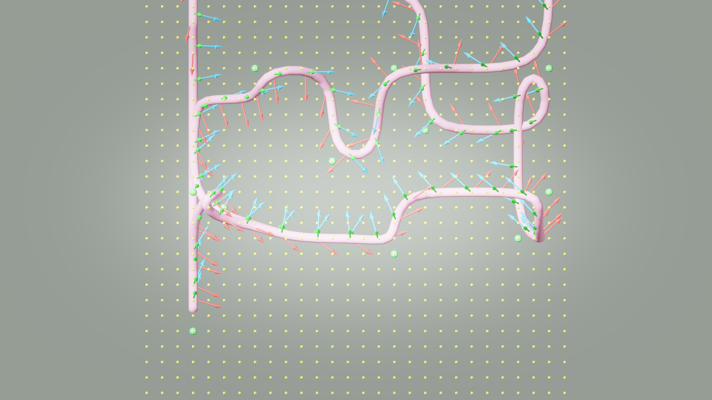
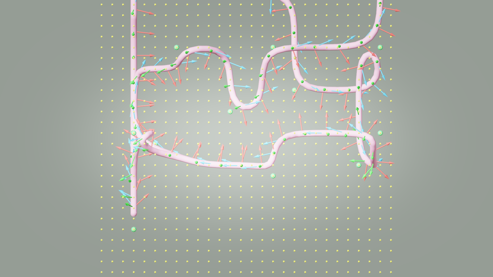
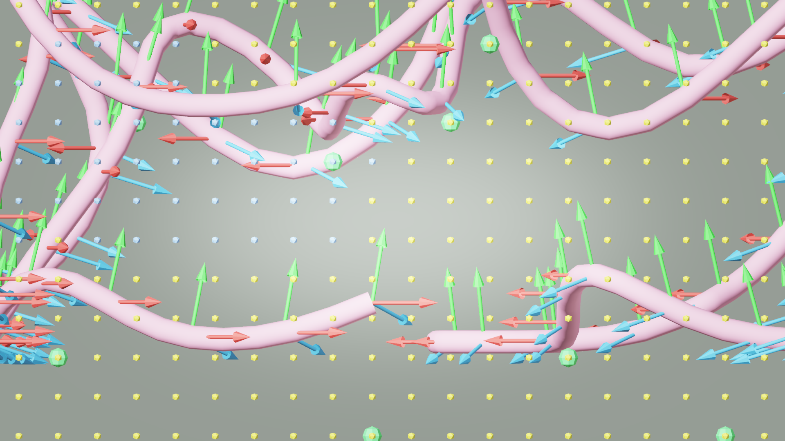
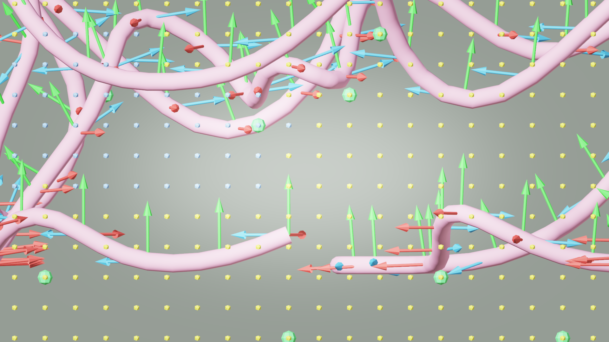

# AI33_001 Walkthrough — v46 & v47: Arc-Length Sampling + Gaze Mode Comparison

**Scene**: `AI33_001_280.blend` (unit_scale=0.01, 1 BU = 1 cm)
**Date**: 2026-05-02
**Render**: Windows Blender 4.5 + WORKBENCH (D3D GPU, ~0.01s/frame)

---

## Changes vs v45

### 1. Arc-Length Path Sampling

v45 以前 `_sample_path` 用 index-based 采样：

```python
# 之前 — index 均匀
idx = t * (len(path_vecs) - 1)
```

这导致摄像机速度正比于 path_point 密度，而不是实际空间距离。Laplacian 平滑之后段长差异即使缩到 5.6×，仍会造成明显的速度波动。

v46/v47 改为 arc-length 二分查找：

```python
# 现在 — arc-length 均匀
arc_lengths = [0, seg1, seg1+seg2, ...]   # 累计弧长预计算
target = t * total_arc
# 二分查找 lo/hi，在 [lo, hi] 段内线性插值
```

同时 `camera_orient.py` 里 waypoint 的 `t` 值也从 `index / n_pp` 改为 `arc_len[idx] / total_arc`，确保方向 slerp 和位置采样用同一套参数化。

### 2. `waypoint_gaze_mode` 配置接通

之前这个 config 项被读取但从未使用（dead code）。现在：

| 值 | 行为 |
|----|------|
| `"waypoint"` | 对每个 waypoint 计算"所有可见未来 waypoint 的平均方向"，沿路径 slerp |
| `"lookahead"` | 沿行进方向前看 `lookahead_fraction`（默认 5% 弧长）处 |

---

## 对比：v46 (waypoint) vs v47 (lookahead)

### GIF

**v46 — waypoint gaze mode:**


**v47 — lookahead mode:**


---

### Debug Visualization（路径相同，摄像机朝向不同）

v46 和 v47 使用完全相同的路径（path.npz），只有摄像机朝向不同。

**XY 俯视 (top view) — v46:**



**XY 俯视 (top view) — v47:**



**XZ 侧视 (side view) — v46:**



**XZ 侧视 (side view) — v47:**



---

### 帧对比

| 帧 | v46 (waypoint) | v47 (lookahead) |
|----|---------------|-----------------|
| frame 1 | 看向沙发区，场景丰富 | 看向墙面设备 |
| frame 300 | 看向门廊/柱 | 看向天花板/天窗 |
| frame 600 | 俯看办公桌区 | **几乎全灰** — 路径爬坡时 look direction 朝天 |

---

## 发现的问题

### lookahead 在 aerial 模式下仰望天空

lookahead 的 look target 计算：

```python
floor_ahead = _sample_path(t + lookahead_fraction)
look_target = cam_pos + (floor_ahead - path_pt)   # 3D 方向，包含 Z 分量
```

`floor_ahead - path_pt` 是路径的 3D 方向向量。aerial 模式下路径有垂直分量，当路径在爬坡时这个方向朝上，摄像机就对着天空。

**修复方向**：将 look direction 投影到水平面后再用。

```python
look_dir = floor_ahead - path_pt
look_dir.z = 0.0   # 强制水平
look_target = cam_pos + look_dir.normalized() * some_dist
```

### waypoint 模式距离无关的平均方向

见 v44 result 文档中的分析。

---

## 结果指标

| 指标 | v46 | v47 |
|------|-----|-----|
| gaze mode | waypoint | lookahead |
| arc-length sampling | ✓ | ✓ |
| Frames | 1,078 | 1,078 |
| Path | 同 v45 | 同 v45 |
| lookahead_fraction | — | 0.05 |

---

## 文件

| 内容 | v46 | v47 |
|------|-----|-----|
| GIF | `docs/assets/ai33_001_walkthrough_v46/ai33_v46_aerial.gif` | `docs/assets/ai33_001_walkthrough_v47/ai33_v47_aerial.gif` |
| Debug top | `docs/assets/.../debug_top.png` | `docs/assets/.../debug_top.png` |
| Debug side | `docs/assets/.../debug_side.png` | `docs/assets/.../debug_side.png` |
| Run script | `run_ai33_v46.py` | `run_ai33_v47.py` |
