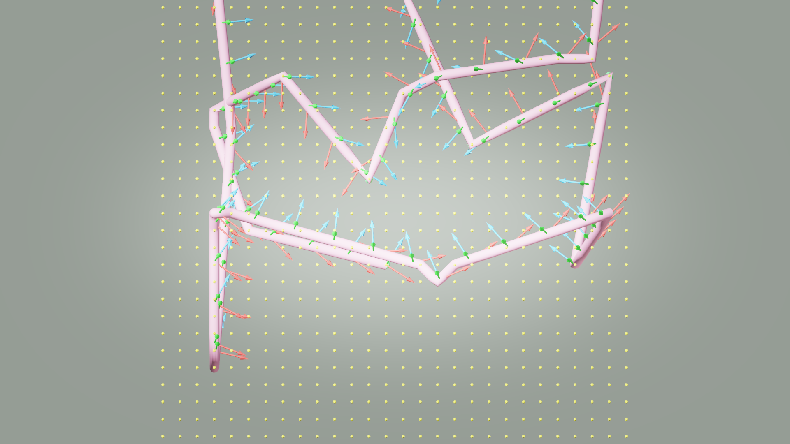
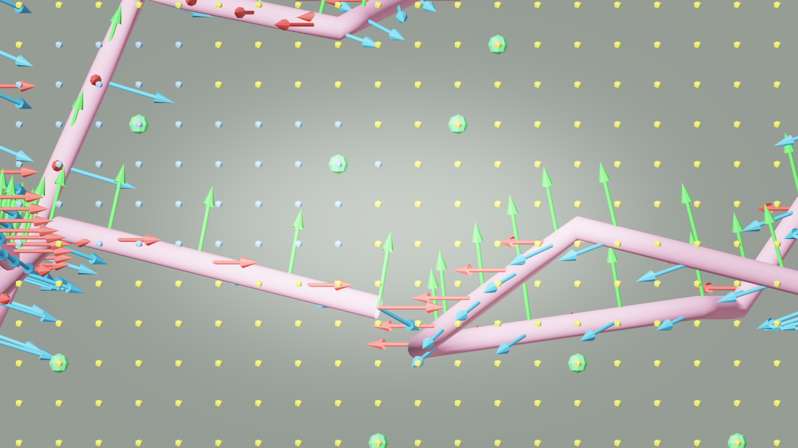

# AI33_001 Walkthrough — v48: Theta* Any-Angle Path Planner

**Scene**: `AI33_001_280.blend` (unit_scale=0.01, 1 BU = 1 cm)
**Date**: 2026-05-02
**Render**: Windows Blender 4.5 + WORKBENCH (D3D GPU, ~0.01s/frame)

---

## 背景：为何切换到 Theta*

v46/v47 的 BFS + Laplacian 方案存在**穿墙问题**：

1. `_build_smooth_path` 在 pip bpy Python 下运行
2. pip bpy 没有加载场景几何体 → `ray_cast` 永远返回无碰撞
3. `_los_clear` 始终返回 True → Laplacian 可以自由平滑，穿过任意墙壁

**修复方案（方案D）**：用 Theta* 完全替换 BFS + Laplacian。Theta* 使用纯 Python 的体素空间 LOS 检查（3D DDA），不依赖 bpy，天然保证墙面安全。

---

## v48 的改动

### 1. `_voxel_los(p0, p1, walkable)`（新增）

3D DDA 直线体素检查：沿 p0→p1 的直线，每隔 L∞ 距离的一步采样一个体素，判断它是否在 walkable 集合中。

```python
steps = max(abs(x1-x0), abs(y1-y0), abs(z1-z0))
for i in range(1, steps):
    t = i / steps
    if (round(x0+t*(x1-x0)), ...) not in walkable:
        return False
return True
```

纯 Python，无 bpy 依赖，在任何 Python 解释器下都能正确判断体素级可见性。

### 2. `_theta_star(start, goal, walkable)`（新增）

Theta* = A*（26-连通体素邻居）+ LOS shortcut：

- `update_vertex`：如果 `_voxel_los(parent(s), neighbor)` 成功，则直接继承 parent 的父节点，绕过中间节点 s
- 启发函数：欧几里得距离
- 如果找不到路径，降级到 BFS

### 3. `build()` 中的分发（修改）

```python
if config.get("path_planner") == "theta_star":
    # 纯 Python，不需要 bpy
    cell_path = _theta_star(tour[i], tour[i+1], walkable_set)  # per segment
    # 4× linear upsample → path_points_arr
else:
    # 原有 BFS + Laplacian（需要 bpy，默认保留）
    ...
```

新增 config key：`"path_planner": "theta_star"`

---

## v48 vs v46 路径对比

| 指标 | v46 (BFS + Laplacian) | v48 (Theta*) |
|------|----------------------|-------------|
| 路径规划 | BFS 走廊 + 5× Laplacian | Theta* (LOS shortcuts) |
| 路径点数 | 949 | 141 |
| 总弧长 | 10782.8 BU | 10662.6 BU |
| 段长 min/mean/max | 3.0 / 11.4 / 17.1 BU | 17.7 / 76.2 / 175.9 BU |
| max/mean 比 | 1.5× | 2.3× |
| \|dZ\| 均值/最大 | 5.1 / 12.5 BU | 25.7 / 137.5 BU |
| 穿墙风险 | 高（LOS broken in pip bpy） | **无**（voxel DDA 保证）|
| 规划用时 | ~几秒（含 Laplacian 迭代） | **0.11s** |

**Theta* 的路径更稀疏**（141 vs 949 点）：36 个体素节点覆盖 19 个 waypoint 段，平均每段约 2 节点，说明大多数段可以直接从 waypoint A 看到 waypoint B（LOS 通畅），Theta* 直接连线而不走 BFS 折线。

**|dZ| 更大**是因为 Theta* 直接连接真实高度变化而不是沿 BFS 阶梯缓慢爬坡。弧长采样保证摄像机匀速，大段不代表速度突变。

---

## GIF

**v48 — Theta* path planner (waypoint gaze mode):**


---

## Debug Visualization

**XY 俯视 (top view) — v48:**



**XZ 侧视 (side view) — v48:**



---

## 结果指标

| 指标 | v46 | v47 | v48 |
|------|-----|-----|-----|
| path_planner | BFS + Laplacian | BFS + Laplacian | **Theta*** |
| gaze mode | waypoint | lookahead | waypoint |
| arc-length sampling | ✓ | ✓ | ✓ |
| 穿墙安全 | ✗ (LOS broken) | ✗ (LOS broken) | **✓** |
| Frames | 1,078 | 1,078 | 1,066 |
| 规划时间 | ~几秒 | ~几秒 | **0.11s** |

---

## 文件

| 内容 | 路径 |
|------|------|
| GIF | `docs/assets/ai33_001_walkthrough_v48/ai33_v48_aerial.gif` |
| Debug top | `docs/assets/ai33_001_walkthrough_v48/debug_top.png` |
| Debug side | `docs/assets/ai33_001_walkthrough_v48/debug_side.png` |
| Run script | `run_ai33_v48.py` |
| Viz script | `run_viz_v48.py` |
