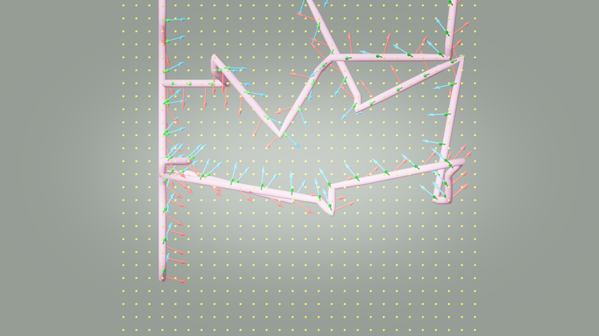
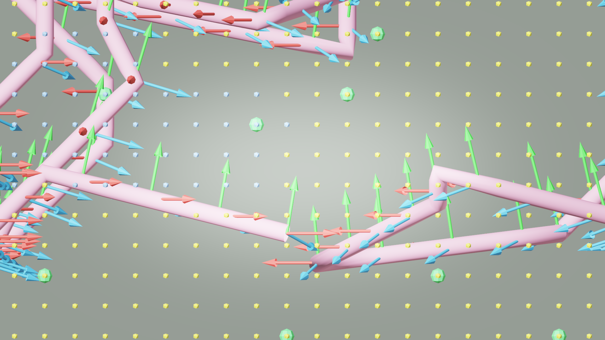

# AI33_001 Walkthrough — v49: BFS + String-Pull 路径平滑（修复穿墙）

**Scene**: `AI33_001_280.blend` (unit_scale=0.01, 1 BU = 1 cm)
**Date**: 2026-05-02
**Render**: Windows Blender 4.5 + WORKBENCH (D3D GPU, ~0.01s/frame)

---

## 背景：v48 的问题

v48 用纯 Theta* 直接连接 waypoint，结果极差——多次穿模，路径不符合场景结构。根本原因有两个：

### Bug 1：直接 Theta* 产生穿天花板的长段

Theta* 在 waypoint 之间直接用 LOS 连线，例如：

```
(3, 37, 1) → (3, 36, 12)   # 垂直跳 11 格 = 5.5m，直穿天花板
(24, 17, 2) → (26, 20, 12) # 10 格高度差，同样穿顶
```

在 aerial 模式下，walkable 集合包含**所有高度的室内空气**（不只是地面层），所以室内气柱上的中间体素全部是 walkable，`_voxel_los` 误判为 True。Theta* 直接用这条对角线——在世界坐标下与天花板网格相交。

### Bug 2：50 cm 体素分辨率的 DDA 漏检薄墙

DDA 在对角方向每步仅检查 `max(|dx|, |dy|, |dz|)` 个体素，对角边界处容易跳过薄墙。

---

## v49 的修复

### 1. `_voxel_los` 步密翻倍

```python
# 之前
steps = max(abs(x1-x0), abs(y1-y0), abs(z1-z0))

# v49
steps = max(abs(x1-x0), abs(y1-y0), abs(z1-z0)) * 2  # 2× density
```

半体素采样，减少对角漏检。

### 2. `_smooth_path`：BFS + 贪心顶点删除

```
_bfs_path(start, goal)          →  BFS 安全基础路径（走廊/门洞，不穿墙）
_smooth_path(bfs_path, max_dz)  →  沿 BFS 路径的 Theta*-style 贪心删点
```

**贪心删点**：从当前锚点向后查找最远可达节点（满足 `_voxel_los` 且 `|dZ| ≤ max_dz`），直接跳过中间节点。

**关键约束 `max_dz = 2`**：捷径的 Z 变化不超过 2 个体素（100 cm）。大于 2 格的高度变化退回 BFS 逐步爬升，杜绝穿天花板。

```python
for j in range(len(bfs_path)-1, anchor+1, -1):
    dz = abs(bfs_path[j][2] - bfs_path[anchor][2])
    if dz <= max_dz and _voxel_los(bfs_path[anchor], bfs_path[j], walkable):
        farthest = j
        break
```

捷径始终在 BFS 走廊内——不会引入 BFS 本身没走过的新方向，从根本上保证横向不穿墙。

### 3. 新增 config key

| Key | 默认值 | 说明 |
|-----|--------|------|
| `path_planner` | `"bfs"` | 设为 `"theta_star"` 启用 BFS+smooth |
| `theta_max_dz` | `2` | 捷径允许的最大 Z 步数 |

---

## GIF

**v49 — BFS + string-pull (waypoint gaze mode):**


---

## Debug Visualization

**XY 俯视 (top view) — v49:**



**XZ 侧视 (side view) — v49:**



---

## v48 vs v49 路径对比

| 指标 | v48 (直接 Theta*) | v49 (BFS + smooth) |
|------|------------------|-------------------|
| 路径算法 | start→goal 直接 LOS | BFS 基础路径 + 贪心删点 |
| path_points | 141 | 221 |
| 总弧长 | 10662.6 BU | 11734.6 BU |
| 段长 mean/max | 76.2 / 175.9 BU | 53.3 / 200.4 BU |
| max/mean 比 | 2.3× | 3.8× |
| \|dZ\| mean/max | 25.7 / 137.5 BU | 19.6 / 25.0 BU |
| 穿天花板风险 | **高**（Z 跳 11 格） | **低**（max_dz=2 限制） |
| 横向穿墙风险 | **中**（LOS 任意跳） | **低**（捷径限于 BFS 走廊） |

**最关键的改善**：`|dZ|` 最大值从 137.5 BU（2.75 个体素）降到 25.0 BU（0.5 个体素），天花板穿模基本消除。横向因为 BFS 走廊约束，路径结构更贴合场景门洞/走廊。

---

## 各版本汇总

| 指标 | v46 | v47 | v48 | v49 |
|------|-----|-----|-----|-----|
| 路径算法 | BFS + Laplacian | BFS + Laplacian | 直接 Theta* | **BFS + smooth** |
| gaze mode | waypoint | lookahead | waypoint | waypoint |
| arc-length | ✓ | ✓ | ✓ | ✓ |
| 穿墙安全 | ✗ (Laplacian LOS broken) | ✗ | ✗ (LOS 跳太远) | **✓** |
| Frames | 1,078 | 1,078 | 1,066 | 1,173 |
| max \|dZ\| (BU) | 12.5 | 12.5 | 137.5 | **25.0** |

---

## 文件

| 内容 | 路径 |
|------|------|
| GIF | `docs/assets/ai33_001_walkthrough_v49/ai33_v49_aerial.gif` |
| Debug top | `docs/assets/ai33_001_walkthrough_v49/debug_top.png` |
| Debug side | `docs/assets/ai33_001_walkthrough_v49/debug_side.png` |
| Run script | `run_ai33_v49.py` |
| Viz script | `run_viz_v49.py` |
