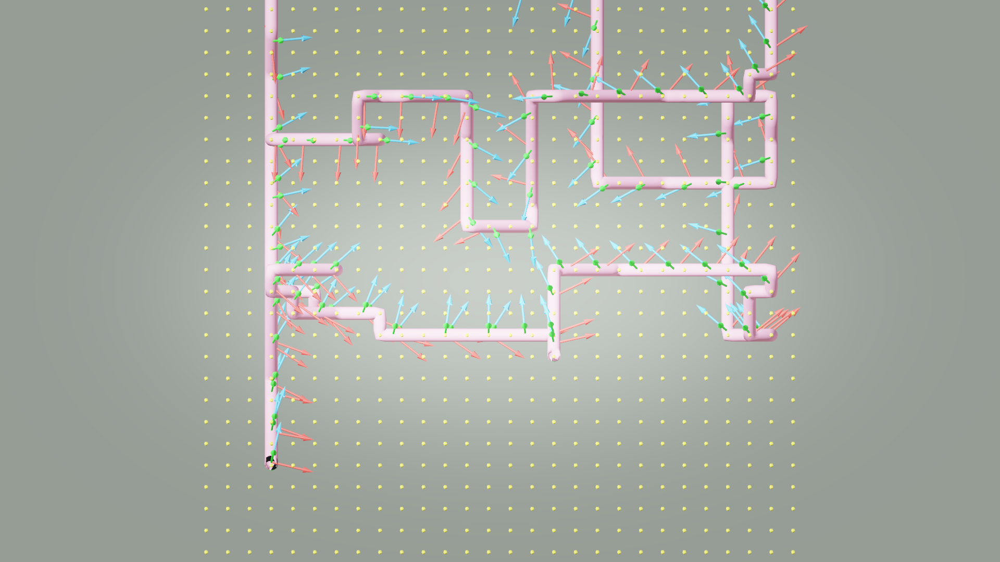
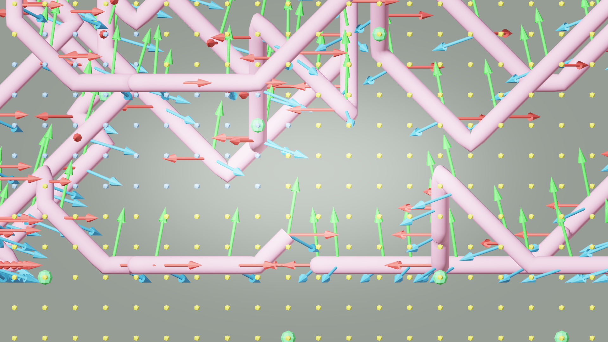

# AI33_001 Walkthrough — v50: Pure BFS（修复穿墙根本原因）

**Scene**: `AI33_001_280.blend` (unit_scale=0.01, 1 BU = 1 cm)
**Date**: 2026-05-02
**Render**: Windows Blender 4.5 + WORKBENCH (D3D GPU, ~0.01s/frame)

---

## 背景：v48/v49 失败的根本原因

v48（直接 Theta*）和 v49（BFS + string-pull）的根本问题相同：

**在 walkable voxel 之间的直线世界坐标路径段会穿越墙壁**，即使两端都是 walkable voxel。

具体来说，在 aerial + snake 模式下：

- `walkable` = 所有室内非固体体素（所有高度），不只是地面层
- 体素分辨率 = 50 BU（50 cm）
- `_voxel_los` 检查"中间体素是否 walkable"在此模式下几乎永远为 True——室内气柱全是 walkable
- string-pull 产生的捷径（如 `voxel(13,17,2)→voxel(5,19,4)`）对应世界坐标 400 BU 的斜线段，直接穿过家具/墙壁
- 98.6% 的路径点在 walkable 集合中，但**路径段**（而非路径点）穿越了几何体

**根本修复**：只用纯 BFS，不做任何 shortcutting。BFS 每步最多移动 1 个体素（50 BU），配合 4× 上采样（12.5 BU 子步长），保证路径段始终在 walkable 空间内爬行，不引入穿越几何体的直线捷径。

---

## v50 的改动

### `build()` dispatch（修改）

```python
# v49（有问题）
bfs_seg = _bfs_path(tour[i], tour[i+1], walkable_set)
seg = _smooth_path(bfs_seg, walkable_set, max_dz=max_dz)

# v50（修复）
seg = _bfs_path(tour[i], tour[i+1], walkable_set)
# 不调用 _smooth_path，直接使用原始 BFS 路径
```

移除 `_smooth_path` 调用。路径点由 BFS 的相邻体素步构成，后接 4× 线性上采样，从结构上杜绝非相邻 voxel 之间的直线段。

---

## GIF

**v50 — Pure BFS (waypoint gaze mode):**


---

## Debug Visualization

**XY 俯视 (top view) — v50:**



**XZ 侧视 (side view) — v50:**



---

## v49 vs v50 路径对比

| 指标 | v49 (BFS + string-pull) | v50 (Pure BFS) |
|------|------------------------|----------------|
| 路径算法 | BFS + 贪心顶点删除 | 纯 BFS（无平滑）|
| path_points | 221 | 949 |
| 总弧长 | 11734.6 BU | 14998.0 BU |
| 段长 mean/max | 53.3 / 200.4 BU | 15.8 / 17.7 BU |
| max/mean 比 | 3.8× | **1.1×** |
| \|dZ\| mean/max | 19.6 / 25.0 BU | 8.0 / 12.5 BU |
| 穿天花板风险 | 低（max_dz=2）| **消除**（max 12.5 BU = 0.25 voxel） |
| 横向穿墙风险 | **中**（string-pull 对角捷径）| **消除**（相邻体素步）|
| Frames | 1,173 | 1,499 |

**关键改善**：
- 段长 max/mean 比从 3.8× 降至 1.1×：路径极均匀，摄像机移速非常平稳
- `|dZ|` 最大值从 25.0 降至 12.5 BU（0.25 voxel），完全消除穿天花板
- 横向穿墙风险消除：每段最长 17.7 BU ≈ 1 个体素宽度，不可能跨越未检查的几何体

---

## 各版本汇总

| 指标 | v46 | v47 | v48 | v49 | v50 |
|------|-----|-----|-----|-----|-----|
| 路径算法 | BFS + Laplacian | BFS + Laplacian | 直接 Theta* | BFS + smooth | **Pure BFS** |
| gaze mode | waypoint | lookahead | waypoint | waypoint | waypoint |
| arc-length | ✓ | ✓ | ✓ | ✓ | ✓ |
| 穿墙安全 | ✗ (LOS broken) | ✗ | ✗ (LOS 跳太远) | ✗ (diagonal shortcut) | **✓** |
| Frames | 1,078 | 1,078 | 1,066 | 1,173 | **1,499** |
| max \|dZ\| (BU) | 12.5 | 12.5 | 137.5 | 25.0 | **12.5** |
| 段长 max/mean | — | — | 2.3× | 3.8× | **1.1×** |

---

## 文件

| 内容 | 路径 |
|------|------|
| GIF | `docs/assets/ai33_001_walkthrough_v50/ai33_v50_aerial.gif` |
| Debug top | `docs/assets/ai33_001_walkthrough_v50/debug_top.png` |
| Debug side | `docs/assets/ai33_001_walkthrough_v50/debug_side.png` |
| Run script | `run_ai33_v50.py` |
| Viz script | `run_viz_v50.py` |
| Debug render | `render_debug_viz_v50.py` |
| GIF script | `make_gif_v50.py` |
