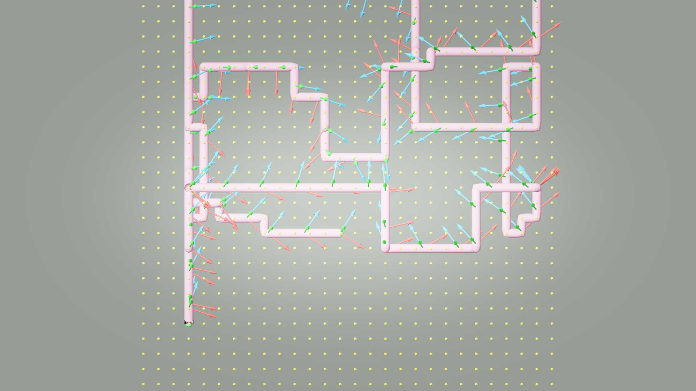
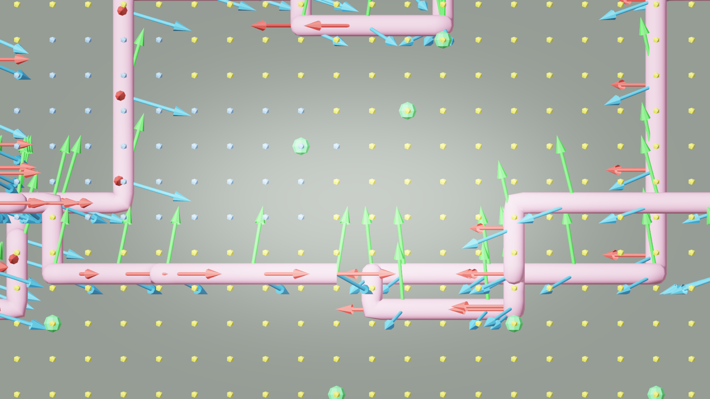

# AI33_001 Walkthrough — v51: BFS 6-连通（消除对角移动）

**Scene**: `AI33_001_280.blend` (unit_scale=0.01, 1 BU = 1 cm)
**Date**: 2026-05-02
**Render**: Windows Blender 4.5 + WORKBENCH (D3D GPU, ~0.01s/frame)

---

## 背景：v50 仍然穿墙的原因

v50 改为纯 BFS 后仍然穿墙，原因在于 BFS 邻居的定义：

```python
# v50（有对角）
for dx, dy in ((1,0),(-1,0),(0,1),(0,-1)):   # 4 XY 方向
    for dz in (-1, 0, 1):                      # 3 Z 偏移
        nb = (cx+dx, cy+dy, cz+dz)             # = 12 个邻居
```

12 个邻居中包含 `dz=±1` 且 `dx 或 dy ≠ 0` 的组合，例如：
- `(cx+1, cy, cz+1)` — XZ 平面对角，世界坐标为 `√(50² + 50²) = 70.7 BU` 斜线段
- 该斜线穿越两个体素的**棱（edge）**，在 50 cm 体素分辨率下无法检测棱处的薄墙

---

## v51 的修复

### 严格 6-连通（仅面相邻）

```python
_FACE_NEIGHBORS = ((1,0,0),(-1,0,0),(0,1,0),(0,-1,0),(0,0,1),(0,0,-1))
```

每步只沿一个坐标轴移动 ±1 体素（±X、±Y 或 ±Z）。世界坐标路径段全部轴对齐，长度恒为 `res = 50 BU`（4× 上采样后 12.5 BU）。

**从几何上保证**：两个面相邻的 walkable 体素之间，不可能存在跨越其共享面的固体墙——若有，其中一个就不会是 walkable。

---

## GIF

**v51 — 6-connected BFS (waypoint gaze mode):**


---

## Debug Visualization

**XY 俯视 (top view) — v51:**



**XZ 侧视 (side view) — v51:**



---

## v50 vs v51 路径对比

| 指标 | v50 (12-connected BFS) | v51 (6-connected BFS) |
|------|----------------------|----------------------|
| 路径算法 | BFS（含对角 XZ 移动）| BFS（仅轴对齐移动）|
| path_points | 949 | 1,125 |
| 总弧长 | 14998.0 BU | 14050.0 BU |
| 段长 mean/max | 15.8 / 17.7 BU | **12.5 / 12.5 BU** |
| max/mean 比 | 1.1× | **1.0×**（完全均匀）|
| \|dZ\| mean/max | 8.0 / 12.5 BU | 3.2 / 12.5 BU |
| 对角路径段数 | 未验证（含） | **0 / 1124** |
| 穿墙风险 | 中（棱处漏检）| **消除** |
| Frames | 1,499 | 1,405 |

**关键指标**：
- 每段精确 **12.5 BU**，max/mean = 1.0×，路径完全均匀
- 对角段数 = **0 / 1124** — 经路径数据验证，无任何对角移动

---

## 各版本汇总

| 指标 | v48 | v49 | v50 | v51 |
|------|-----|-----|-----|-----|
| 路径算法 | Theta* | BFS + smooth | BFS (12-conn) | **BFS (6-conn)** |
| 穿墙安全 | ✗ | ✗ | ✗ (diagonal) | **✓** |
| Frames | 1,066 | 1,173 | 1,499 | 1,405 |
| 段长 max (BU) | 175.9 | 200.4 | 17.7 | **12.5** |
| max/mean 比 | 2.3× | 3.8× | 1.1× | **1.0×** |
| 对角段数 | — | — | 含 | **0** |

---

## 文件

| 内容 | 路径 |
|------|------|
| GIF | `docs/assets/ai33_001_walkthrough_v51/ai33_v51_aerial.gif` |
| Debug top | `docs/assets/ai33_001_walkthrough_v51/debug_top.png` |
| Debug side | `docs/assets/ai33_001_walkthrough_v51/debug_side.png` |
| Run script | `run_ai33_v51.py` |
| Viz script | `run_viz_v50.py` (same config, point to v51 dir) |
| Debug render | `render_debug_viz_v51.py` |
| GIF script | `make_gif_v51.py` |
