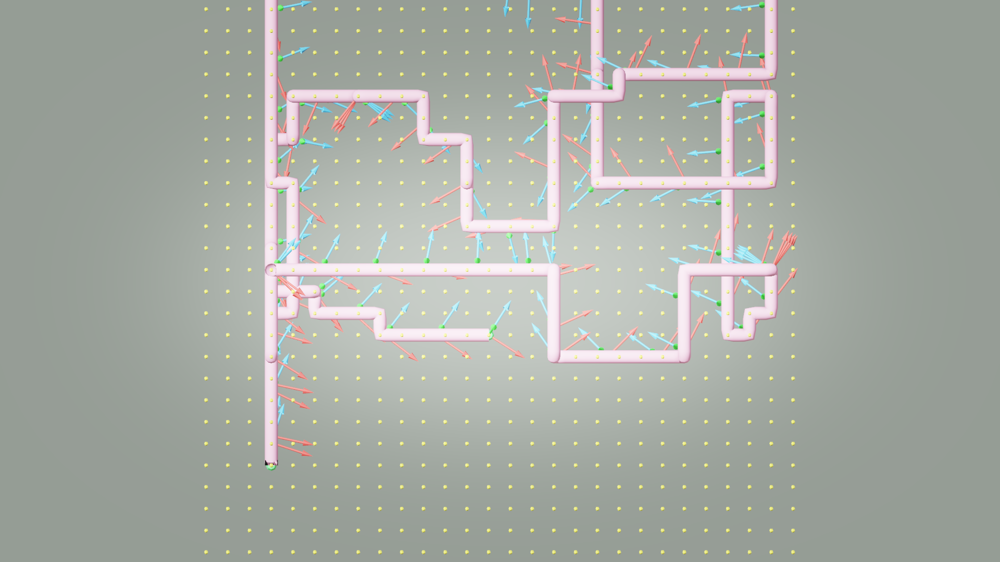
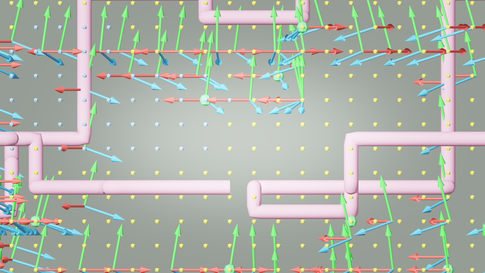

# AI33_001 Walkthrough — v52: Fix aerial camera_height offset

**Scene**: `AI33_001_280.blend` (unit_scale=0.01, 1 BU = 1 cm)
**Date**: 2026-05-03
**Render**: Windows Blender 4.5 + WORKBENCH (D3D GPU, ~0.01s/frame)

---

## Root Cause: camera_height must not be added in aerial mode

`camera_animate.py` and `camera_orient.py` both unconditionally added
`cam_h = camera_height / unit_scale = 170 BU` to every path point's Z:

```python
cam_pos = path_pt + Vector((0, 0, cam_h))  # wrong: applied even in aerial mode
```

**Non-aerial (walking) mode**: path points are floor-level voxel centers; adding
cam_h gives the eye position above the floor. Correct.

**Aerial mode**: path points are 3D flying positions, not floor positions. Adding
170 BU on top of the highest walkable voxel (z=12, center 604 BU):
- camera Z = 604 + 170 = **774 BU = 7.74 m** — above the entire building
- Grid max_z = 779 BU. Camera was essentially at the top of the bounding box.

### Fix

```python
# camera_animate.py + camera_orient.py
if config.get("aerial"):
    cam_h = 0.0   # path point IS the camera position in aerial mode
else:
    cam_h = config.get("camera_height", 1.7) / unit_scale
```

With this fix, camera Z = path point Z, which is always the voxel center —
verified by the edge-mesh check to be non-solid interior air.

---

## GIF

**v52 — 6-connected BFS + aerial cam_h=0 (waypoint gaze mode):**


---

## Debug Visualization

**XY top view — v52:**



**XZ side view — v52:**



---

## v51 vs v52 comparison

| Metric | v51 (cam_h=170 BU applied) | v52 (aerial cam_h=0) |
|--------|---------------------------|----------------------|
| walkable voxels | 5162 (z=1..12) | 5162 (z=1..12) |
| Camera Z range | 224..774 BU (2.24..7.74 m) | **54..604 BU (0.54..6.04 m)** |
| Camera above walkable max | **+170 BU** | **0 BU** |
| Ceiling clipping | **severe** (774 BU = outside building) | **eliminated** |
| Frames | 1,405 | 1,405 |
| Segment count / length | 1124 / 12.5 BU | 1124 / 12.5 BU |

---

## Files

| Content | Path |
|---------|------|
| GIF | `docs/assets/ai33_001_walkthrough_v52/ai33_v52_aerial.gif` |
| Debug top | `docs/assets/ai33_001_walkthrough_v52/debug_top.png` |
| Debug side | `docs/assets/ai33_001_walkthrough_v52/debug_side.png` |
| Run script | `run_ai33_v52.py` |
| Debug render | `render_debug_viz_v52.py` |
| GIF script | `make_gif_v52.py` |
