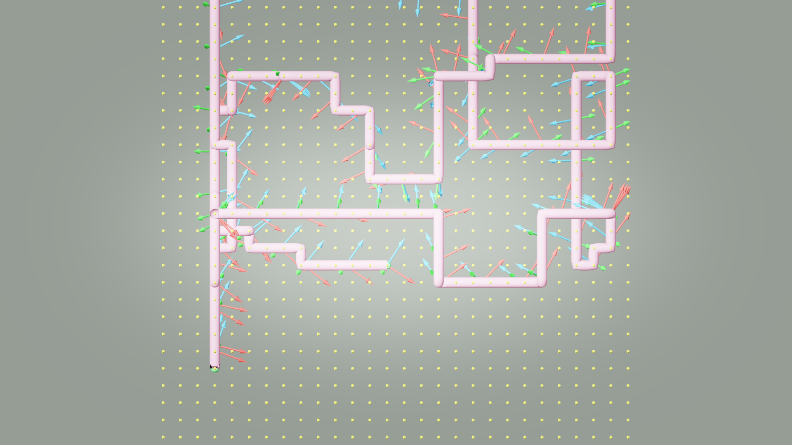
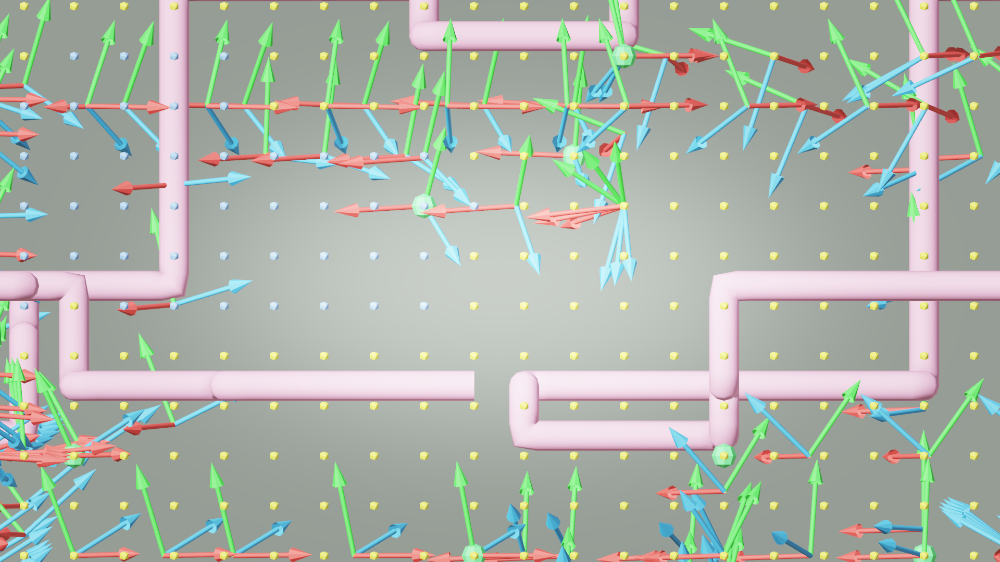

# AI33_001 Walkthrough — v53 & v53b: Aerial 3D Gaze + Gaze Mode Comparison

**Scene**: `AI33_001_280.blend` (unit_scale=0.01, 1 BU = 1 cm)
**Date**: 2026-05-03
**Render**: Windows Blender 4.5 + WORKBENCH (D3D GPU, ~0.01s/frame)

---

## v53: Fix Aerial Camera Gaze Z (Root Cause)

`camera_orient.py` computed waypoint gaze directions with Z explicitly zeroed in two places:

```python
# _compute_waypoint_orientations — line 62
to_j = eyes[j] - eyes[i]
to_j.z = 0.0          # ← zeroed Z: camera never tilts up or down

# _dir_to_quat — line 90
d = Vector((direction.x, direction.y, 0.0))   # ← zeroed Z again
target = Vector((d.x, d.y, -0.3)).normalized() # ← fixed -0.3 tilt regardless
```

The camera always gazed horizontally with a fixed slight downward tilt, even when the
path moved between voxels at very different heights (z=1 at 0.54 m up to z=12 at 6.04 m).

This was correct for walking mode (path points are floor-level, gaze should be flat).
In aerial mode where the drone travels between waypoints at different Z levels, the
camera should tilt up/down toward the actual target position.

### Fix

Both functions now accept `aerial=False`. When `aerial=True`:
- `to_j.z` is preserved — gaze direction is the true 3D vector to the next waypoint
- `_dir_to_quat` uses `Vector(x, y, z)` directly — no Z zeroing, no fixed -0.3 tilt

```python
def _compute_waypoint_orientations(..., aerial=False):
    ...
    to_j = eyes[j] - eyes[i]
    if not aerial:
        to_j.z = 0.0   # walking: keep gaze horizontal

def _dir_to_quat(direction, aerial=False):
    if aerial:
        d = Vector((direction.x, direction.y, direction.z)).normalized()
    else:
        d = Vector((direction.x, direction.y, 0.0)).normalized()
        d = Vector((d.x, d.y, -0.3)).normalized()
```

---

## v53b: Lookahead Gaze Mode

v53b uses the same path and all the same fixes as v53. The only difference is `waypoint_gaze_mode`:

| Setting | v53 | v53b |
|---------|-----|------|
| `waypoint_gaze_mode` | `"waypoint"` | `"free"` (lookahead) |

**Waypoint mode (v53)**: `camera_orient.py` pre-computes a gaze quaternion at each tour
waypoint by averaging 3D directions toward all future waypoints visible via LOS ray-cast.
`camera_animate.py` slerps between these pre-baked quaternions as the camera travels.

**Lookahead mode (v53b)**: No pre-computation. At each frame, the camera looks toward the
path position `lookahead_fraction=0.05` of total arc-length ahead of the current position —
always aligned with the travel direction.

Both modes apply the same slerp smoothing (`rotation_smooth_seconds=2.0`).

---

## GIFs

**v53 — waypoint gaze (3D LOS average toward future waypoints):**


**v53b — lookahead gaze (looks 5% arc-length ahead on path):**


---

## Debug Visualization

Path is identical between v53 and v53b (gaze mode does not affect path planning).

**XY top view:**



**XZ side view:**



---

## Comparison Table

| Metric | v52 | v53 (waypoint) | v53b (lookahead) |
|--------|-----|----------------|------------------|
| Frames | 1,405 | 1,405 | 1,405 |
| Camera Z range | 54..604 BU | 54..604 BU | 54..604 BU |
| Gaze Z component | **always 0** | full 3D (tilt toward WPs) | full 3D (follows path) |
| Gaze computation | fixed -0.3 tilt | LOS avg of future waypoints | 5% arc-length lookahead |
| Anticipation | none | looks across rooms to far WPs | looks just ahead on path |
| Rotation smoothing | — | 2.0 s slerp | 2.0 s slerp |

### Trade-offs: v53 vs v53b

**Waypoint gaze (v53)**: Camera can look across a large room toward a far waypoint — gives
the impression of purposeful navigation. Can produce large sudden rotations when switching
between LOS targets. LOS ray-cast is baked once per waypoint during `camera_orient` step.

**Lookahead (v53b)**: Camera always faces the travel direction — natural for a flying drone.
No pre-computation needed. On tight corners the gaze may lag behind the turn due to slerp
smoothing; on straight segments it tracks cleanly. Never looks "across" the space — only forward.

---

## Files

| Content | Path |
|---------|------|
| v53 GIF | `docs/assets/ai33_001_walkthrough_v53/ai33_v53_aerial.gif` |
| v53b GIF | `docs/assets/ai33_001_walkthrough_v53b/ai33_v53b_aerial.gif` |
| Debug top | `docs/assets/ai33_001_walkthrough_v53/debug_top.png` |
| Debug side | `docs/assets/ai33_001_walkthrough_v53/debug_side.png` |
| v53 run script | `run_ai33_v53.py` |
| v53b run script | `run_ai33_v53b.py` |
