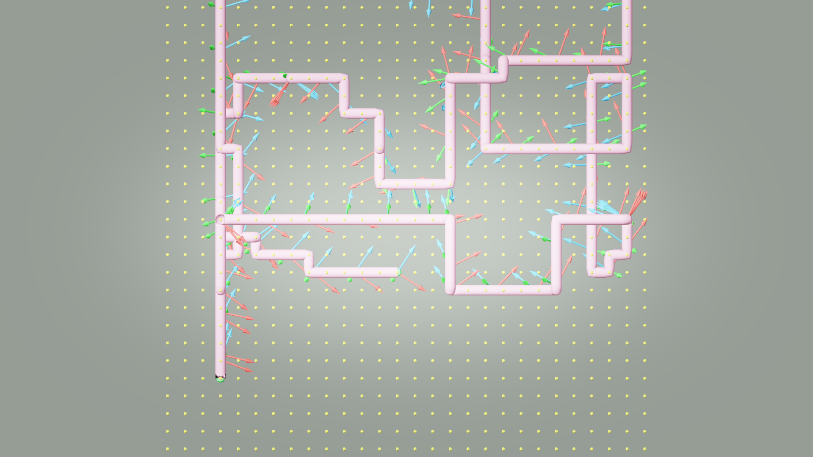
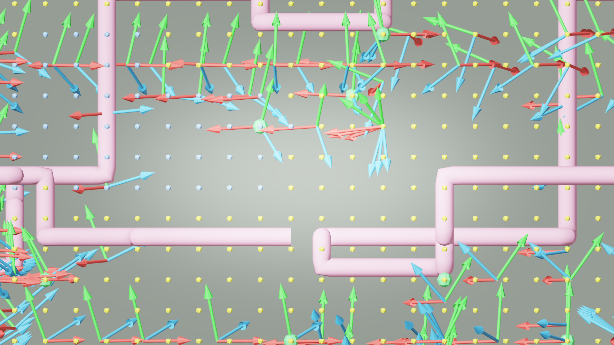

# AI33_001 Walkthrough — v53b: Lookahead Camera vs Waypoint Gaze (v53)

**Scene**: `AI33_001_280.blend` (unit_scale=0.01, 1 BU = 1 cm)
**Date**: 2026-05-03
**Render**: Windows Blender 4.5 + WORKBENCH (D3D GPU, ~0.01s/frame)

---

## What Changed: Gaze Mode

The only difference from v53 is `waypoint_gaze_mode`:

| Setting | v53 | v53b |
|---------|-----|------|
| `waypoint_gaze_mode` | `"waypoint"` | `"free"` (lookahead) |

**v53 — waypoint mode**: `camera_orient.py` pre-computes a gaze quaternion at each tour
waypoint by averaging 3D directions toward all future waypoints visible via LOS ray-cast.
`camera_animate.py` slerps between these pre-baked quaternions as the camera travels.

**v53b — lookahead mode**: No pre-computation. At each frame, the camera looks toward the
path position `lookahead_fraction=0.05` of total arc-length ahead of the current position.
Direction is `look_target - cam_pos` — always aligned with the travel direction.

Both modes apply the same slerp smoothing (`rotation_smooth_seconds=2.0`).

---

## GIFs

**v53 — waypoint gaze (3D LOS average toward future waypoints):**

**v53b — lookahead gaze (looks 5% arc-length ahead on path):**

---

## Debug Visualization

**XY top view — v53b (path identical to v53):**

**XZ side view — v53b (path identical to v53):**

---

## v53 vs v53b Comparison

| Metric | v53 (waypoint gaze) | v53b (lookahead) |
|--------|---------------------|------------------|
| Frames | 1,405 | 1,405 |
| Path | identical | identical |
| Camera Z range | 54..604 BU | 54..604 BU |
| Gaze computation | LOS average of future waypoints | 5% arc-length lookahead |
| Gaze Z component | full 3D (up/down tilt toward WPs) | full 3D (follows path gradient) |
| Anticipation | looks across rooms toward visible targets | looks just ahead on travel path |
| Rotation smoothing | 2.0 s slerp | 2.0 s slerp |

### Trade-offs

**Waypoint gaze (v53)**: Camera can look across a large room toward a far waypoint — gives
the impression of purposeful navigation. Can produce large sudden rotations when switching
between LOS targets. LOS ray-cast is baked once per waypoint during `camera_orient` step.

**Lookahead (v53b)**: Camera always faces the travel direction, which feels natural for a
flying drone. No pre-computation needed. On tight corners the gaze may lag behind the turn
due to slerp smoothing; on straight segments it tracks smoothly. Never looks "across" the
space — only forward along the path.

---

## Files

| Content | Path |
|---------|------|
| GIF | `docs/assets/ai33_001_walkthrough_v53b/ai33_v53b_aerial.gif` |
| Debug top | `docs/assets/ai33_001_walkthrough_v53b/debug_top.png` |
| Debug side | `docs/assets/ai33_001_walkthrough_v53b/debug_side.png` |
| Run script | `run_ai33_v53b.py` |
| Debug render | `render_debug_viz_v53b.py` |
| GIF script | `make_gif_v53b.py` |
| v53 result | `docs/20260503_WalkthroughRenderer_AI33_V53_Results.md` |
