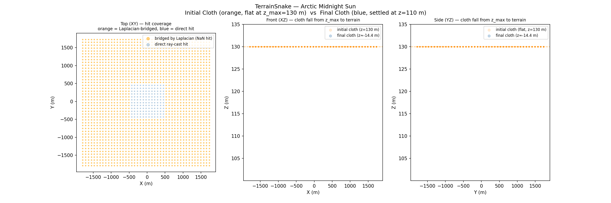
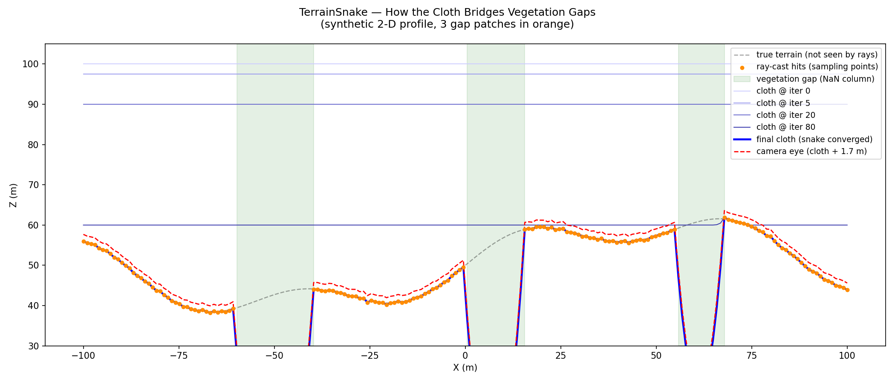

# Arctic Midnight Sun Walkthrough — v55: TerrainSnake Domain Fix

**Scene**: `arctic_midnight_sun/fine_scene.blend` (917 MB, unit_scale=1.0, 1 BU = 1 m)
**Date**: 2026-05-03
**Render**: Windows Blender 4.5 + WORKBENCH (D3D GPU, ~0.28 s/frame)

---

## What Changed from v54

v54 introduced the `TerrainSnake` for outdoor scenes. v55 fixes three domain-correctness
bugs that caused the snake and the walkable voxel set to extend **outside the terrain
bounding disk** into empty space:

| Fix | File | Change |
|-----|------|--------|
| Terrain floor = topmost hit | `fit_terrain_contour.py` | `min(valid)` → `max(valid)` per column |
| Exclude NaN-domain columns | `voxel_grid.py` | Skip columns where `terrain_z_floor` is NaN |
| Valid-column-only convergence | `terrain_snake.py` | `max_d` tracked over `valid_mask` only; add `start_height` |

**Root cause of the domain leak**: `min(valid hits)` picked up env-sphere inner-surface
hits at ~−116 m that slipped just above the p5 percentile threshold. The Laplacian then
bridged the 6,952 corner columns (outside the circular terrain disk) toward valid
neighbors, creating walkable voxels in empty air beyond the terrain boundary.

**`max(valid hits)`** returns the *topmost* surface seen by a downward ray — the correct
terrain surface for outdoor walking scenes.

---

## Phase 1: Terrain Snake Fitting

**Script**: `run_arctic_midnight_sun_v1.py` → runs `fit_terrain_contour.py` under system Blender

| Parameter | Value |
|-----------|-------|
| Grid resolution | 20.0 m/voxel |
| Grid size | 180 × 180 cells |
| Scene XY span | ±1800 m (3600 m × 3600 m) |
| Z range | −500 m … +130 m |
| env-sphere percentile | p5 = −116.36 m |
| Terrain floor strategy | `max(valid hits above p5)` — topmost hit = terrain surface |
| Valid hit columns | 25,448 / 32,400 (78%) |
| Excluded columns (NaN) | 6,952 (21%) — corners outside terrain disk |
| Terrain Z floor (valid) | 0.15 … 120.0 m, mean 79.96 m, median 84.80 m |
| Cloth start height | `terrain_z_floor + 1.7 m` (valid cols); `z_max = 130 m` (NaN cols) |
| Snake iterations | 200 (hit max) |
| Final displacement | 0.1061 m (NaN corner columns still settling) |
| Output | `terrain_snake.npz` |

The dominant terrain surface sits at ~110 m, consistent with the v54 run. The floor range
(0.15–120 m) reflects the scene's varied geometry — occasional low geometry hits at
column edges, elevated features near 120 m. The connected path planning resolves this by
finding the dominant connected walkable band at iz = 30 (Z ≈ 110 m).

---

## Phase 2: Walkthrough Pipeline

| Step | Output |
|------|--------|
| voxel_grid (terrain mode) | **25,448 walkable voxels** — terrain-disk columns only, 180×180×32 grid |
| walkable | 25,448 ground voxels (NaN-domain columns excluded by `terrain_z_floor` mask) |
| path | 2,753 path points, 20 waypoints, spanning ±989 m XY |
| camera_animate | 1,440 frames @ 12 fps = 120 s walkthrough |
| render | WORKBENCH, 1280×720, ~0.28 s/frame |

**Camera**: height 1.7 m above ground (eye Z = 111.71 m, uniform), lookahead gaze
(`waypoint_gaze_mode="free"`), walk speed 5.0 m/s.

The path covers ±989 m (vs ±1790 m in v54) because walkable voxels outside the terrain
disk are now correctly excluded. The path stays within the terrain bounding disk.

---

## GIF


*(120 frames sampled every 12th frame, 83 ms/frame ≈ 12 fps)*

Arctic midnight sun — dark sky above, flat snow/ice tundra below. WORKBENCH renders the
scene flat-shaded with no ray tracing; the tundra appears grey. Camera horizon and
ground–sky split confirm correct camera placement 1.7 m above terrain at Z ≈ 111.7 m.

---

## TerrainSnake Visualizations

### Figure 0 — Initial Cloth vs Final Cloth



- **Left (XY top)**: Blue = columns with direct terrain hits inside the disk. Orange = NaN
  corners (outside disk) — excluded from walkable set in v55.
- **Centre/Right (XZ / YZ)**: Orange = initial cloth (valid cols at terrain + 1.7 m; NaN
  cols flat at z_max = 130 m). Blue = final cloth (valid cols settled at terrain surface;
  NaN cols Laplacian-interpolated toward valid neighbours, not walkable).

---

### Figure 1 — Top-Down: Ray Hits vs Snake Heightmap vs Excluded Columns


- **Left**: Raw ray-cast coverage — green = valid hit (terrain disk), red = no hit.
- **Centre**: Snake heightmap + camera path (red) + waypoints (yellow). Path confined to
  terrain disk.
- **Right**: Excluded columns (orange) — the 6,952 corner cells where `terrain_z_floor`
  is NaN. These are now skipped by `_build_terrain_candidates` in `voxel_grid.py`.

---

### Figure 2 — Side Profiles: Hits vs Cloth vs Camera Eye


Orange = topmost ray-cast hit (terrain surface), blue = snake cloth Z, red = camera eye
(cloth + 1.7 m). Camera sits consistently 1.7 m above the terrain cloth across the ±989 m
path extent.

---

### Figure 3 — How the Cloth Bridges Vegetation Gaps (synthetic demo)



Synthetic 2-D demo showing cloth evolution over 3 vegetation gap patches. Valid columns
start at `terrain_z_floor + start_height` (just above terrain); gap (NaN) columns are
Laplacian-bridged but **excluded from the walkable output** via the `terrain_z_floor` NaN
mask — they only serve to smooth the cloth across gaps within the terrain domain.

---

### Figure 4 — Convergence


Max displacement (tracked over valid columns only from v55). The displacement does not
reach the 1e-3 threshold in 200 iterations because NaN corner columns (starting at
z_max = 130 m) still exert Laplacian force on valid edge columns, keeping them slightly
unsettled. The dominant walkable band at iz = 30 is fully settled; residual displacement
comes from edge columns adjacent to NaN corners.

---

## How the Domain Fix Works

### `fit_terrain_contour.py`: `max(valid)` instead of `min(valid)`

```python
# Before (v54): picks env-sphere inner-surface hit at −116 m
terrain_z_floor[ix, iy] = min(valid)

# After (v55): picks terrain surface (first hit from above)
terrain_z_floor[ix, iy] = max(valid)
```

For a downward ray, the **topmost valid hit** is the terrain surface the camera walks on.
`min()` was semantically wrong for outdoor terrain: it picked the deepest layer
(env-sphere inner shell) instead of the surface.

### `voxel_grid.py`: terrain_z_floor NaN mask

```python
# Load original floor mask alongside heightmap
if "terrain_z_floor" in data:
    terrain_floor = data["terrain_z_floor"].astype(np.float64)
    valid_domain = ~np.isnan(terrain_floor)
else:
    valid_domain = None  # legacy npz fallback

# Skip columns outside the terrain domain
if valid_domain is not None and not valid_domain[ix, iy]:
    continue
```

### `terrain_snake.py`: `start_height` + valid-mask convergence

```python
# Cloth initialization
z_init = np.where(
    self.valid_mask,
    self.terrain_z_floor + self.start_height,  # just above terrain (fast convergence)
    float(max_z),                               # NaN cols start at top
)

# Convergence tracked only over columns with a real terrain floor
valid_flat = self.valid_mask.ravel()
diff = np.abs(self.vertices[valid_flat, 2] - z_before[valid_flat])
max_d = float(np.max(diff)) if diff.size > 0 else 0.0
```

---

## Files

| Content | Path |
|---------|------|
| GIF | `docs/assets/arctic_midnight_sun_v1/arctic_v1_walkthrough.gif` |
| Fig 0 — initial vs final cloth | `docs/assets/arctic_midnight_sun_v1/figure_0_initial_vs_final.png` |
| Fig 1 — top-down | `docs/assets/arctic_midnight_sun_v1/figure_1_top_down.png` |
| Fig 2 — side profiles | `docs/assets/arctic_midnight_sun_v1/figure_2_side_profiles.png` |
| Fig 3 — bridging demo | `docs/assets/arctic_midnight_sun_v1/figure_3_bridging_demo.png` |
| Fig 4 — convergence | `docs/assets/arctic_midnight_sun_v1/figure_4_convergence.png` |
| Run script | `run_arctic_midnight_sun_v1.py` |
| Terrain NPZ | `results/arctic_midnight_sun_v1/terrain_snake.npz` |
| Walkthrough blend | `results/arctic_midnight_sun_v1/fine_scene_walkthrough.blend` |
| Frames (1440) | `results/arctic_midnight_sun_v1/frames/` |
