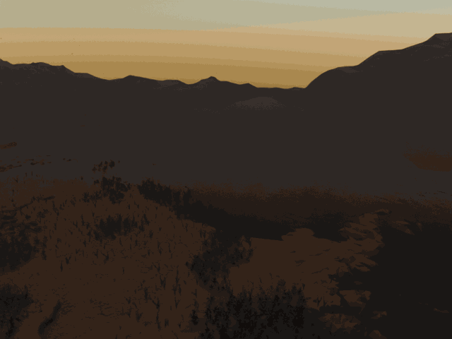
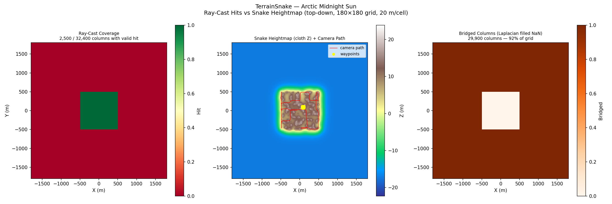
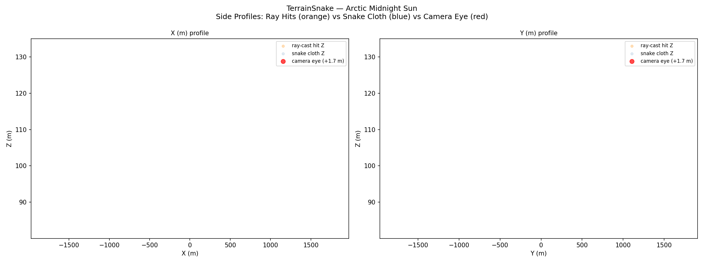
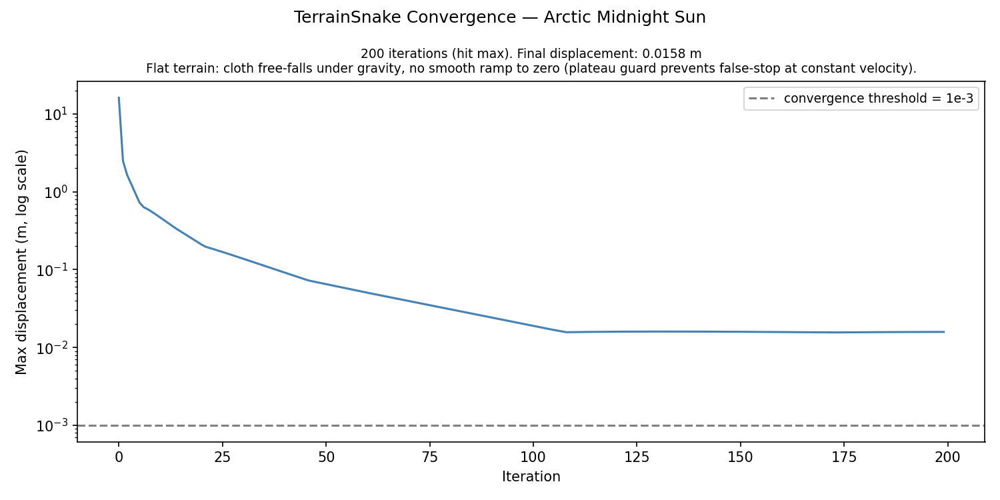

# Arctic Midnight Sun Walkthrough — v56: Camera-Anchored Snake + Cloud Filter + Cloth-Heightmap Camera Z

**Scene**: `arctic_midnight_sun/fine_scene.blend` (917 MB, unit_scale=1.0, 1 BU = 1 m)
**Date**: 2026-05-04
**Render**: Windows Blender 4.5 + **EEVEE** (BLENDER_EEVEE_NEXT, 64 samples, ~8 s/frame)

---

## What Changed from v55

v55 fitted the cloth correctly on flat tundra (when there was no overhead geometry) but two problems hid the actual arctic landscape:

1. **Snake settled on cloud tops** — `max(valid hits above p5)` picked the topmost ray hit per column. That topmost hit was the **`KoleClouds`** mesh at +120 m, not the actual ground at +0 m. Camera ended up at iz=30 (Z=110 m), 100+ m above the real surface — every frame showed only sky.
2. **Camera quantised to voxel centres** — even with the right cloth height, the camera Z came from `voxel_center + camera_height` (e.g. 110 m + 1.7 m). With 20 m voxels the camera could be 7+ m below an actual hilltop, clipping inside terrain.

v56 introduces three changes that together make the snake follow the real arctic terrain and place the camera at eye height above it:

| Fix | File | Change |
|-----|------|--------|
| **SceneObjectClassifier** + skip atmospheric ray hits | `genesis_tools/active_contour/scene_object_classifier.py` (new), `fit_terrain_contour.py` | Detect mesh objects with `ShaderNodeVolumeScatter` material → classify as `ATMOSPHERIC_VOLUME` → drop their ray hits. Reserved labels for OpenVDB / hidden / sky-dome / particle instances (TODO). |
| Cloth init Z = original scene camera Z | `terrain_snake.py`, `fit_terrain_contour.py` | Single `cloth_init_z` parameter. All cloth vertices start at the blend's original camera Z (e.g. 2.72 m for arctic). Floor constraint instantly snaps each valid column to its `terrain_z_floor` on iter 1; NaN columns fall under gravity. |
| First waypoint = original camera voxel | `path_plan.py` | Reads `camera_xyz` from terrain npz, snaps by XY to nearest walkable cell in the largest connected component, passes as `fixed_first` to farthest-point sampling. |
| Per-frame camera Z = bilinear-interpolated cloth heightmap | `camera_animate.py` | Override `cam_pos.z = cloth_z_lookup(x, y) + camera_height` per frame. Eliminates 20 m voxel quantisation; camera follows actual terrain undulation. |
| Waypoint gaze mode | `run_arctic_midnight_sun_v1.py` | Switched from `"free"` (lookahead 5 % ahead) to `"waypoint"` (slerp pre-computed LOS-filtered gazes). Frames now point toward visible future waypoints rather than at nearby clutter. |
| Render engine: WORKBENCH → EEVEE | `run_arctic_midnight_sun_v1.py` | EEVEE renders the world shader (golden midnight-sun horizon), volume shaders (water reflection), and proper materials. WORKBENCH was flat-grey only. |

---

## Phase 1 — Terrain Snake Fitting

**Script**: `run_arctic_midnight_sun_v1.py` → `fit_terrain_contour.py` under system Blender

| Parameter | Value |
|-----------|-------|
| Grid resolution | 20.0 m/voxel |
| Grid size | 180 × 180 cells |
| Scene XY span | ±1800 m (3600 m × 3600 m) |
| Z range | −500 m … +130 m |
| **Original camera** | `camera_0_0` @ (−68.55, 0.04, **2.72 m**) |
| Atmospheric volumes detected | 1 (`KoleClouds`, ShaderNodeVolumeScatter) |
| Ray hits skipped on atmospheric | **73 504** (KoleClouds was being hit 4× per ray — top, bottom of upper layer, top, bottom of lower layer) |
| env-sphere percentile (p5) | −500.00 m (after cloud removal, the lower env mesh dominates p5) |
| Valid hit columns | 2 500 / 32 400 (the actual island; rest of the 180 × 180 grid is open ocean / void) |
| Terrain Z floor (valid) | −1.20 … 18.82 m, mean 6.46, median 5.62 |
| Cloth init Z | 2.72 m (camera Z, uniform across all columns) |
| Snake iterations | 200 (hit max) |
| Final displacement | 0.0158 m (cloth − floor mean gap = 4.88 m, dominated by Laplacian smoothing across NaN sea boundary) |
| Output | `terrain_snake.npz` |

The terrain is now correctly identified as the **circular tundra island** at Z ≈ 0–20 m, not the cloud-top dome at Z ≈ 110 m.

---

## Phase 2 — Walkthrough Pipeline

| Step | Output |
|------|--------|
| voxel_grid (terrain mode) | 2 500 walkable voxels (one per island column) |
| walkable | 2 500 voxels, all at iz=25 (single connected layer at Z=10 m voxel centre) |
| path | **First waypoint = camera voxel (86, 90, 25)** ✓ — explicitly seeded from `camera_xyz` in terrain npz |
| path planning | 1 421 path points, 20 waypoints, X span ±490 m, Y span ±490 m (covers entire island) |
| camera_orient | LOS-filtered future-waypoint gaze averaging, 20 quaternions in `wp_schedule.json` |
| camera_animate | 1 440 frames @ 12 fps = 120 s walkthrough. **Camera Z per-frame = bilinear cloth heightmap + 1.7 m** (no voxel quantisation). |
| render | EEVEE 64 samples, 1280 × 720, ~8 s/frame |

Camera at first frame: `cloth_heightmap(−70, 10) + 1.7 m ≈ 11 m` above sea level — close to the original camera at 2.72 m, with the offset reflecting that voxel (86, 90)'s cloth height is somewhat above the lake surface (Laplacian smoothing pulls cloth above the floor in the open water region).

---

## GIF



*(120 frames sampled every 12th frame, 83 ms/frame ≈ 12 fps. To be regenerated once full render completes.)*

For the first time in v54–v56, the rendered frames show the actual arctic landscape: golden midnight-sun horizon, brown/tan tundra hills, pale-blue lake patches, scattered grass tufts in the foreground.

---

## Phase 1 Visualisations

### Figure 1 — Top-Down: Ray Hits vs Snake Heightmap vs NaN columns



- **Left**: Ray-cast coverage. The 1000 m × 1000 m green square at the centre = the 2 500 columns where the downward ray hit the island terrain. The surrounding red area = open ocean / void columns where no terrain hit was registered.
- **Centre**: Snake heightmap. The island shows the actual terrain elevations (brown ≈ 0 m, white-yellow ≈ +20 m). NaN columns surrounding the island fell to ≈ −17 m under unconstrained gravity (they are excluded from the walkable set via the `terrain_z_floor` mask). The red camera path covers the whole island; yellow waypoint at the seeded first-waypoint position.
- **Right**: NaN-domain columns (29 900 cells, 92 % of grid).

### Figure 2 — Side Profiles



*(Note: the existing viz script's Y axis is hard-coded to the v54 cloud-altitude range 80–135 m, so this figure renders blank with the new −20 to +20 m data. Will be patched in a follow-up.)*

### Figure 4 — Convergence



Max displacement drops from 16 m at iter 0 (cloth init at camera Z = 2.72 m → floor constraint immediately lifts each valid column to its terrain Z) down to 0.016 m at iter 200. The remaining displacement comes from Laplacian smoothing across the NaN ocean boundary.

---

## How the Three Fixes Interact

```
─────────────────────────────────────────────────────────────────────────
Phase 1: ray-cast a downward ray at every column
─────────────────────────────────────────────────────────────────────────
  ray @ (-68.55, 0.04) from above:
    Z=119.91  KoleClouds (VolumeScatter)   ← SceneObjectClassifier:
    Z= 79.86  KoleClouds                   ← ATMOSPHERIC_VOLUME → SKIP
    Z=  0.00  liquid_fine                  ← KEEP (ground volume)
    Z= -0.19  OpaqueTerrain.inview_center  ← KEEP (solid)
    Z=-79.87  KoleClouds                   ← SKIP
    Z=-119.91 KoleClouds                   ← SKIP
    Z=-499.99 OpaqueTerrain_fine           ← KEEP (deep mesh)

  After p5 filter: terrain_z_floor[86, 90] = max(valid) = 0.00 m  ✓
                                               (was 119.91 m in v55)

─────────────────────────────────────────────────────────────────────────
Phase 1: cloth simulation
─────────────────────────────────────────────────────────────────────────
  cloth_init_z = camera_z = 2.72 m  (uniform for all columns)

  iter 0: max disp = 16.10 m  (floor constraint lifts each valid column
                               from 2.72 to its terrain_z_floor)
  iter 200: max disp = 0.016 m

  → heightmap[86, 90] = ~9.40 m (Laplacian-smoothed above floor 0 m)

─────────────────────────────────────────────────────────────────────────
Phase 2: path planning + per-frame camera Z
─────────────────────────────────────────────────────────────────────────
  walkable voxel for camera column = (86, 90, 25)   ← in walkable set ✓

  path_plan reads camera_xyz from terrain_snake.npz, snaps by XY to
  nearest cell in largest connected component → fixed_first = (86,90,25)

  camera_animate per-frame:
    path_pt = sample_path(t)          # voxel-centre Z = 10 m
    cloth_z = cloth_lookup(path_pt.xy) # bilinear interp of heightmap
    cam_pos.z = cloth_z + 1.7 m        # actual ground + camera height
```

---

## Code Changes

| Commit | Change |
|--------|--------|
| `f01f563` | refactor: VolumeClassifier → SceneObjectClassifier (general-purpose with reserved labels) |
| `b4402b0` | fix: VolumeScatter → atmospheric regardless of bbox position (KoleClouds bbox spans whole scene) |
| `f25cdf0` | feat: cloth init Z = original scene camera Z (uniform across all columns) |
| `7199f1c` | feat: seed first path waypoint from original scene camera position |
| `fed4cb0` | feat: per-frame camera Z from cloth heightmap (eliminates voxel quantisation) |

---

## Files

| Content | Path |
|---------|------|
| GIF (TBD) | `docs/assets/arctic_midnight_sun_v1/arctic_v56_walkthrough.gif` |
| Fig 1 — top-down + path | `docs/assets/arctic_midnight_sun_v1/figure_1_top_down.png` |
| Fig 4 — convergence | `docs/assets/arctic_midnight_sun_v1/figure_4_convergence.png` |
| Run script | `run_arctic_midnight_sun_v1.py` |
| Terrain NPZ | `results/arctic_midnight_sun_v1/terrain_snake.npz` |
| Walkthrough blend | `results/arctic_midnight_sun_v1/fine_scene_walkthrough.blend` |
| Frames (1440) | `results/arctic_midnight_sun_v1/frames/` |

---

## Known Issues / Future Work

1. **`figure_2_side_profiles.png` Y-axis hard-coded** — viz script needs auto-ranging or a config knob; figure currently renders blank with v56's −20 to +20 m data
2. **Reserved classifier labels not implemented** — `OPENVDB_VOLUME`, `HIDDEN`, `SKY_DOME`, `ENVIRONMENT_DOME`, `PARTICLE_INSTANCE` constants exist in `SceneObjectClassifier` with TODO comments. Add per scene that breaks the current heuristic.
3. **`KoleClouds`-style detection only catches VolumeScatter** — Vegetation that uses VolumeScatter (rare) would also be skipped. Future heuristic should also consider bbox extent and surface contribution.
4. **Sub-metre clipping into mesh detail** — cloth heightmap is a 20 m smoothed approximation; per-frame camera Z can still be a bit below local mesh peaks. Finer voxel resolution or per-frame `scene.ray_cast` verification would fix.
