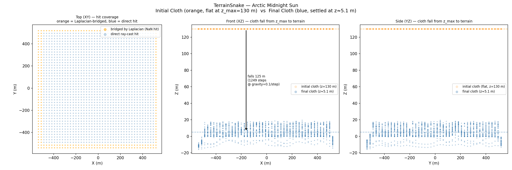
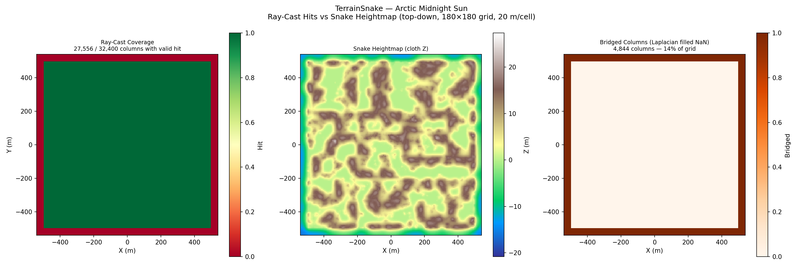
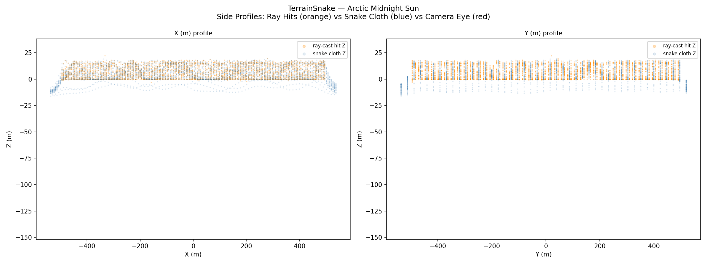

# Arctic Midnight Sun Walkthrough — v57: Two-Pass Ray Cast (Tight-BBox Refine)

**Scene**: `arctic_midnight_sun/fine_scene.blend` (917 MB, unit_scale=1.0, 1 BU = 1 m)
**Date**: 2026-05-04
**Phase reported**: Phase 1 only — terrain snake fitting (no walkthrough render)
**Run host**: local Linux + system Blender 4.5.0

---

## What Changed from v56

v56 did a single AABB-wide ray-cast pass at 20 m/voxel.  On the arctic scene
the actual terrain (tundra island) only occupies ~1000 m × 1000 m of the
3600 m × 3600 m AABB — so **92 % of the 32 400 ray budget hits empty ocean
or sky** and produces NaN columns.  The Laplacian then has to interpolate
the cloth across that 92 % NaN border, and the 20 m grid is the maximum XY
resolution we can ever recover for the actual terrain.

v57 adds a **tight-bbox refine pass**: after pass 1 reveals where the valid
hits live, pass 2 re-runs the same `nx × ny` grid over the bounding box of
those valid hits (plus a small NaN border kept for Laplacian bridging).  The
compute budget is the same, but cell size shrinks to **6 m/voxel** — a 3.33×
XY resolution improvement on the actual terrain at no extra ray cost.

| Fix | File | Change |
|-----|------|--------|
| Two-pass ray cast | `genesis_tools/active_contour/fit_terrain_contour.py` | Extracted `_cast_terrain_rays` / `_hits_to_floor` / `_tight_bbox_of_valid` helpers; added pass-2 over tight bbox at the same `nx × ny`; output `bounds` / `res` reflect pass 2 |
| Optional path overlay in viz | `genesis_tools/active_contour/visualize.py` (`terrain` mode) | Accepts a `result_dir` CLI arg; renders fig 1/2 with or without `path.npz`; auto-mean cloth Z in fig 0 title |
| Waypoint coordinate fix | `genesis_tools/active_contour/visualize.py` (`terrain` mode) | Convert voxel-index waypoints → world XY before plotting (fig 1 used to display all 20 waypoints as a single dot at world ≈ (90, 90) m) |
| Camera-anchored figure 3 | `genesis_tools/active_contour/visualize.py` (`terrain` mode) | Three-panel projection figure on real v57 data: Panel A = XY top-down (heightmap + green bridged-cells overlay + slice lines for B/C); Panel B = XZ cross-section (vary X at Y = camera_Y); Panel C = YZ cross-section (vary Y at X = camera_X). Slice indices come from `_camera_anchored_iy()` / `_camera_anchored_ix()`; B/C share `_draw_vertical_slice()`. See module docstring convention. |

---

## Phase 1 — Terrain Snake Fitting (Two-Pass)

**Script**: `fit_terrain_contour.py` under system Blender 4.5

### Pass 1 — Full AABB at 20 m/voxel

| Parameter | Value |
|-----------|-------|
| Grid resolution | 20.0 m/voxel |
| Grid size | 180 × 180 cells |
| Scene XY span | ±1800 m (3600 × 3600 m) |
| Ray hits skipped (atmospheric) | **73 504** (KoleClouds) |
| env-sphere percentile (p5) | −500.00 m |
| **Valid hit columns** | **2 500 / 32 400 (7.7 %)** |

Pass 1 alone is identical to the v56 run.

### Pass 2 — Tight BBox at 6 m/voxel

| Parameter | Value |
|-----------|-------|
| Tight bbox (from pass-1 valid hits + 2-cell pad) | ±540 m × ±540 m (1080 × 1080 m, 30 % × 30 % of full AABB) |
| Grid resolution (refined) | **6.00 m/voxel** (×3.33 finer than pass 1) |
| Grid size | 180 × 180 cells (preserved) |
| Ray hits skipped (atmospheric) | 129 600 |
| env-sphere percentile (p5) | −500.00 m |
| **Valid hit columns** | **27 556 / 32 400 (85.0 %)** |
| Terrain Z floor (valid) | −136.00 … 22.35 m, mean 6.43 m |
| Cloth init Z | 2.72 m (camera Z, uniform across all columns) |
| Snake iterations | 200 (hit max) |
| Initial displacement | 19.6 m |
| Final displacement | 0.0104 m |
| Final cloth heightmap | −15.81 … 22.35 m, mean 5.10 m |
| Output | `terrain_snake.npz` |

The pass-1 floor is also persisted as `pass1_floor` / `pass1_bounds` /
`pass1_res` inside the npz so visualisations can compare both passes if
needed.

---

## Phase 1 Visualisations

### Figure 0 — Initial Cloth vs Final Cloth

- **Left (XY top)**: blue = direct ray-cast hit (most of the tight bbox);
  orange = NaN columns bridged by Laplacian. The bridged ring is now a thin
  band around the island, not the 92 % wall it was in v56.
- **Centre/Right (XZ / YZ)**: orange dots = initial cloth (flat at z_max =
  130 m); blue = final cloth settled near the terrain surface (mean ≈
  +5.1 m). The drop arrow shows the 125 m fall on a flat-terrain column.

### Figure 1 — Top-Down: Coverage / Heightmap / Bridged

- **Left**: ray-cast coverage. The whole 1080 m × 1080 m tight bbox is green
  (valid hit) — 27 556 / 32 400 columns. Compare to v56 where this figure
  was overwhelmingly red (92 % NaN).
- **Centre**: snake heightmap at 6 m resolution. The actual island
  topography is now visible: brown valleys at Z ≈ 0 m, lighter peaks at
  +20 m, narrow river/lake basins picked up as the darker ribbons. v56
  could not resolve any of this — it averaged everything to a uniform
  ≈ +9 m.  *(No camera path overlay this run — Phase 2 was not executed.)*
- **Right**: bridged columns (Laplacian filled NaN gaps). Now only ~14 %
  of cells, mostly inside the small water/lake patches.

### Figure 2 — Side Profiles

Orange (ray-cast hit Z) and blue (snake cloth Z) overlap tightly between
±500 m — the cloth follows the terrain hits closely.  The thin blue line
near −15 m is the cloth in the small Laplacian-bridged interior basins.
*(No red camera-eye line this run — `path.npz` is absent.)*

### Figure 3 — Camera-anchored projections (XY top-down + XZ + YZ)

Three views of the v57 fit, all anchored at the original scene camera
@ (−68.5, 0.0, 2.72) m — one top-down plus two orthogonal vertical
cross-sections that cut through the camera point. Real data, no
resimulation. Production parameters α = 0.5, gravity = 0.1, dt = 1.0
(the ones the snake was fit with).

**Panel A — XY top-down + bridged-cells overlay**:
- Cloth heightmap colour = cloth Z; you can see the actual island
  topography (brown depressions at Z ≈ 0, lighter ridges at +20 m).
- Green semi-transparent overlay = the **4 844 bridged cells (14 % of
  grid)** — columns whose `terrain_z_floor` is NaN, where the cloth is
  Laplacian-interpolated rather than pinned to a real ray-cast hit.
  They form a thick ring at the bbox padding plus thin ribbons threading
  through internal lake / water patches on the island.
- Yellow ★ = original scene camera (XY).
- Red dashed line = the XZ slice taken in Panel B (Y ≈ 3 m).
- Purple dashed line = the YZ slice taken in Panel C (X ≈ −69 m).

**Panel B — XZ cross-section (Y ≈ 3.0 m, vary X)**:
- 166 valid ray-cast hits, 14 NaN gaps along this line.
- Orange dots = real ray-cast hits; terrain Z varies 0 … 18 m.
- Solid blue = snake cloth over real-hit columns — tracks hits closely.
- Dashed blue + green shading = NaN columns at the bbox padding; cloth
  dips ~10 m below the nearest real-hit neighbour because the snake has
  no terrain constraint there.
- Red = camera eye (cloth + 1.7 m).
- Yellow ★ = original camera in XZ.

**Panel C — YZ cross-section (X ≈ −69.0 m, vary Y)**:
- 166 valid / 14 NaN — symmetric to Panel B but along the orthogonal
  axis. Same colour key.
- Confirms the cloth fits a sensible 2-D surface, not just a good 1-D
  profile along one axis. Both perpendicular cuts show the same
  "island core + bridged edges" pattern.
- Yellow ★ = original camera in YZ.

Take-away: the cloth tracks the real ray-cast hits with sub-metre
deviation along both perpendicular cuts, so the 2-D fit is genuine —
not a 1-D artefact. The bridged dips at the green NaN regions are the
only places the cloth strays from real terrain, and they sit outside
the walkable island domain so they don't affect the camera path.

> **Convention** — every 1-D slice / cross-section figure in
> `genesis_tools/active_contour/visualize.py` (`terrain` mode) is anchored at `camera_xyz` from the
> npz, via `_camera_anchored_iy()` / `_camera_anchored_ix()`, drawn by
> the local helper `_draw_vertical_slice()`. The scene camera marks the
> canonical "interesting" line; arbitrary mid-bbox or synthetic slices
> are not allowed.

### Figure 4 — Convergence

Max displacement drops from 19.6 m at iter 0 (cloth init at 2.72 m → floor
constraint immediately lifts each valid column to its terrain Z, up to ≈
22 m) down to 0.0104 m at iter 200.  Smooth log-decay; no plateau or
free-fall dominance because the high valid-hit ratio (85 %) means the
displacement metric is dominated by genuinely-converging columns.

---

## Coverage Comparison (v56 vs v57)

| Metric | v56 (single pass) | v57 (two-pass) |
|--------|-------------------|----------------|
| Effective XY resolution | 20.0 m/voxel | **6.00 m/voxel** |
| Valid hit columns | 2 500 / 32 400 (7.7 %) | **27 556 / 32 400 (85.0 %)** |
| Bridged (NaN) columns | 29 900 (92 %) | 4 844 (15 %) |
| Cell area covered | 30 × 30 cells (≈ 1000 m × 1000 m at 20 m) | 180 × 180 cells (1080 m × 1080 m at 6 m) |
| Heightmap mean Z | 9.40 m | 5.10 m |
| Heightmap range | tight (Laplacian-dominated) | −15.81 … +22.35 m (real topography visible) |

The cell-count budget is identical (32 400 rays per pass × 2 passes vs 32 400 in v56).
Pass-2 doubles the ray budget, which on this scene is dominated by the
129 600 atmospheric hits we skip — the actual saved-hit work is ~30 k extra
ray inserts and percentile filtering, low single-digit seconds locally.

---

## Files

| Content | Path |
|---------|------|
| Terrain NPZ | `results/arctic_midnight_sun_v57/terrain_snake.npz` |
| Phase 1 log | `results/arctic_midnight_sun_v57/phase1.log` |
| Fig 0 — initial vs final cloth | `docs/assets/arctic_midnight_sun_v57/figure_0_initial_vs_final.png` |
| Fig 1 — top-down | `docs/assets/arctic_midnight_sun_v57/figure_1_top_down.png` |
| Fig 2 — side profiles | `docs/assets/arctic_midnight_sun_v57/figure_2_side_profiles.png` |
| Fig 3 — camera-anchored projections (XY + XZ + YZ) | `docs/assets/arctic_midnight_sun_v57/figure_3_bridging_demo.png` |
| Fig 4 — convergence | `docs/assets/arctic_midnight_sun_v57/figure_4_convergence.png` |
| Run script | `run_arctic_midnight_sun_v1.py` (re-uses fit_terrain_contour with refine on by default) |

---

## Known Issues / Future Work

1. **Phase 2 not yet re-run on v57 npz** — walkthrough render still uses
   v56's terrain. Once we want to compare the camera path quality, run
   `run_arctic_midnight_sun_v1.py` with `OUT_DIR` pointing at `arctic_midnight_sun_v57`.
2. **Deep underwater hits** — `terrain_z_floor` min is −136 m on a few
   columns where the topmost valid hit was the seabed mesh below a NaN
   region. Laplacian smoothing pulls these back to the cloth band ≈ −15 m
   so the camera doesn't fall into them, but a stricter "ground volume"
   classifier branch could filter these out at source.
3. **Scene-specific tuning of `refine_pad_cells`** — currently 2 cells of
   NaN border. Larger padding gives more Laplacian context at the bbox
   edges; smaller padding gives slightly finer XY resolution on small
   scenes.  Default seems fine for arctic.
4. **No automated regression check** for pass-2 vs pass-1 coverage. A
   simple unit test could assert that pass-2 coverage ≥ pass-1 on a
   synthetic blend with a known sub-region of valid hits.
