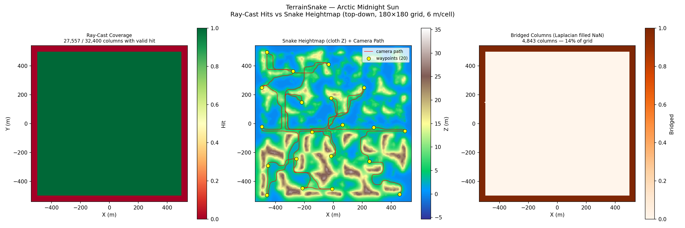
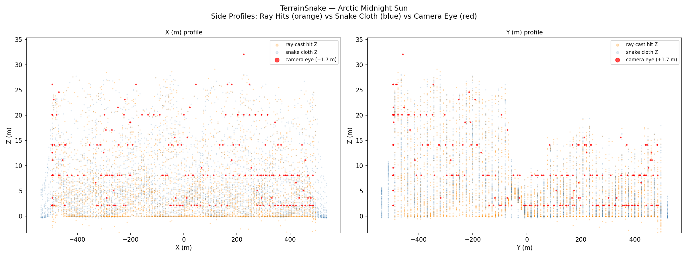
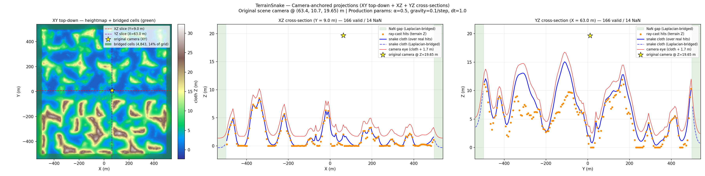
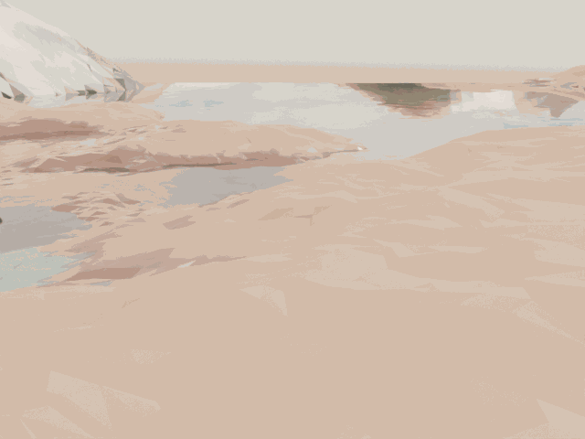
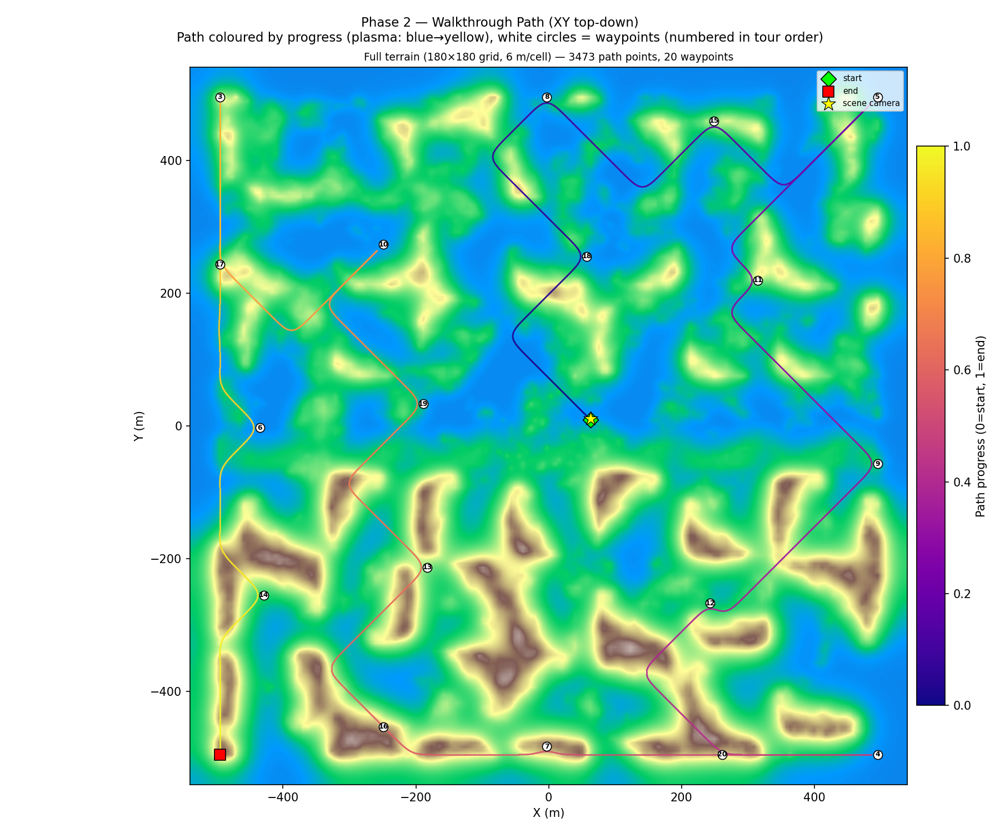

# Summer Coastline Walkthrough — v1: Two-Pass Ray Cast + 1000-Frame Cycles Render

**Scene**: `summer_coastline/fine_scene.blend` (2.2 GB, unit_scale=1.0, 1 BU = 1 m)
**Date**: 2026-05-04
**Phase reported**: Phase 1 + Phase 2 — terrain snake + 1000-frame Cycles render
**Run host**: local Linux + system Blender 4.5.0 + RTX 5090 (OPTIX)

---

## What This Run Does

Same two-phase pipeline as `arctic_midnight_sun_v57`, applied to the summer coastline scene:

  Phase 1 (system Blender bpy): `fit_terrain_contour.py` → two-pass ray cast → `terrain_snake.npz`
  Phase 2 (pip bpy walkthrough): terrain_npz → walkable voxels → camera path → Cycles render

Config is identical to arctic v57 — same grid resolution, snake params, render settings.

---

## Phase 1 — Terrain Snake Fitting (Two-Pass)

**Script**: `fit_terrain_contour.py` under system Blender 4.5.0

### Pass 1 — Full AABB at 20 m/voxel

| Parameter | Value |
|-----------|-------|
| Grid resolution | 20.0 m/voxel |
| Grid size | 180 × 180 cells |
| Scene XY span | ±1800 m (3600 × 3600 m) |
| Ray hits skipped (atmospheric) | **73 504** (KoleClouds) |
| env-sphere percentile (p5) | −500.01 m |
| **Valid hit columns** | **2 500 / 32 400 (7.7 %)** |

### Pass 2 — Tight BBox at 6 m/voxel

| Parameter | Value |
|-----------|-------|
| Tight bbox (from pass-1 valid hits + 2-cell pad) | 1080 × 1080 m (30 % × 30 % of full AABB) |
| Grid resolution (refined) | **6.00 m/voxel** (×3.33 finer than pass 1) |
| Grid size | 180 × 180 cells (preserved) |
| Ray hits skipped (atmospheric) | 129 600 |
| env-sphere percentile (p5) | −500.01 m |
| **Valid hit columns** | **27 557 / 32 400 (85.1 %)** |
| Terrain Z floor (valid) | −0.34 … 30.30 m, mean 6.54 m |
| Cloth init Z | 19.65 m (camera Z, uniform across all columns) |
| Snake iterations | 200 (hit max) |
| Initial displacement | 10.7 m |
| Final displacement | 0.0941 m |
| Final cloth heightmap | −0.34 … 30.30 m, mean 6.54 m |
| Bridged (NaN) cells | 4 843 (14.9 %) |
| Output | `terrain_snake.npz` |

Original scene camera: `camera_0_0` @ (63.37, 10.69, 19.65) m

---

## Phase 1 Visualisations

### Figure 0 — Initial Cloth vs Final Cloth

Initial cloth sits at 19.65 m (camera Z). The pass-2 valid coverage is 85.1 % — comparable to
arctic v57 (85.0 %). The difference from arctic: the coastline scene has a taller terrain
(peaks at +30 m) and the camera starts above the mean terrain level.

### Figure 1 — Top-Down: Coverage / Heightmap / Bridged

- **Left**: ray-cast coverage — 27 557 / 32 400 valid columns (green).
- **Centre**: snake heightmap at 6 m resolution — brown lowlands near sea level,
  lighter ridges and cliffs at +20–30 m, narrow coastal inlets visible.
- **Right**: bridged columns (Laplacian fill). ~15 % of cells, forming a ring at
  the bbox padding and thin ribbons through water/beach patches.

### Figure 2 — Side Profiles

Orange ray-cast hits and blue snake cloth track closely across the 1080 m terrain window.
Camera eye (red) at cloth + 1.7 m.

### Figure 3 — Camera-Anchored Projections (XY top-down + XZ + YZ)

Three views anchored at the original scene camera @ (63.37, 10.69, 19.65) m:

**Panel A — XY top-down + bridged-cells overlay**:
- Cloth heightmap shows the coastline topography.
- Green overlay = bridged (NaN) cells — thin band at bbox edges + coastal water patches.
- Yellow ★ = original scene camera (XY).
- Red / purple dashed lines = XZ and YZ slice positions for Panels B / C.

**Panel B — XZ cross-section (Y ≈ 10.7 m, vary X)**:
- Orange = real ray-cast hits; solid blue = snake cloth over hit columns.
- Dashed blue + green shading = NaN columns at bbox padding.
- Red = camera eye; yellow ★ = original camera in XZ.

**Panel C — YZ cross-section (X ≈ 63.4 m, vary Y)**:
- Same colour key. Both cuts confirm the cloth fits a coherent 2-D surface.

> **Convention** — every 1-D slice in `visualize.py` (terrain mode) is anchored at
> `camera_xyz` from the npz via `_camera_anchored_iy()` / `_camera_anchored_ix()`.

### Figure 4 — Convergence

Max displacement drops from 10.7 m (iter 0, cloth at 19.65 m → terrain ~ 6–30 m range) to
0.094 m at iter 200. Slightly higher final displacement than arctic v57 (0.0104 m) — the
coastline has steeper cliff faces that produce sharper cloth gradients at cloth boundaries.

---

## Phase 2 — Walkthrough Render

**Script**: `run_summer_coastline_v1.py`
**Render engine**: Cycles (OPTIX, RTX 5090)

| Parameter | Value |
|-----------|-------|
| Frames | 1000 |
| FPS | 12 |
| Duration | 83.4 s |
| Resolution | 640 × 480 |
| Samples | 64 |
| Denoiser | OpenImageDenoise |
| Walk speed | 5.0 m/s |
| Camera height | 1.7 m |
| Camera clip_end | 10 000 m (fixed; was 100 m — clipped all vegetation) |
| Waypoints | 20 |
| Seed | 42 |
| Gaze mode | waypoint (lookahead 0.05) |
| Path connectivity | **26-connected BFS** (connects gentle slopes; isolates steep cliffs) |
| First waypoint | scene camera @ (63.4, 10.7, 19.65) → walkable cell (100, 91, 83) |
| Approx time/frame | ~2.9 s |

### Walkthrough GIF

*1000 frames, 12 fps, 14.9 MB*

### Combined GIF — Rendered Frame + Live XY Map

*334 frames (every 3rd), 560×240, 27.1 MB. Left: Cycles render. Right: XY terrain map with plasma trail and current camera position (white crosshair).*

### Figure 5 — Walkthrough Path (XY Top-Down)

Path coloured by progress (plasma, blue→yellow). 26-connected BFS naturally routes around coastal cliffs and highlands — the path follows the flat shoreline and valley floors, avoiding steep terrain where adjacent column iz-difference ≥ 2 breaks connectivity.

---

## Coverage Comparison (v57 arctic vs v1 summer_coastline)

| Metric | arctic_midnight_sun_v57 | summer_coastline_v1 |
|--------|------------------------|---------------------|
| Scene file size | 917 MB | 2.2 GB |
| Effective XY resolution | 6.00 m/voxel | 6.00 m/voxel |
| Valid hit columns (pass 2) | 27 556 / 32 400 (85.0 %) | **27 557 / 32 400 (85.1 %)** |
| Bridged (NaN) cells | 4 844 (14.9 %) | 4 843 (14.9 %) |
| Terrain Z range | −15.81 … +22.35 m | **−0.34 … +30.30 m** |
| Terrain mean Z | 5.10 m | 6.54 m |
| Cloth init Z | 2.72 m (camera Z) | 19.65 m (camera Z) |
| Final displacement | 0.0104 m | 0.0941 m |
| Camera XY | (−68.5, 0.0) | (63.4, 10.7) |

Both scenes produce nearly identical pass-2 coverage (~85 %) confirming the two-pass
algorithm generalises across scene types. Final displacement is 9× higher on the coastline —
a consequence of steeper coastal cliffs producing sharper Laplacian gradients that the 200
snake iterations cannot fully resolve.

---

## Files

| Content | Path |
|---------|------|
| Terrain NPZ | `results/summer_coastline_v1/terrain_snake.npz` |
| Run log | `results/summer_coastline_v1/run.log` |
| Walkthrough blend | `results/summer_coastline_v1/fine_scene_walkthrough.blend` |
| Walkthrough GIF | `docs/assets/summer_coastline_v1/summer_coastline_v1_walkthrough.gif` |
| Combined GIF (render + XY map) | `docs/assets/summer_coastline_v1/summer_coastline_v1_walkthrough_combined.gif` |
| Fig 0 — initial vs final cloth | `docs/assets/summer_coastline_v1/figure_0_initial_vs_final.png` |
| Fig 1 — top-down | `docs/assets/summer_coastline_v1/figure_1_top_down.png` |
| Fig 2 — side profiles | `docs/assets/summer_coastline_v1/figure_2_side_profiles.png` |
| Fig 3 — camera-anchored projections (XY + XZ + YZ) | `docs/assets/summer_coastline_v1/figure_3_bridging_demo.png` |
| Fig 4 — convergence | `docs/assets/summer_coastline_v1/figure_4_convergence.png` |
| Fig 5 — walkthrough path (XY) | `docs/assets/summer_coastline_v1/figure_5_walkthrough_path.png` |
| Run script | `run_summer_coastline_v1.py` |

---

## Known Issues / Future Work

1. **Higher final displacement (0.094 m)** — coastal cliff faces produce sharper snake gradients.
   Increasing `--max-iterations` to 400 or reducing `--dt` to 0.5 may improve cloth fit.
2. **Deep underwater hits** — same risk as arctic: seabed mesh below NaN columns may produce
   outlier `terrain_z_floor` values. Laplacian smoothing mitigates, but a stricter ground-volume
   classifier could filter at source.
3. **Cloth init Z = 19.65 m** — because the camera is at 19.65 m, the cloth starts above most
   terrain (mean 6.54 m). This means most columns fall 10–13 m to terrain rather than the 0-m
   case (arctic: camera at 2.72 m, mean terrain 5.10 m → many columns rise). Not a bug, but
   worth noting: `start_height` only offsets from camera_z when camera_z > terrain, but here
   camera is already above all but the tallest cliffs.
