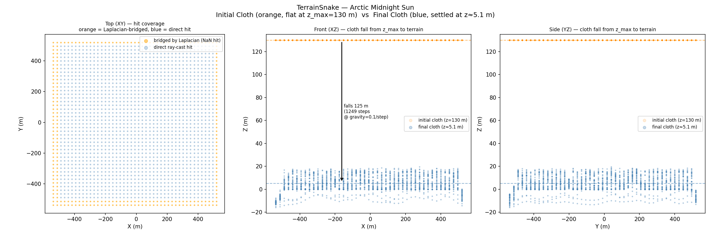
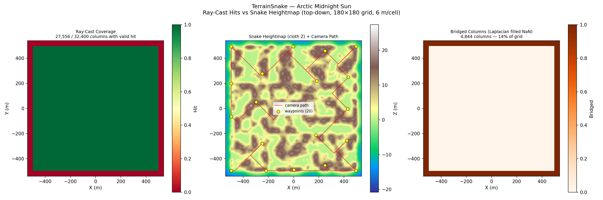
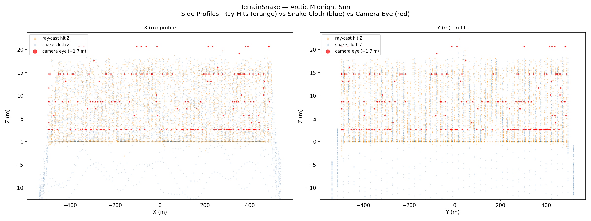
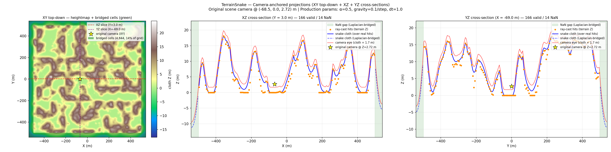
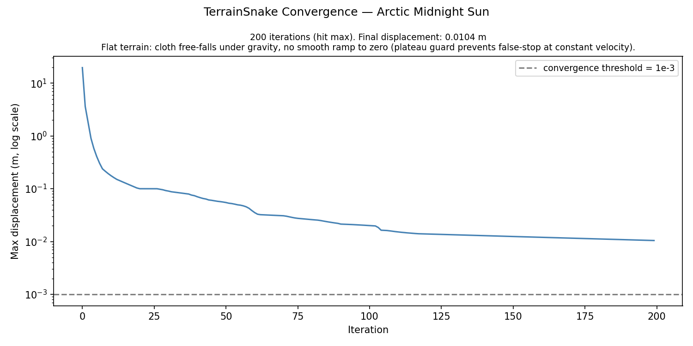
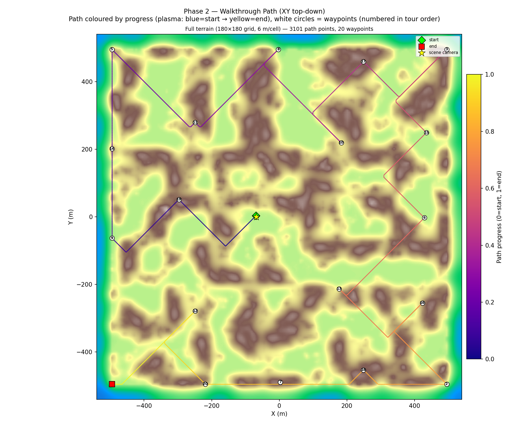
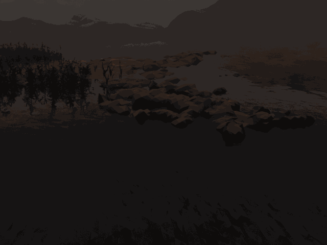

# Arctic Midnight Sun Walkthrough — v58: Held-Karp Exact TSP

**Scene**: `arctic_midnight_sun/fine_scene.blend` (917 MB, unit_scale=1.0, 1 BU = 1 m)
**Date**: 2026-05-05
**Phase reported**: Phase 2 only — Held-Karp path planning + 1000-frame Cycles render
**Run host**: local Linux + pip bpy 4.5 + RTX 5090 (OPTIX)

---

## What Changed from v57

v57 used a greedy 2-opt nearest-neighbour TSP to order the 20 farthest-point-sampled
waypoints.  v58 replaces it with the **Held-Karp exact dynamic-programming TSP**:

```
dp[mask][v] = min cost to visit all nodes in mask, starting at node 0, ending at node v
```

State space: O(2ⁿ × n) = ~20 M states for n=20.  Inner loop is fully vectorised with
numpy fancy indexing, eliminating the Python-level `for u in range(n)` loop.
Result is the **globally optimal open-path tour** for these 20 waypoints under the
Euclidean XY distance metric.

Path colour was also reverted from height-Z back to **arc-length progress** (plasma:
blue=start → yellow=end), and figure 5 is now a single full-terrain panel (zoomed panel
removed).  Figure 2 Z-axis uses 2nd/98th percentile clipping to exclude seabed outlier
hits from the axis range.

| Fix | File | Change |
|-----|------|--------|
| Held-Karp exact TSP | `genesis_tools/walkthrough_renderer/pipeline/path_plan.py` | `_held_karp_tsp()` replaces `_two_opt_improve()`; vectorised numpy inner loop; ~6.6 s for n=20 |
| Arc-length path colour (revert) | `genesis_tools/walkthrough_renderer/combined_gif.py`, `genesis_tools/active_contour/visualize.py` | Path colour = arc-length progress (plasma, blue→yellow); reverted from height-Z |
| Figure 5 single panel | `genesis_tools/active_contour/visualize.py` | Removed zoomed right panel; single full-terrain (12×10 in) view |
| Figure 2 percentile Z range | `genesis_tools/active_contour/visualize.py` | Z axis clipped to [p2, p98] of path Z samples to exclude seabed outliers |

Terrain (Phase 1) is unchanged — `terrain_snake.npz` reused from v57.

---

## Phase 1 — Terrain Snake (Reused from v57)

See [20260504_WalkthroughRenderer_Arctic_V57_Results.md](20260504_WalkthroughRenderer_Arctic_V57_Results.md) for full Phase 1 details.

| Parameter | Value |
|-----------|-------|
| Grid resolution | 6.00 m/voxel (tight-bbox refine) |
| Grid size | 180 × 180 cells |
| Valid hit columns | 27 556 / 32 400 (85.0 %) |
| Terrain Z range | −15.81 … +22.35 m, mean 5.10 m |
| Original scene camera | `camera_0_0` @ (−68.5, 0.0, 2.72) m |

---

## Phase 1 Visualisations (Reused from v57 data)

### Figure 0 — Initial Cloth vs Final Cloth



### Figure 1 — Top-Down: Coverage / Heightmap / Bridged



### Figure 2 — Side Profiles



Z-axis now clipped to [p2, p98] of the walkable voxel Z samples, preventing seabed outlier
hits from collapsing the visible range to −300 m.

### Figure 3 — Camera-Anchored Projections (XY + XZ + YZ)



### Figure 4 — Convergence



---

## Phase 2 — Walkthrough Render

**Script**: `run_arctic_midnight_sun_v58.py`
**Render engine**: Cycles (OPTIX, RTX 5090)

### Path Planning — Held-Karp

| Parameter | Value |
|-----------|-------|
| Algorithm | Held-Karp exact open-path TSP |
| Waypoints | 20 (farthest-point sampling, seed 42) |
| First waypoint | scene camera @ (−68.5, 0.0, 2.72) m → walkable cell (78, 90, 83) |
| Path connectivity | 26-connected BFS (face + edge + corner) |
| Held-Karp time | **6.6 s** (n=20, vectorised numpy, ~524 k DP states) |
| BFS path stitching | 776 cells, 0.23 s |
| Total path points | 3 101 |

### Render

| Parameter | Value |
|-----------|-------|
| Frames | 1000 |
| FPS | 12 |
| Duration | 83.4 s |
| Resolution | 640 × 480 |
| Samples | 64 |
| Denoiser | OpenImageDenoise |
| Walk speed | 5.0 m/s |
| Camera height | 1.7 m |
| Camera clip_end | 10 000 m |
| Gaze mode | waypoint (lookahead 0.05) |
| Approx time/frame | ~2.9 s |

### Figure 5 — Walkthrough Path (XY Top-Down)



Held-Karp produces the globally optimal ordering for these 20 waypoints.
The flat arctic tundra creates a dense uniform walkable grid, so the tour
appears more grid-like than the coastline — a terrain property, not a
connectivity artefact.

### Walkthrough GIF



*1000 frames, 12 fps, 14 MB*

### Combined GIF — Rendered Frame + Live XY Map


*334 frames (every 3rd), 12 fps, 26 MB. Left: Cycles render. Right: XY terrain map with
plasma trail (arc-length progress) and current camera position (white crosshair).*

---

## Files

| Content | Path |
|---------|------|
| Terrain NPZ (reused from v57) | `results/arctic_midnight_sun_v58/terrain_snake.npz` |
| Path NPZ | `results/arctic_midnight_sun_v58/path.npz` |
| Run log | `results/arctic_midnight_sun_v58/run.log` |
| Walkthrough blend | `results/arctic_midnight_sun_v58/fine_scene_walkthrough.blend` |
| Walkthrough GIF | `docs/assets/arctic_midnight_sun_v58/arctic_v58_walkthrough.gif` |
| Combined GIF (render + XY map) | `docs/assets/arctic_midnight_sun_v58/arctic_v58_walkthrough_combined.gif` |
| Combined MP4 | `docs/assets/arctic_midnight_sun_v58/arctic_v58_walkthrough_combined.mp4` |
| Fig 0 — initial vs final cloth | `docs/assets/arctic_midnight_sun_v58/figure_0_initial_vs_final.png` |
| Fig 1 — top-down | `docs/assets/arctic_midnight_sun_v58/figure_1_top_down.png` |
| Fig 2 — side profiles | `docs/assets/arctic_midnight_sun_v58/figure_2_side_profiles.png` |
| Fig 3 — camera-anchored projections | `docs/assets/arctic_midnight_sun_v58/figure_3_bridging_demo.png` |
| Fig 4 — convergence | `docs/assets/arctic_midnight_sun_v58/figure_4_convergence.png` |
| Fig 5 — walkthrough path (XY) | `docs/assets/arctic_midnight_sun_v58/figure_5_walkthrough_path.png` |
| Run script | `run_arctic_midnight_sun_v58.py` |
| Path-only script | `gen_path_v58.py` |
