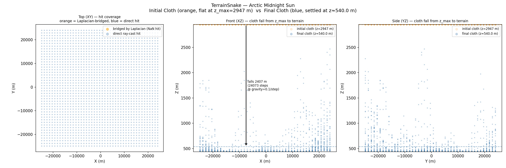
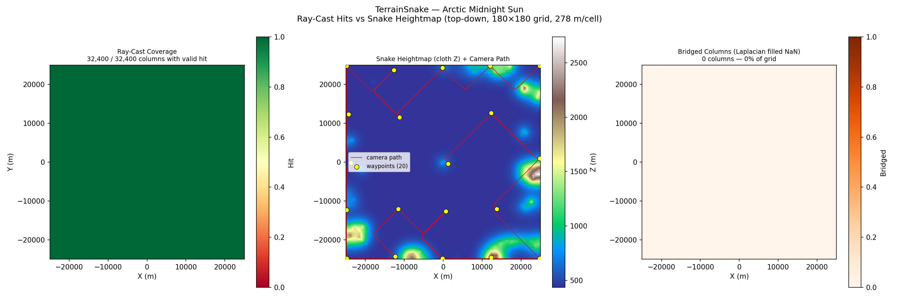
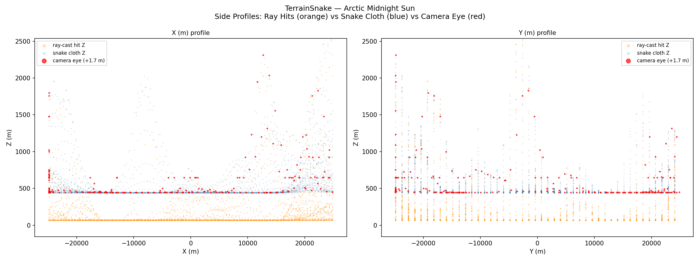
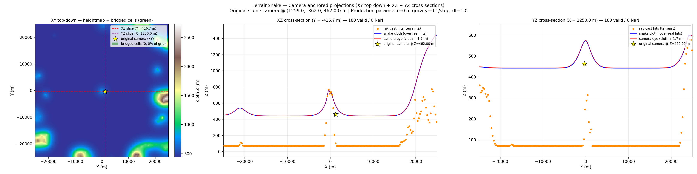
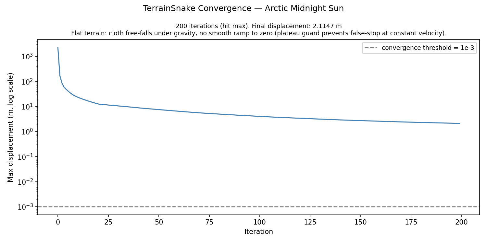
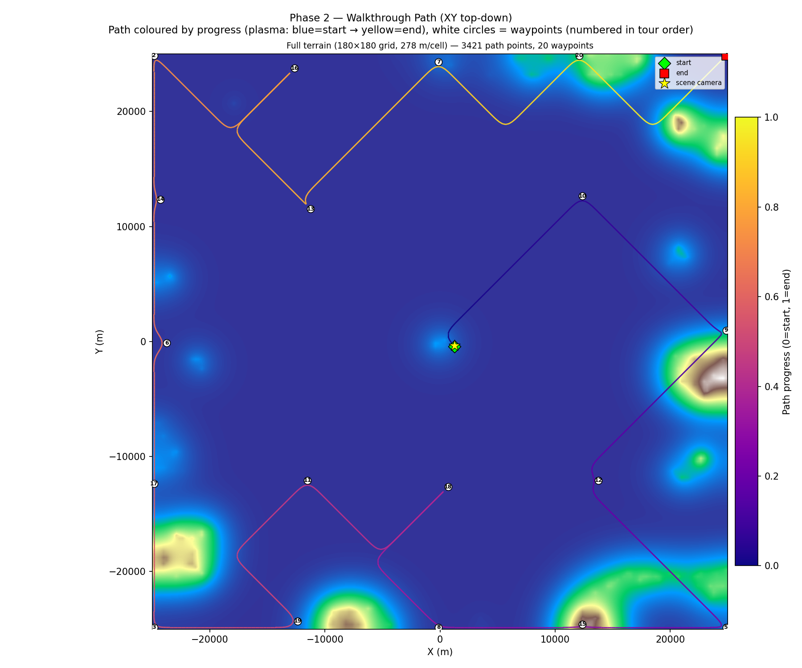
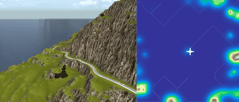

# Coastal Road Walkthrough — Terrain v1: TerrainSnake + Held-Karp + Cycles

**Scene**: `coastal_road/coastal road.blend`
**Date**: 2026-05-05
**Config**: `configs/terrain_scene.json` — TerrainSnake Phase 1, Held-Karp path, Cycles render
**Run host**: local Linux + pip bpy 4.5 + Windows Blender 4.5.7 LTS (Cycles)
**Commit**: `ac2deb9`

---

## Pipeline

Two-phase pipeline.  Phase 1 casts rays from system Blender to build the
terrain heightmap (`terrain_snake.npz`).  Phase 2 reads the heightmap directly
(no bpy required), builds a ground-level walkable voxel grid, plans a
Held-Karp tour, animates the camera, and renders.

---

## Voxel Grid + Walkable (Terrain Mode)

| Parameter | Value |
|-----------|-------|
| Grid resolution | 277.78 BU/voxel |
| Grid size | 180 × 180 × 11 |
| Scene bounds (XY) | [−25 000, −25 000] … [+25 000, +25 000] BU |
| Scene bounds (Z) | −50 … +2 947 BU |
| TerrainSnake | Pass 1 only (Pass 2 skipped — Pass 1 covered ≥ 95 % of scene) |
| Walkable voxels | **32 400** (all 180 × 180 grid columns, terrain mode) |

---

## Path Planning — Held-Karp

| Parameter | Value |
|-----------|-------|
| Algorithm | Held-Karp exact open-path TSP |
| Waypoints | 20 (farthest-point sampling, seed 42) |
| Path connectivity | 26-connected BFS |
| Total path points | 3 421 |
| Path Z range | 366.7 … 2 311.1 BU |
| Solve time | 8.1 s |

---

## Render

| Parameter | Value |
|-----------|-------|
| Frames | 1 000 |
| FPS | 6 |
| Duration | 166.7 s |
| Resolution | 640 × 480 |
| Render engine | Cycles |
| Samples | 64 |
| Denoiser | OpenImageDenoise |
| Walk speed | 5.0 BU/s |
| Camera height | 1.7 BU |

---

## Figures

### Figure 0 — Initial vs Final Snake

### Figure 1 — Top-Down Walkable + Path

### Figure 2 — Side Profiles

### Figure 3 — Bridging Demo

### Figure 4 — Convergence

### Figure 5 — Walkthrough Path

---

## Walkthrough GIF

*1 000 frames, 6 fps*

## Combined GIF (path overlay)

---

## Files

| Content | Path |
|---------|------|
| Voxel grid | `results/coastal_road_terrain_v1/voxel_grid.npz` |
| Terrain snake | `results/coastal_road_terrain_v1/terrain_snake.npz` |
| Walkable | `results/coastal_road_terrain_v1/walkable.npz` |
| Path | `results/coastal_road_terrain_v1/path.npz` |
| Run log | `results/coastal_road_terrain_v1/run.log` |
| Walkthrough blend | `results/coastal_road_terrain_v1/coastal road_walkthrough.blend` |
| Walkthrough GIF | `docs/assets/coastal_road_terrain_v1/coastal_road_terrain_v1_walkthrough.gif` |
| Combined GIF | `docs/assets/coastal_road_terrain_v1/coastal_road_terrain_v1_walkthrough_combined.gif` |
| Combined MP4 | `docs/assets/coastal_road_terrain_v1/coastal_road_terrain_v1_walkthrough_combined.mp4` |
| Run script | `run_coastal_road_terrain_v1.py` |

---

## Notes

- **Huge scene**: The coastal road scene spans 50 000 × 50 000 BU — larger than
  any previous test.  At 277.78 BU/voxel the 180 × 180 grid still captures the
  macro terrain shape, but individual roads and small features are below
  voxel resolution.
- **Single-pass TerrainSnake**: Pass 1 achieved 100 % column coverage so Pass 2
  (tight-bbox refinement) was skipped automatically.
- **High altitude path**: Path Z range spans 366–2 311 BU, reflecting the
  dramatic elevation change in this coastal landscape.
