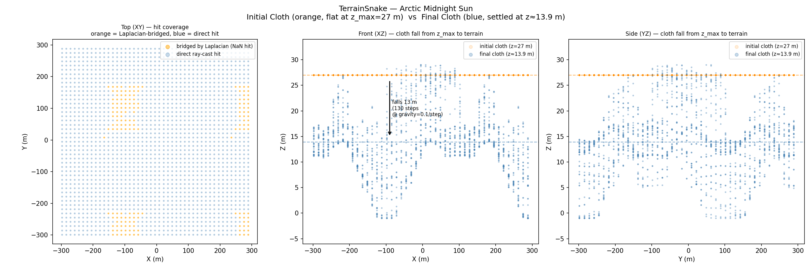
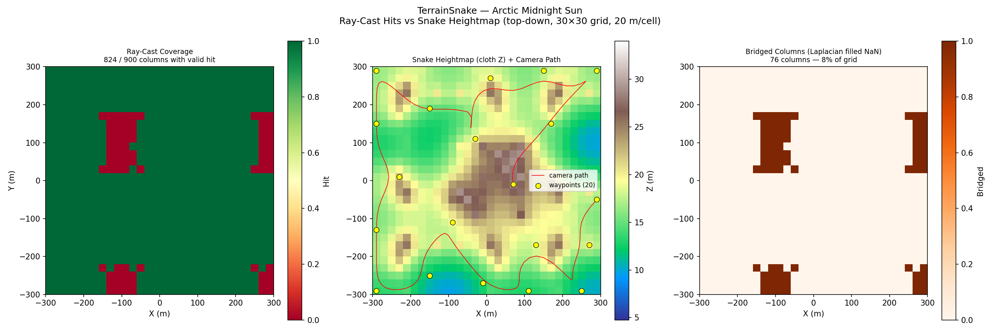
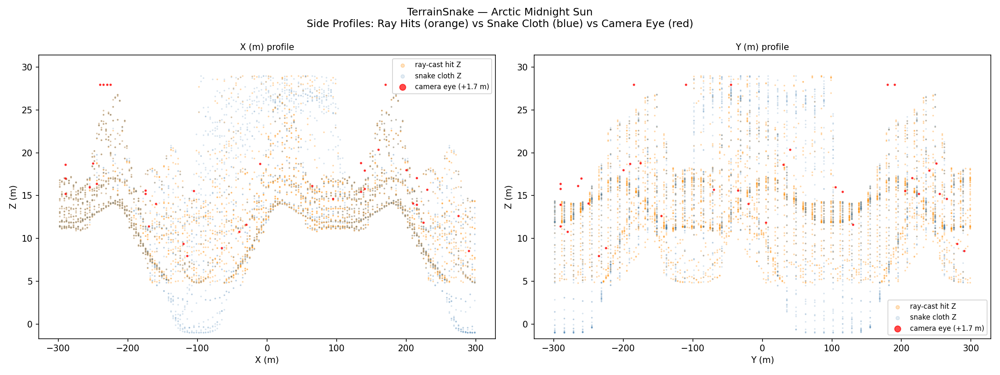
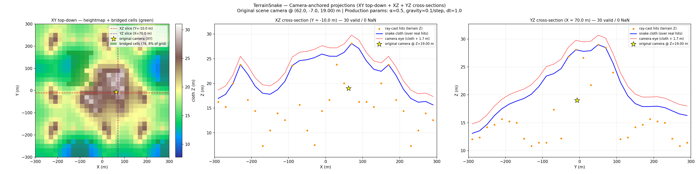
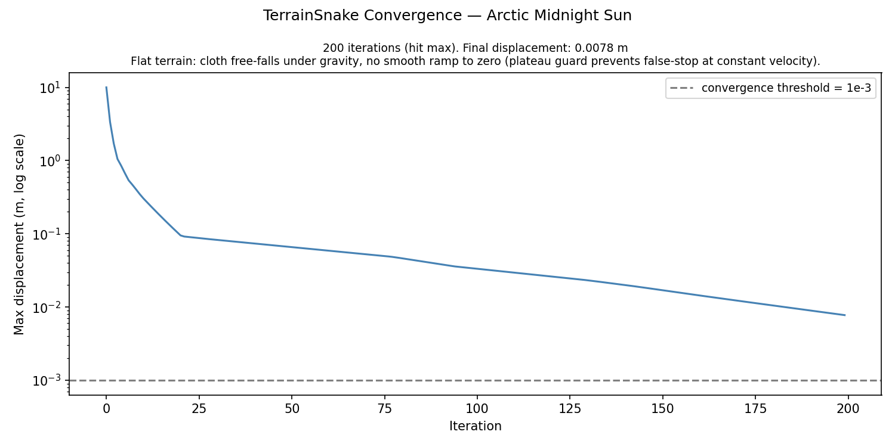
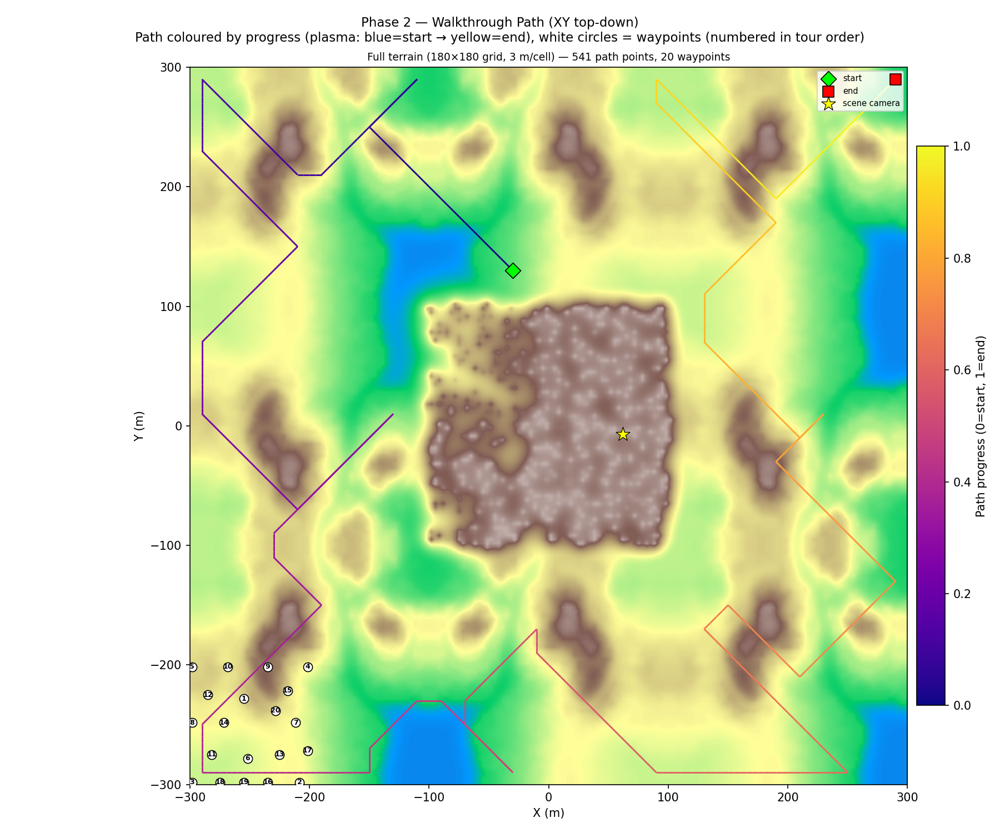

# Forest Paths Walkthrough — Terrain v1: TerrainSnake + Held-Karp + Cycles

**Scene**: `forest_paths/forest paths.blend` (334 MB)
**Date**: 2026-05-05
**Config**: `configs/terrain_scene.json` — TerrainSnake Phase 1+2, Held-Karp path, Cycles render
**Run host**: local Linux + pip bpy 4.5 + Windows Blender 4.5.7 LTS (Cycles)
**Commit**: `c322903`

---

## Pipeline

Two-phase pipeline.  Phase 1 casts rays from system Blender to build the
terrain heightmap (`terrain_snake.npz`).  Phase 2 reads the heightmap directly
(no bpy required), builds a ground-level walkable voxel grid, plans a
Held-Karp tour, animates the camera, and renders.

**ScenePreprocessor** was applied before render.  The scene has 2 scatter
particle objects (terrain, background) that were converted to static meshes.

---

## Voxel Grid + Walkable (Terrain Mode)

| Parameter | Value |
|-----------|-------|
| Grid resolution | 20.0 BU/voxel |
| Grid size | 30 × 30 × 2 |
| Scene bounds (XY) | [−300, −300] … [+300, +300] BU |
| Scene bounds (Z) | −3.8 … +27.0 BU |
| TerrainSnake passes | 2 |
| TerrainSnake iterations | 200 |
| Heightmap Z range | 9.75 … 29.0 BU |
| Walkable voxels | **824** (terrain mode — one per grid column) |

---

## Path Planning — Held-Karp

| Parameter | Value |
|-----------|-------|
| Algorithm | Held-Karp exact open-path TSP |
| Waypoints | 20 (farthest-point sampling, seed 42) |
| Path connectivity | 26-connected BFS |
| Total path points | 537 |
| Path Z range | 13.5 … 30.7 BU |

---

## Render

| Parameter | Value |
|-----------|-------|
| Frames | 1 000 |
| FPS | 12 |
| Duration | 83.3 s |
| Resolution | 640 × 480 |
| Render engine | Cycles |
| Samples | 64 |
| Denoiser | OpenImageDenoise |
| Walk speed | 5.0 BU/s |
| Camera height | 1.7 BU |
| ScenePreprocessor | 2 particle objects → mesh (terrain, background) |

---

## Figures

### Figure 0 — Initial vs Final Snake

### Figure 1 — Top-Down Walkable + Path

### Figure 2 — Side Profiles

### Figure 3 — Bridging Demo

### Figure 4 — Convergence

### Figure 5 — Walkthrough Path

---

## Walkthrough GIF

*1 000 frames, 12 fps*

## Combined GIF (path overlay)

---

## Files

| Content | Path |
|---------|------|
| Voxel grid | `results/forest_paths_terrain_v1/voxel_grid.npz` |
| Terrain snake | `results/forest_paths_terrain_v1/terrain_snake.npz` |
| Walkable | `results/forest_paths_terrain_v1/walkable.npz` |
| Path | `results/forest_paths_terrain_v1/path.npz` |
| Run log | `results/forest_paths_terrain_v1/run.log` |
| Walkthrough blend | `results/forest_paths_terrain_v1/forest paths_walkthrough.blend` |
| Walkthrough GIF | `docs/assets/forest_paths_terrain_v1/forest_paths_terrain_v1_walkthrough.gif` |
| Combined GIF | `docs/assets/forest_paths_terrain_v1/forest_paths_terrain_v1_walkthrough_combined.gif` |
| Run script | `run_forest_paths_terrain_v1.py` |

---

## Notes

- **Small dense scene**: 600 × 600 BU scene with 30 × 30 grid (20 BU/voxel) — finer than the
  coast scenes because the forest paths are narrow.  Low walkable column count (824) reflects
  dense canopy cover blocking many grid columns.
- **Flat terrain**: Z range only 9.75–29 BU; path stays at 13–31 BU above sea level.
- **MP4 generation error**: `make_combined_mp4` failed due to odd output resolution (917 × 393)
  not divisible by 2 for libx264.  GIF was generated successfully.
