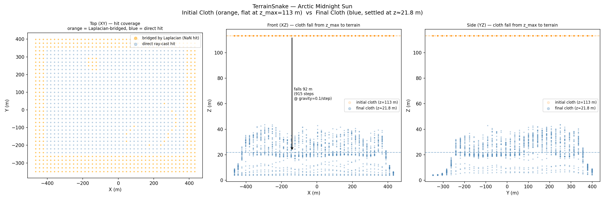
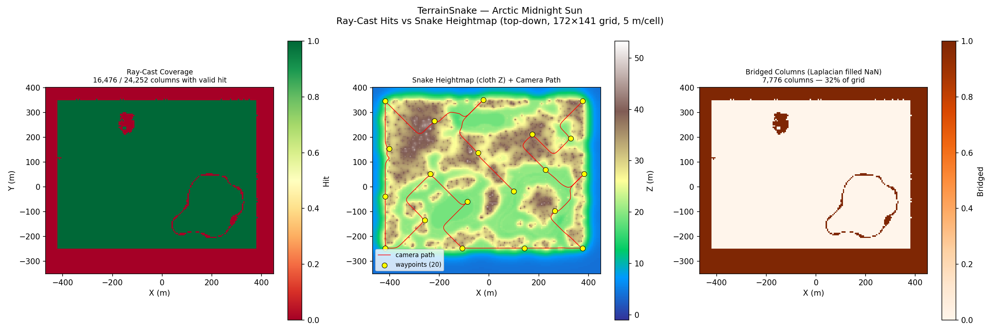
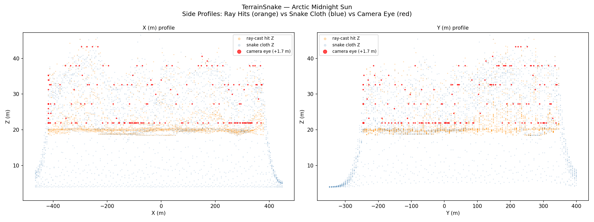
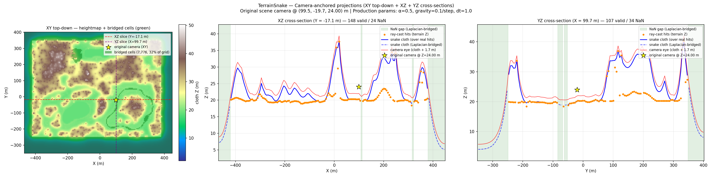
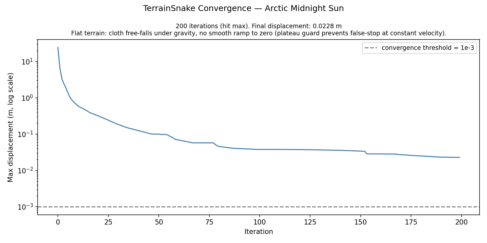
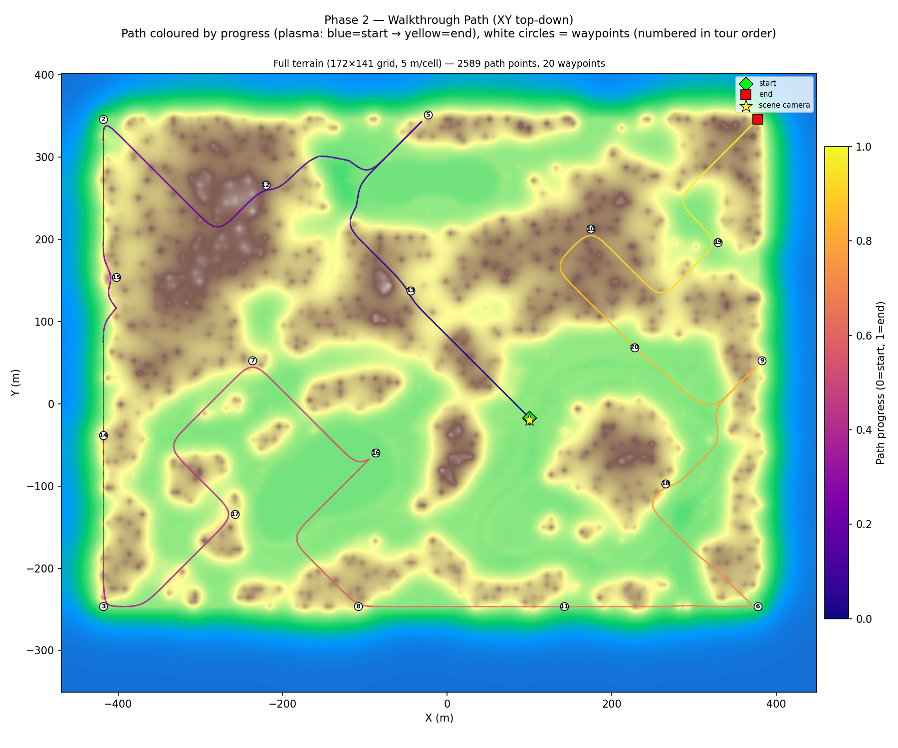

# In the Park Walkthrough — Terrain v1: TerrainSnake + Held-Karp + Cycles

**Scene**: `in_the_park/in the park.blend`
**Date**: 2026-05-05
**Config**: `configs/terrain_scene.json` — TerrainSnake Phase 1+2, Held-Karp path, Cycles render
**Run host**: local Linux + pip bpy 4.5 + Windows Blender 4.5.7 LTS (Cycles)
**Commit**: `c322903`

---

## Pipeline

Two-phase pipeline.  Phase 1 casts rays from system Blender to build the
terrain heightmap (`terrain_snake.npz`).  Phase 2 reads the heightmap directly
(no bpy required), builds a ground-level walkable voxel grid, plans a
Held-Karp tour, animates the camera, and renders.

**ScenePreprocessor** was applied before render.  The scene has 4 scatter
particle objects (terrain, background, paths, sidewalks) that caused Blender to
rebuild the BVH every frame.  Converting them to static meshes reduced render
time from **38 s/frame → 1.3 s/frame** (28× speedup).

---

## Voxel Grid + Walkable (Terrain Mode)

| Parameter | Value |
|-----------|-------|
| Grid resolution | 5.34 BU/voxel |
| Grid size | 172 × 141 × 22 |
| Scene AABB (XY) | 7 155 × 7 509 BU |
| Tight bbox (XY) | 918 × 751 BU (12.8 × 10.0 % of scene) |
| Scene bounds (Z) | −3.8 … +113.4 BU |
| TerrainSnake passes | 2 (Pass 2 refined ×7.8 resolution over tight bbox) |
| TerrainSnake iterations | 200 (converged) |
| Walkable columns (Pass 2) | 16 476 / 24 252 (67.9 %) |
| Walkable voxels | **16 476** (terrain mode — one per grid column) |

---

## Path Planning — Held-Karp

| Parameter | Value |
|-----------|-------|
| Algorithm | Held-Karp exact open-path TSP |
| Waypoints | 20 (farthest-point sampling, seed 42) |
| Path connectivity | 26-connected BFS |
| Total path points | 2 589 |
| Path Z range | 20.3 … 41.6 BU |
| TSP solve time | 8.9 s |

---

## Render

| Parameter | Value |
|-----------|-------|
| Frames | 1 000 |
| FPS | 12 |
| Duration | 83.3 s |
| Resolution | 640 × 480 |
| Render engine | Cycles |
| Samples | 64 |
| Denoiser | OpenImageDenoise |
| Walk speed | 5.0 BU/s |
| Camera height | 1.7 BU |
| ScenePreprocessor | 2 particle objects → mesh (terrain, paths) |

---

## Figures

### Figure 0 — Initial vs Final Snake

### Figure 1 — Top-Down Walkable + Path

### Figure 2 — Side Profiles

### Figure 3 — Bridging Demo

### Figure 4 — Convergence

### Figure 5 — Walkthrough Path

---

## Walkthrough GIF

*1 000 frames, 12 fps*

## Combined GIF (path overlay)

---

## Files

| Content | Path |
|---------|------|
| Voxel grid | `results/in_the_park_terrain_v1/voxel_grid.npz` |
| Terrain snake | `results/in_the_park_terrain_v1/terrain_snake.npz` |
| Walkable | `results/in_the_park_terrain_v1/walkable.npz` |
| Path | `results/in_the_park_terrain_v1/path.npz` |
| Run log | `results/in_the_park_terrain_v1/run.log` |
| Walkthrough blend | `results/in_the_park_terrain_v1/in the park_walkthrough.blend` |
| Walkthrough GIF | `docs/assets/in_the_park_terrain_v1/in_the_park_terrain_v1_walkthrough.gif` |
| Combined GIF | `docs/assets/in_the_park_terrain_v1/in_the_park_terrain_v1_walkthrough_combined.gif` |
| Combined MP4 | `docs/assets/in_the_park_terrain_v1/in_the_park_terrain_v1_walkthrough_combined.mp4` |
| Run script | `run_in_the_park_terrain_v1.py` |

---

## Notes

- **Massive scene, tiny walkable area**: The In the Park scene spans 7 155 × 7 509 BU AABB but the
  actual park is only ~918 × 751 BU.  Two-pass TerrainSnake zooms in ×7.8 to get 5.34 BU/voxel
  resolution over the walkable area.
- **ScenePreprocessor critical**: Without converting particle objects, each frame forced a full
  BVH rebuild (38 s/frame, ~10 h total).  Converting terrain + paths to static meshes brought
  render time to 1.3 s/frame (~20 min total).
- **Ground-level Z range**: Path stays 20–42 BU — the park terrain rises only ~20 BU.
