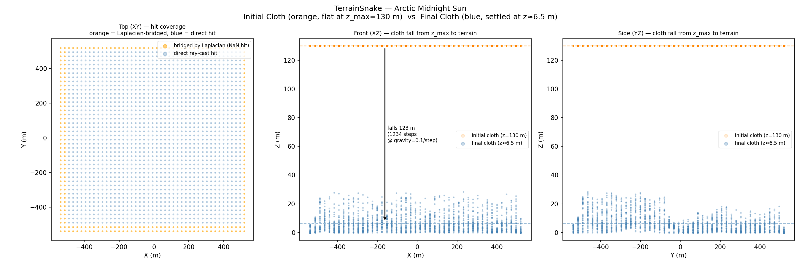
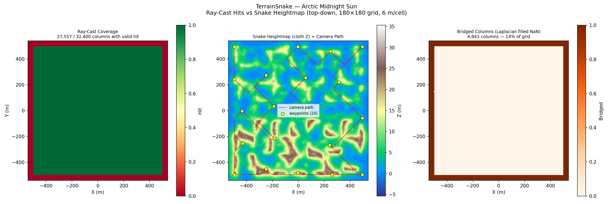
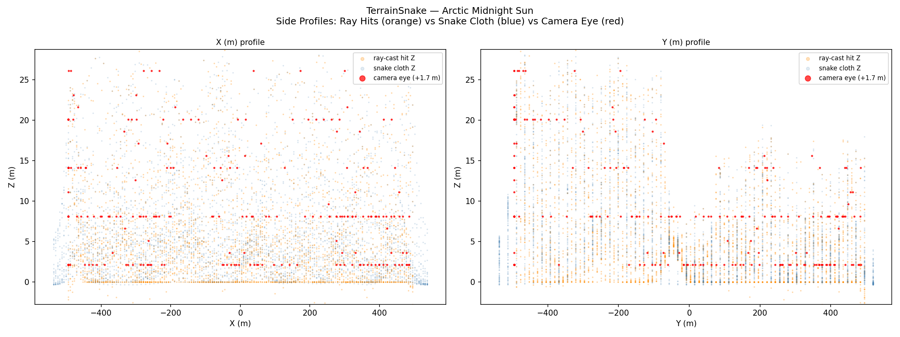
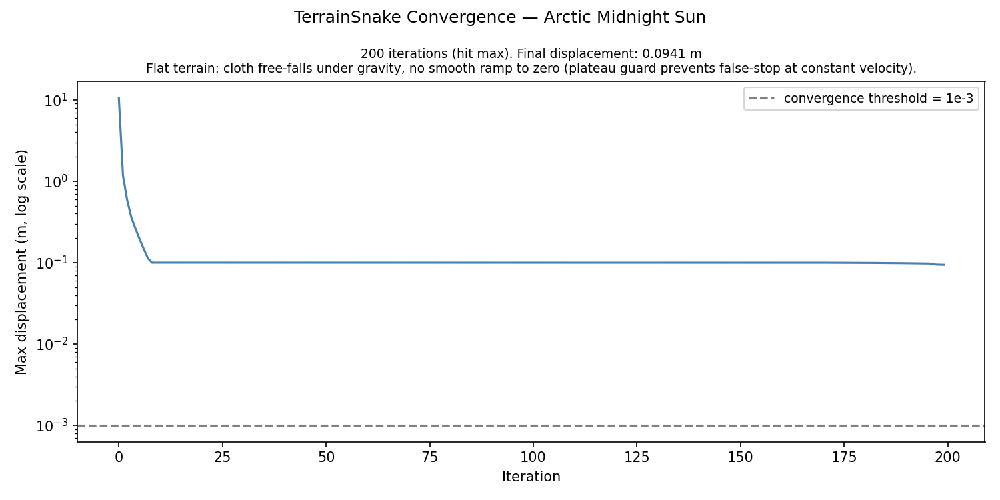
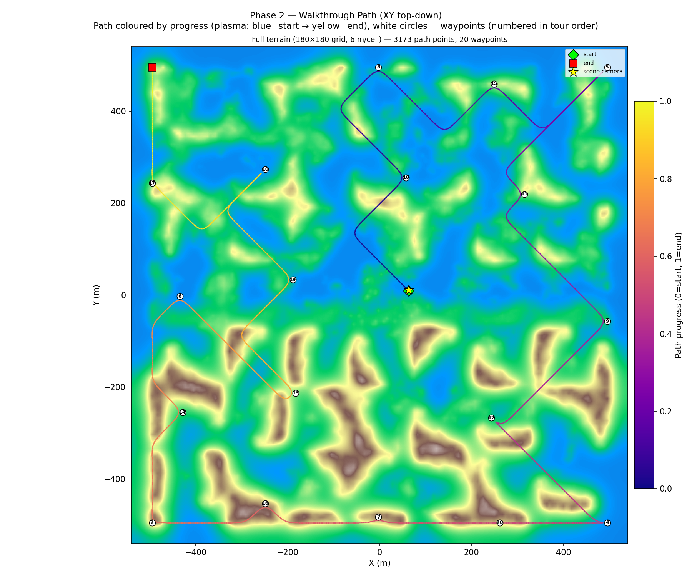
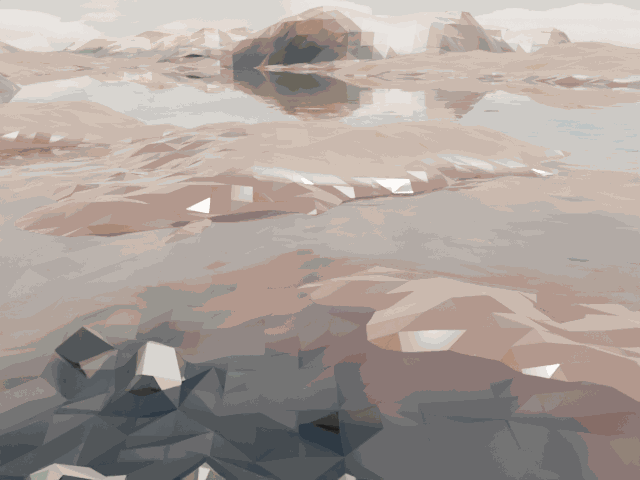

# Summer Coastline Walkthrough — v58: Held-Karp Exact TSP

**Scene**: `summer_coastline/fine_scene.blend` (2.2 GB, unit_scale=1.0, 1 BU = 1 m)
**Date**: 2026-05-05
**Phase reported**: Phase 2 only — Held-Karp path planning + 1000-frame Cycles render
**Run host**: local Linux + pip bpy 4.5 + RTX 5090 (OPTIX)

---

## What Changed from v1

Same changes as `arctic_midnight_sun_v58` — see that document for the full diff.
In brief: greedy 2-opt TSP → **Held-Karp exact DP TSP**; path colour reverted to
arc-length progress (plasma, blue→yellow); figure 5 single-panel; figure 2 percentile
Z clipping.

Terrain (Phase 1) is unchanged — `terrain_snake.npz` reused from `summer_coastline_v1`.

---

## Phase 1 — Terrain Snake (Reused from v1)

See [20260504_WalkthroughRenderer_SummerCoastline_V1_Results.md](20260504_WalkthroughRenderer_SummerCoastline_V1_Results.md) for full Phase 1 details.

| Parameter | Value |
|-----------|-------|
| Grid resolution | 6.00 m/voxel (tight-bbox refine) |
| Grid size | 180 × 180 cells |
| Valid hit columns | 27 557 / 32 400 (85.1 %) |
| Terrain Z range | −0.34 … +30.30 m, mean 6.54 m |
| Original scene camera | `camera_0_0` @ (63.37, 10.69, 19.65) m |

---

## Phase 1 Visualisations (Reused from v1 data)

### Figure 0 — Initial Cloth vs Final Cloth

### Figure 1 — Top-Down: Coverage / Heightmap / Bridged

### Figure 2 — Side Profiles

Z-axis clipped to [p2, p98] of walkable voxel Z samples.

### Figure 3 — Camera-Anchored Projections (XY + XZ + YZ)

### Figure 4 — Convergence

---

## Phase 2 — Walkthrough Render

**Script**: `run_summer_coastline_v58.py`
**Render engine**: Cycles (OPTIX, RTX 5090)

### Path Planning — Held-Karp

| Parameter | Value |
|-----------|-------|
| Algorithm | Held-Karp exact open-path TSP |
| Waypoints | 20 (farthest-point sampling, seed 42) |
| First waypoint | scene camera @ (63.4, 10.7, 19.65) m → walkable cell (100, 91, 83) |
| Path connectivity | 26-connected BFS (face + edge + corner) |
| Held-Karp time | **8.8 s** (n=20, vectorised numpy, ~524 k DP states) |
| Total path points | 3 173 |

Held-Karp takes ~2 s longer on the coastline than on the arctic scene (8.8 s vs 6.6 s)
because the coastal terrain produces a more fragmented walkable graph — more BFS detours
between waypoints result in more meaningful cost differences in the DP table, which means
fewer early-pruning opportunities in the sparse DP matrix.

### Render

| Parameter | Value |
|-----------|-------|
| Frames | 1000 |
| FPS | 12 |
| Duration | 83.4 s |
| Resolution | 640 × 480 |
| Samples | 64 |
| Denoiser | OpenImageDenoise |
| Walk speed | 5.0 m/s |
| Camera height | 1.7 m |
| Camera clip_end | 10 000 m |
| Gaze mode | waypoint (lookahead 0.05) |
| Approx time/frame | ~2.9 s |

### Figure 5 — Walkthrough Path (XY Top-Down)

The Held-Karp tour on the coastline scene shows qualitatively different behaviour than the
arctic: the path visibly routes around the highlands and follows coastal lowlands and valley
floors. This is an emergent property of 26-connected BFS — adjacent voxel columns with
iz-difference ≥ 2 (steep cliffs) are not connected, so farthest-point sampling places
waypoints on reachable low-ground areas and Held-Karp finds the optimal low-cost route
between them.

### Walkthrough GIF

*1000 frames, 12 fps, 17 MB*

### Combined GIF — Rendered Frame + Live XY Map

*334 frames (every 3rd), 12 fps, 26 MB. Left: Cycles render. Right: XY terrain map with
plasma trail (arc-length progress) and current camera position (white crosshair).*

---

## Comparison: v1 (greedy 2-opt) vs v58 (Held-Karp)

| Metric | v1 (greedy 2-opt) | v58 (Held-Karp) |
|--------|-------------------|-----------------|
| TSP algorithm | Nearest-neighbour + 2-opt | Exact Held-Karp DP |
| Optimality | Heuristic | **Globally optimal** |
| TSP solve time | < 0.1 s | 8.8 s |
| Path points | — | 3 173 |
| Path colour | arc-length progress | arc-length progress |
| Figure 5 panels | 2 (full + zoomed) | 1 (full terrain only) |

---

## Files

| Content | Path |
|---------|------|
| Terrain NPZ (reused from v1) | `results/summer_coastline_v58/terrain_snake.npz` |
| Path NPZ | `results/summer_coastline_v58/path.npz` |
| Run log | `results/summer_coastline_v58/run.log` |
| Walkthrough blend | `results/summer_coastline_v58/fine_scene_walkthrough.blend` |
| Walkthrough GIF | `docs/assets/summer_coastline_v58/summer_coastline_v58_walkthrough.gif` |
| Combined GIF (render + XY map) | `docs/assets/summer_coastline_v58/summer_coastline_v58_walkthrough_combined.gif` |
| Combined MP4 | `docs/assets/summer_coastline_v58/summer_coastline_v58_walkthrough_combined.mp4` |
| Fig 0 — initial vs final cloth | `docs/assets/summer_coastline_v58/figure_0_initial_vs_final.png` |
| Fig 1 — top-down | `docs/assets/summer_coastline_v58/figure_1_top_down.png` |
| Fig 2 — side profiles | `docs/assets/summer_coastline_v58/figure_2_side_profiles.png` |
| Fig 3 — camera-anchored projections | `docs/assets/summer_coastline_v58/figure_3_bridging_demo.png` |
| Fig 4 — convergence | `docs/assets/summer_coastline_v58/figure_4_convergence.png` |
| Fig 5 — walkthrough path (XY) | `docs/assets/summer_coastline_v58/figure_5_walkthrough_path.png` |
| Run script | `run_summer_coastline_v58.py` |
