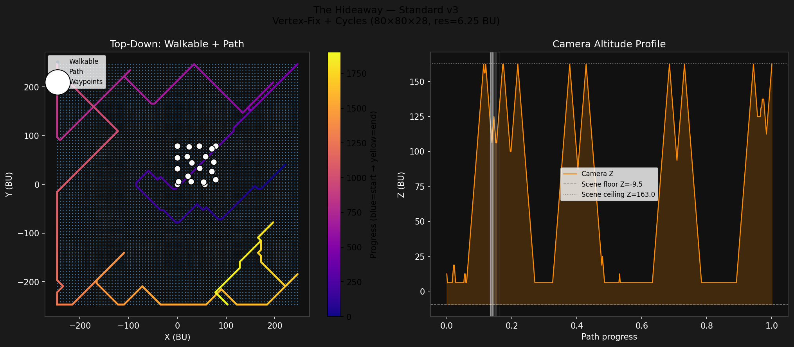
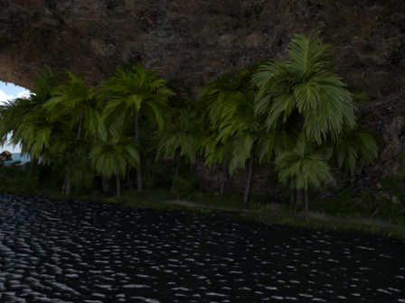
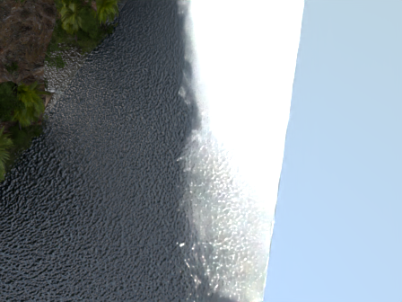
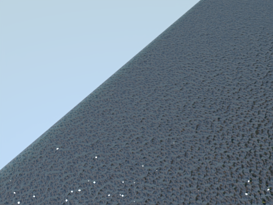
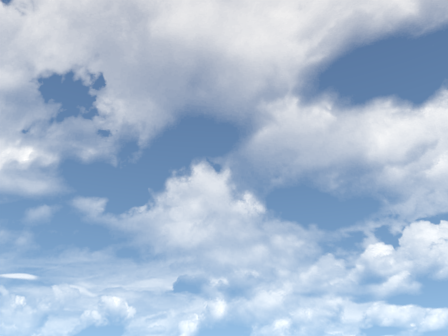

# The Hideaway Walkthrough — Standard v3: Vertex-Based Solid Detection + Cycles

**Scene**: `the_hideaway/the hideaway.blend` (108 MB)
**Date**: 2026-05-05
**Config**: `configs/standard_scene.json` + Cycles overrides
**Run host**: local Linux + pip bpy 4.5 + Windows Blender 4.5.7 LTS (Cycles)
**Commit**: `ac2deb9`

---

## Changes vs v1/v2

| Issue | v2 Approach | v3 Fix |
|-------|-------------|--------|
| Thin walls invisible to ray casting | Finer grid (2.87 BU/voxel) — reduces but doesn't eliminate | Vertex check: any voxel containing ≥1 mesh vertex is solid |
| Workbench — no lighting | Cycles 640×480 64spp | Same |
| Slow BFS (1.6M voxels at v2 scale) | N/A | Original grid (6.25 BU/voxel) → 153k voxels, 9s BFS |

**Core fix** (`voxel_grid.py` → `_mark_vertex_voxels()`): after ray-cast
voxelisation, iterate all mesh vertices in world space and mark their
containing voxel as solid.  Catches any wall geometry regardless of face
orientation or thickness relative to voxel size.  This run added **+2 865**
solid voxels on top of ray casting.

---

## Voxel Grid + Walkable

| Parameter | Value |
|-----------|-------|
| Grid resolution | 6.25 BU/voxel |
| Grid size | 80 × 80 × 28 |
| Scene bounds (XY) | [−250, −250] … [+250, +250] BU |
| Scene bounds (Z) | −9.5 … +163.0 BU |
| Solid detection | Ray casting + vertex check (+2 865 voxels) |
| Walkable voxels (aerial) | **153 785** (all free voxels) |

---

## Path Planning — Held-Karp

| Parameter | Value |
|-----------|-------|
| Algorithm | Held-Karp exact open-path TSP |
| Waypoints | 20 (farthest-point sampling, seed 42) |
| Path connectivity | 26-connected BFS |
| Total path points | 1 905 |
| Path Z range | 6.1 … 162.4 BU |
| TSP solve time | 10.0 s |
| BFS time | 9.2 s |

---

## Render

| Parameter | Value |
|-----------|-------|
| Frames | 1 200 |
| FPS | 12 |
| Duration | 100 s |
| Resolution | 640 × 480 |
| Render engine | Cycles |
| Samples | 64 |
| Denoiser | OpenImageDenoise |
| Walk speed | 2.0 BU/s |
| Camera height | 1.7 BU |

---

## Path Overview

*Left: top-down walkable voxels (blue) + Held-Karp path (plasma: blue=start → yellow=end) + waypoints (white dots).  Right: camera altitude profile across the 1 200-frame walkthrough.*

---

## Sample Frames

| Start (frame 1) | 25 % (frame 301) |
|---|---|
|  |  |

| 50 % (frame 601) | End (frame 1200) |
|---|---|
|  |  |

---

## Walkthrough GIF

*1 200 frames, 12 fps*

---

## Files

| Content | Path |
|---------|------|
| Voxel grid | `results/the_hideaway_standard_v3/voxel_grid.npz` |
| Walkable | `results/the_hideaway_standard_v3/walkable.npz` |
| Path | `results/the_hideaway_standard_v3/path.npz` |
| Run log | `results/the_hideaway_standard_v3/run.log` |
| Walkthrough blend | `results/the_hideaway_standard_v3/the hideaway_walkthrough.blend` |
| Walkthrough GIF | `docs/assets/the_hideaway_standard_v3/the_hideaway_standard_v3_walkthrough.gif` |
| Run script | `run_the_hideaway_standard_v3.py` |

---

## Notes

- **Vertex check is the definitive wall fix**: Ray casting misses faces
  parallel to all three sweep axes.  Checking vertex containment guarantees
  that any wall with at least one vertex in a voxel is marked solid — O(n_vertices),
  negligible runtime overhead.
- **Original grid size is sufficient**: v2's 10× finer grid (174×174×60 vs
  80×80×28) multiplied walkable voxels by ~10× and BFS time by ~12×, while
  still not fully fixing wall clipping.  v3 gets better wall detection at
  the original grid resolution.
- **Vertex check now runs by default** for all global and local voxel grid modes
  in the pipeline (`voxel_grid.py` commit `0db423d`).
