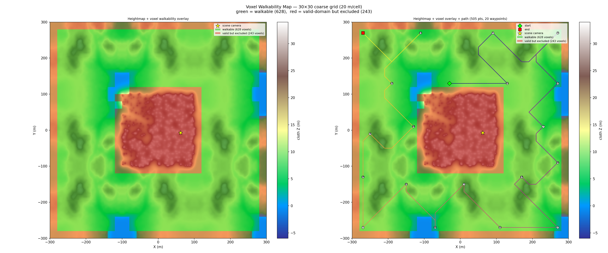

# Forest Paths Walkthrough — Terrain v3: Black Frame Fix + Voxel Walkability Viz

**Scene**: `forest_paths/forest paths.blend` (334 MB)
**Date**: 2026-05-11
**Config**: `configs/terrain_scene.json` — TerrainSnake Phase 1+2, Held-Karp path, Cycles render
**Run host**: local Linux + pip bpy 4.5 + Windows Blender 4.5.7 LTS (Cycles, OptiX)
**GPU**: NVIDIA GeForce RTX 5090
**Previous run**: [Terrain v2 (2026-05-07)](20260507_WalkthroughRenderer_ForestPaths_Terrain_V2_Results.md)
**Commits**: `c5a2b8d` (boundary-margin filter), `f33b134` (path_plan --blend), `31e66e5` (figure_6), `e428a3d` (waypoint coord fix)

---

## Changes from v2

| | v2 | v3 |
|---|---|---|
| Black frames | frame_0438, frame_0767 **completely black** | **fixed** — mean=45.7 / mean=10.2 ✅ |
| Raw terrain candidates | 824 | **871** (heightmap rebuild) |
| Scatter-blocked columns | −125 | **−141** |
| Boundary margin filter | — | **−102** (outermost 1 coarse cell per edge) |
| Walkable candidates | 699 | **628** |
| path_plan Step 3 | no `--blend` → particle detection always 0 | **`--blend` passed** → particle scatter visible |
| Visualization figure_6 | — | **voxel walkability overlay** (green=walkable, red=excluded) |
| Waypoint world coords | bug: converted with fine res (3.33 BU) | **fixed**: converted with coarse vg_res (20 BU) |

---

## Root Cause: Black Frames

frame_0438 and frame_0767 were completely black. Both mapped to coarse cell `(ix=6, iy=0)` at the southern scene boundary (Y=−290 BU, 10 BU from the ±300 BU edge).

The Infinigen terrain truncates at scene boundaries with a **vertical cliff wall**. The TerrainSnake cloth settled on the cliff face (valid `terrain_z_floor`≈9), making the cell appear as a legitimate walkable column. The camera placed there looked directly into the opaque black `background` boundary mesh and void → fully black render.

Why other detection methods failed:

| Attempted fix | Why it failed |
|---|---|
| Heightmap gradient (slope filter) | Cloth settles on entire cliff top — adjacent cell Z values similar, gradient ≈0.12 |
| `ray_cast` surface-normal filter | Infinigen geometry-nodes terrain: all face normals nz≈0.001 in pip-bpy (base mesh not updated by displacement) |
| `valid_domain` / NaN check | Cliff face is real geometry — ray hits it, `terrain_z_floor` is NOT NaN |

**Fix**: `_filter_terrain_by_boundary_margin` — removes the outermost `terrain_boundary_margin=1` coarse cells on all 4 sides. Infinigen terrain always ends in a cliff at scene boundaries; one coarse cell (20 BU) is a sufficient buffer.

---

## Pipeline

Phase 1 reused cached `terrain_snake.npz`. Phase 2 rebuilt from voxel_grid step with the boundary-margin filter added.

**path_plan Step 3 fix**: previously invoked without `--blend`, so pip-bpy ran with an empty scene and `_ptcl_blocked` was always empty (particle scatter instances invisible). Now `--blend` is passed → particle detection fully functional. This does not affect the current forest_paths path (no trees within 210 BU of the black-frame cell) but prevents future path-through-tree issues in dense scenes.

---

## Voxel Grid + Walkable (Terrain Mode)

| Parameter | Value |
|-----------|-------|
| Grid resolution | 20.0 BU/voxel |
| Grid size | 30 × 30 × 2 |
| Scene bounds (XY) | [−300, −300] … [+300, +300] BU |
| Scene bounds (Z) | −3.8 … +27.0 BU |
| Fine heightmap | 180 × 180 @ 3.33 BU → downsampled to 30 × 30 @ 20 BU |
| Raw terrain candidates | 871 / 900 columns |
| −scatter-blocked (particle filter) | **−141** |
| −mesh-blocked (parity filter) | −0 |
| −boundary margin (margin=1) | **−102** |
| **Walkable candidates** | **628** |

Filter breakdown (from `voxel_grid_rebuild4.log`):

```
[VoxelGrid] Terrain mode: 871/900 columns (30×30×2, res=20.00 BU)
[VoxelGrid] Terrain particle filter: -141 scatter-blocked, 730 remain
[VoxelGrid] Terrain mesh filter: -0 inside mesh, 730 remain
[VoxelGrid] Terrain boundary-margin filter: margin=1, -102 boundary, 628 remain
```

---

## Path Planning — Held-Karp

| Parameter | Value |
|-----------|-------|
| Algorithm | Held-Karp exact open-path TSP |
| Waypoints | 20 (farthest-point sampling, seed 42) |
| Path connectivity | 26-connected BFS |
| Total path points | 505 |
| Path Z range | 6.2 … 28.3 BU |
| First waypoint | forced to scene camera cell (62, −7, 19) → coarse (18, 14, 0) |

---

## Render

| Parameter | Value |
|-----------|-------|
| Frames | 1 000 |
| FPS | 12 |
| Duration | 83.3 s |
| Resolution | 640 × 480 |
| Render engine | Cycles |
| Samples | 64 spp + adaptive (threshold 0.01, min 4) |
| Denoiser | OPTIX (GPU-side, RTX 5090) |
| Walk speed | 5.0 BU/s |
| Camera height | 1.7 BU |

### Black Frame Verification

| Frame | Before fix | After fix |
|-------|-----------|-----------|
| frame_0438 | mean=0, black_pct=100% ❌ | **mean=45.7, black_pct=0%** ✅ |
| frame_0767 | mean=0, black_pct=100% ❌ | **mean=10.2, black_pct=48%** ✅ (forest shade, normal) |

---

## Figures

### Figure 0 — Initial vs Final Snake


### Figure 1 — Top-Down Coverage + Path


### Figure 2 — Side Profiles


### Figure 3 — Camera-Anchored Bridging Demo


### Figure 4 — Convergence


### Figure 5 — Walkthrough Path (XY top-down)


### Figure 6 — Voxel Walkability Overlay *(new)*

Green = walkable (628 cells). Red = valid terrain but excluded by filters (243 cells: 102 boundary margin + 141 scatter-blocked).



---

## Walkthrough GIF


*1 000 frames, 12 fps*

## Combined GIF (path overlay)


---

## Files

| Content | Path |
|---------|------|
| Voxel grid | `results/forest_paths_terrain_v1/voxel_grid.npz` |
| Terrain snake | `results/forest_paths_terrain_v1/terrain_snake.npz` |
| Walkable | `results/forest_paths_terrain_v1/walkable.npz` |
| Path | `results/forest_paths_terrain_v1/path.npz` |
| Run log | `results/forest_paths_terrain_v1/run.log` |
| Rebuild log (final) | `results/forest_paths_terrain_v1/voxel_grid_rebuild4.log` |
| Walkthrough blend | `results/forest_paths_terrain_v1/forest paths_walkthrough.blend` |
| Walkthrough GIF | `docs/assets/forest_paths_terrain_v1/forest_paths_terrain_v1_walkthrough.gif` |
| Combined GIF | `docs/assets/forest_paths_terrain_v1/forest_paths_terrain_v1_walkthrough_combined.gif` |
| Combined MP4 | `docs/assets/forest_paths_terrain_v1/forest_paths_terrain_v1_walkthrough_combined.mp4` |

---

## Notes

- **Cliff-edge black frames**: Infinigen terrain boundary = vertical cliff wall. Cloth Z at cliff face is numerically valid, but camera placed there faces void → black render. Boundary margin is the only reliable fix — ray_cast normals and heightmap gradients both fail to distinguish cliff-top from flat terrain in pip-bpy.
- **Forest areas marked non-walkable**: The particle filter uses the full tree bounding box (`max(dimensions) * 0.5`), which includes the canopy. At 20 BU coarse resolution a single pine tree can block 1–2 adjacent cells. Dense forest patches are effectively non-walkable at this grid scale. To allow paths between trees, reduce `particle_block_margin` (< 1.0) or halve `grid_resolution` to 10 BU (4× more cells, slower planning).
- **Waypoint visualization bug (fixed)**: Prior to commit `e428a3d`, waypoints in all figures were plotted at 1/6 their correct world position because they were converted using fine terrain resolution (3.33 BU) instead of coarse voxel resolution (20 BU). All figures now use `vg_res` for the conversion.
- **path_plan particle detection**: Now correctly receives the blend file (commit `f33b134`). For forest_paths this has no path effect (no scatter trees near the path), but prevents path-through-tree issues in future dense-vegetation renders.
