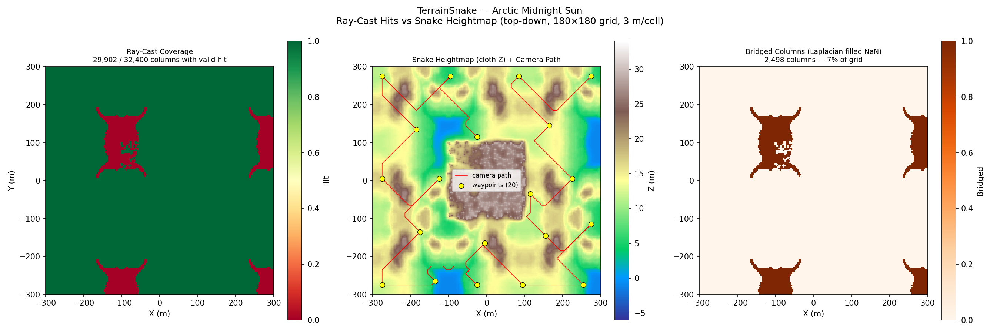
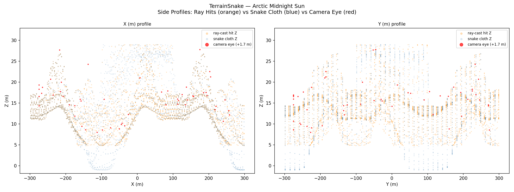
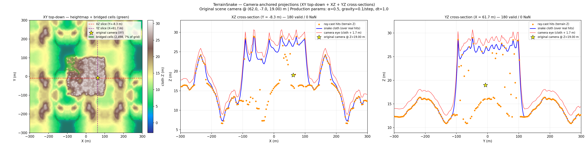
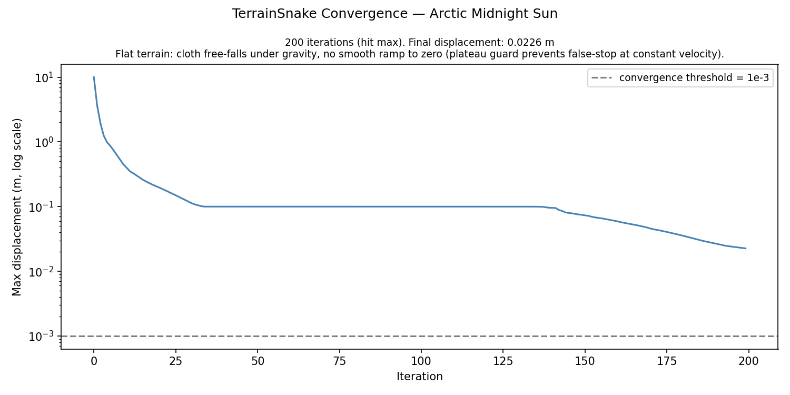
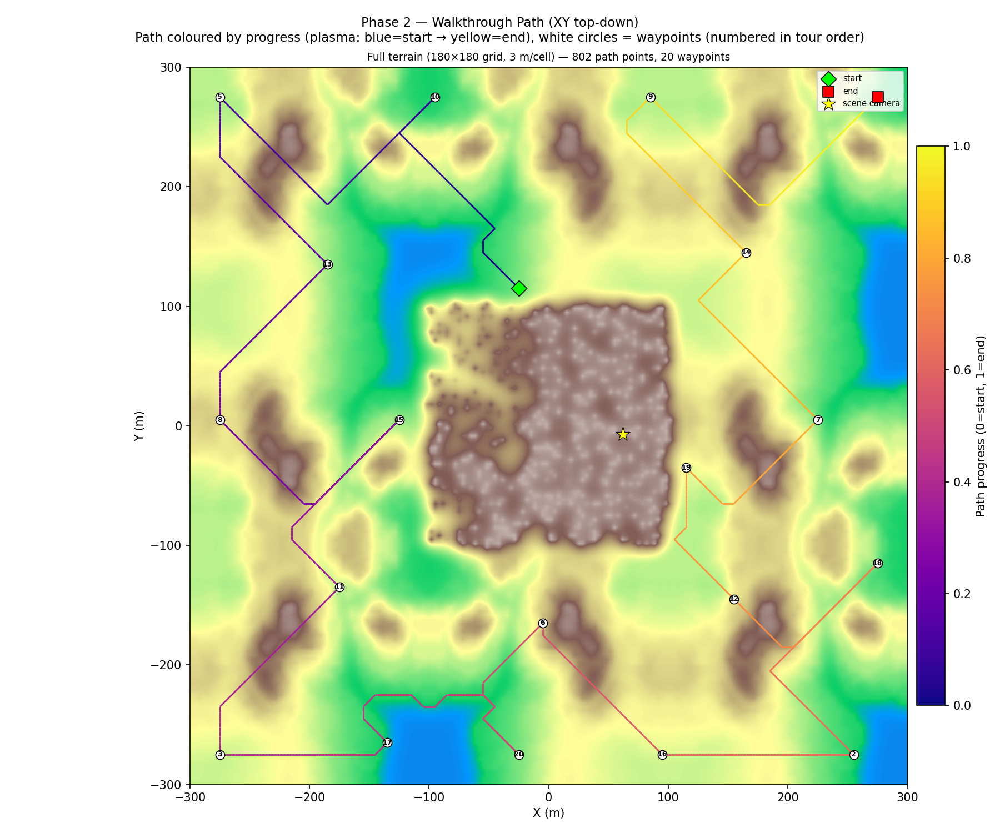
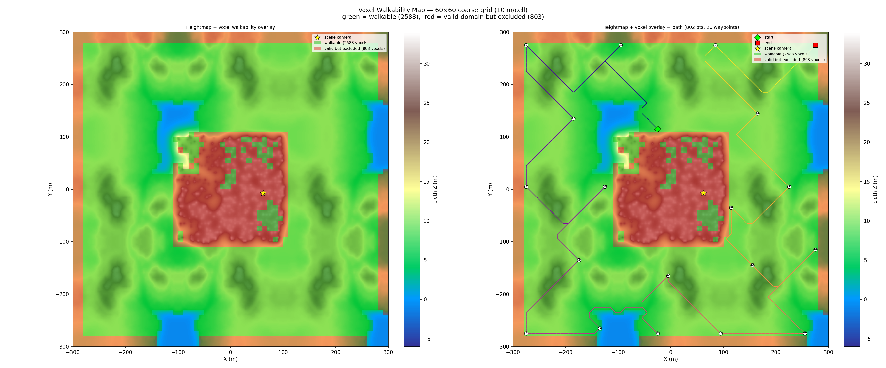

# Forest Paths Walkthrough — Terrain v4: 10 BU Grid + Walkable Forest Paths

**Scene**: `forest_paths/forest paths.blend` (334 MB)
**Date**: 2026-05-11
**Config**: `configs/terrain_scene.json` — TerrainSnake Phase 1 (reused from v1), Phase 2 rebuilt, Held-Karp path, Cycles render
**Run host**: local Linux + pip bpy 4.5 + Windows Blender 4.5.7 LTS (Cycles, OptiX)
**GPU**: NVIDIA GeForce RTX 5090
**Previous run**: [Terrain v3 (2026-05-11)](20260511_WalkthroughRenderer_ForestPaths_Terrain_V3_Results.md)
**Commits**: `ae6b0a9` (v4 run script), `f231a24` (auto-resolution feature)

---

## Changes from v3

| | v3 | v4 |
|---|---|---|
| Grid resolution | 20.0 BU/voxel | **10.0 BU/voxel** |
| Grid size | 30×30×2 | **60×60×4** |
| Total cells | 900 | **3 600** |
| particle_block_margin | 1.5 | **1.0** |
| terrain_boundary_margin | 1 | **2** |
| Raw terrain candidates | 871 / 900 | **3 391 / 3 600** |
| −scatter-blocked | −141 | **−371** |
| −mesh-blocked | −0 | **−27** |
| −boundary margin | −102 | **−405** |
| Walkable candidates | 628 | **2 588** |
| Path points | 505 | **802** |

---

## Motivation: Forest Areas Non-Walkable at 20 BU

At 20 BU/voxel, the particle filter uses `max(inst.dimensions) * 0.5` (full canopy bounding sphere), blocking 1–2 adjacent cells per tree. Dense forest patches become solid walls of blocked cells at that scale. Reducing to 10 BU/cell gives 4× finer spatial resolution — each tree footprint is more accurately represented and paths can route between trunks rather than having to go around entire blocked regions.

Additionally, `particle_block_margin` was reduced from 1.5 to 1.0, allowing the path planner to step within 1.0 BU of a tree bounding sphere instead of 1.5 BU.

The net result: walkable candidates increased from **628 → 2 588** (+312%), enabling paths through the forested interior rather than only along open clearings.

**Note on camera cell**: Even at 10 BU, the initial scene camera cell `(36, 29)` is inside a pine tree bounding sphere and remains particle-blocked. `path_plan` automatically searches forward along the camera's lookat direction and places the first waypoint at `(27, 41)` instead. The new `grid_resolution="auto"` feature (`f231a24`) will halve the resolution until the camera cell becomes walkable in future scenes where this is a concern.

---

## Pipeline

Phase 1 reused cached `terrain_snake.npz` from v1 (no cloth re-fit). Phase 2 rebuilt with `grid_resolution=10.0`, new `terrain_boundary_margin=2`, and `particle_block_margin=1.0`.

---

## Voxel Grid + Walkable (Terrain Mode)

| Parameter | Value |
|-----------|-------|
| Grid resolution | 10.0 BU/voxel |
| Grid size | 60 × 60 × 4 |
| Scene bounds (XY) | [−300, −300] … [+300, +300] BU |
| Scene bounds (Z) | −3.8 … +27.0 BU |
| Fine heightmap | 180 × 180 @ 3.33 BU → downsampled to 60 × 60 @ 10 BU |
| Raw terrain candidates | 3 391 / 3 600 columns |
| −scatter-blocked (particle filter) | **−371** |
| −mesh-blocked (parity filter) | **−27** |
| −boundary margin (margin=2) | **−405** |
| **Walkable candidates** | **2 588** |

Filter breakdown (from process stdout):

```
[VoxelGrid] Downsampled heightmap 180×180 (3.33 BU) → 60×60 (10.00 BU)
[VoxelGrid] Terrain mode: 3391/3600 columns have walkable voxels (60×60×4 grid, res=10.00 BU)
[VoxelGrid] Terrain particle filter: -371 blocked by scatter, 3020 candidates remain
[VoxelGrid] Mesh filter: excluding large objects from parity: ['background']
[VoxelGrid] Terrain mesh filter: -27 inside mesh objects, 2993 candidates remain
[VoxelGrid] Terrain boundary-margin filter: margin=2 coarse cells, -405 boundary voxels, 2588 candidates remain
```

---

## Path Planning — Held-Karp

| Parameter | Value |
|-----------|-------|
| Algorithm | Held-Karp exact open-path TSP |
| Waypoints | 20 (farthest-point sampling, seed 42) |
| Path connectivity | 26-connected BFS |
| Total path points | 802 |
| Path Z range | 5.8 … 28.3 BU |
| First waypoint | camera cell (36, 29) particle-blocked → moved along lookat to (27, 41, 1) |
| Held-Karp solve time | 7.8 s |
| Fine adjust | 0 / 801 nudged |

---

## Render

| Parameter | Value |
|-----------|-------|
| Frames | 1 000 |
| FPS | 12 |
| Duration | 83.3 s |
| Resolution | 640 × 480 |
| Render engine | Cycles |
| Samples | 64 spp + adaptive (threshold 0.01, min 4) |
| Denoiser | OPTIX (GPU-side, RTX 5090) |
| Walk speed | 5.0 BU/s |
| Camera height | 1.7 BU |

---

## Figures

### Figure 0 — Initial vs Final Snake


### Figure 1 — Top-Down Coverage + Path



### Figure 2 — Side Profiles



### Figure 3 — Camera-Anchored Bridging Demo



### Figure 4 — Convergence



### Figure 5 — Walkthrough Path (XY top-down)



### Figure 6 — Voxel Walkability Overlay

Green = walkable (2 588 cells). Red = valid terrain but excluded (803 cells: 405 boundary margin + 371 scatter-blocked + 27 mesh-blocked).



---

## Walkthrough GIF


*1 000 frames, 12 fps*

## Combined GIF (path overlay)


---

## Files

| Content | Path |
|---------|------|
| Voxel grid | `results/forest_paths_terrain_v4/voxel_grid.npz` |
| Terrain snake | `results/forest_paths_terrain_v1/terrain_snake.npz` (reused) |
| Walkable | `results/forest_paths_terrain_v4/walkable.npz` |
| Path | `results/forest_paths_terrain_v4/path.npz` |
| Walkthrough blend | `results/forest_paths_terrain_v4/forest paths_walkthrough.blend` |
| Walkthrough GIF | `docs/assets/forest_paths_terrain_v4/forest_paths_terrain_v4_walkthrough.gif` |
| Combined GIF | `docs/assets/forest_paths_terrain_v4/forest_paths_terrain_v4_walkthrough_combined.gif` |
| Combined MP4 | `docs/assets/forest_paths_terrain_v4/forest_paths_terrain_v4_walkthrough_combined.mp4` |

---

## Notes

- **Forest traversal**: At 10 BU/cell, the walkthrough now routes through forested interior areas instead of being limited to clearings. The 312% increase in walkable cells (628 → 2 588) reflects finer-grained path options between tree trunks.
- **Camera blocked at any grid size**: The initial scene camera sits inside a pine canopy bounding sphere and will not be walkable at any practical resolution without removing that tree. The `path_plan` fallback (search along lookat) correctly relocates the first waypoint. For automated handling, set `grid_resolution="auto"` — the pipeline halves resolution until camera walkability is achieved or `max_total_voxels_xy` is reached.
- **Boundary margin doubled**: margin=2 removes the outermost 2 coarse cells on all sides (vs margin=1 in v3). Since cells are now 10 BU, this still provides a 20 BU physical buffer at scene edges — the same physical distance as v3's 1 × 20 BU margin.
- **Auto-resolution feature** (`grid_resolution="auto"`): Added in commit `f231a24`. Starting from `grid_resolution_start` (default 20 BU), the pipeline halves resolution until the camera voxel is walkable or `max_total_voxels_xy` (default 14 400) is exceeded. bpy is opened exactly once per run regardless of iteration count.
