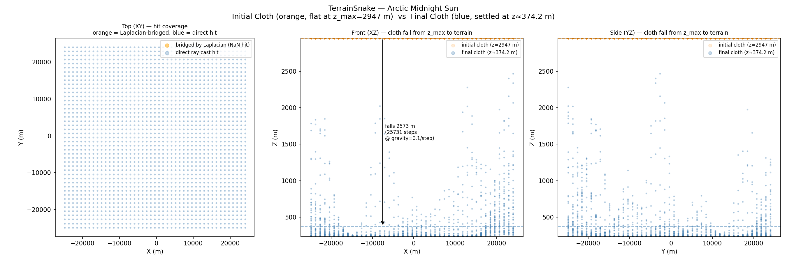
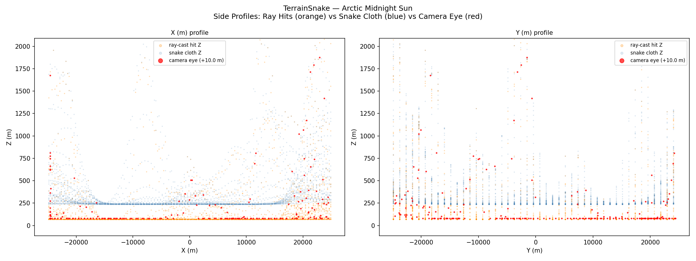
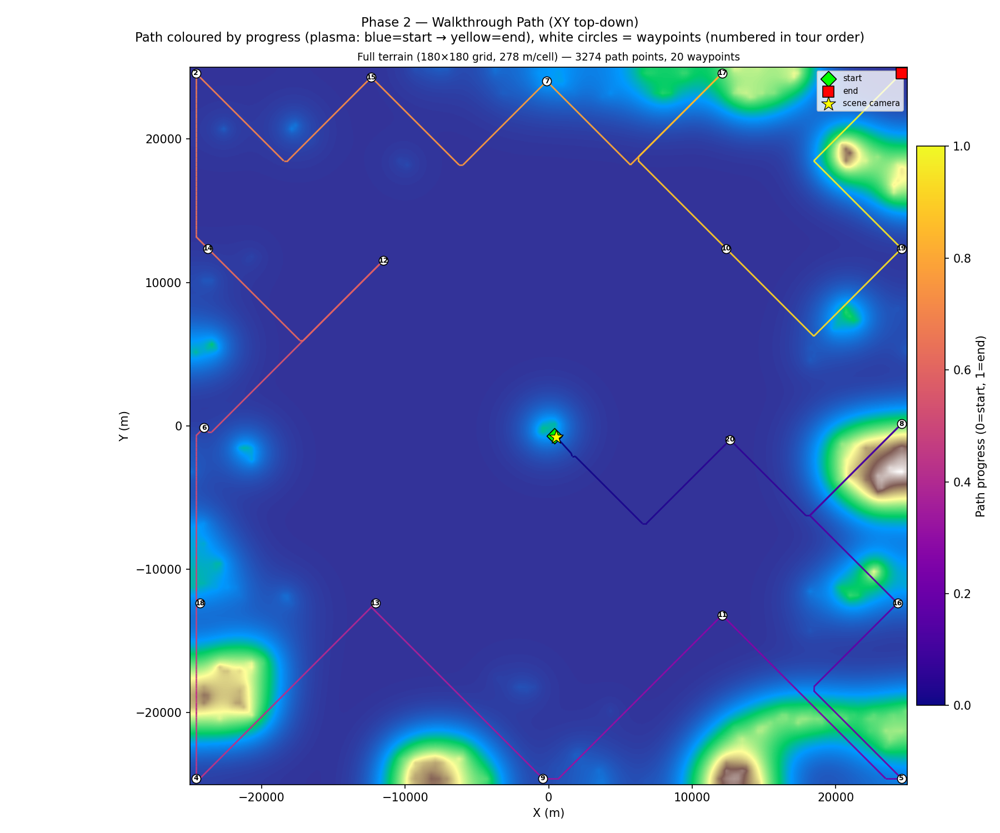

# Walkthrough Renderer — Coastal Road Terrain V2 Results

**Date**: 2026-05-12
**Commit**: `9e9d562`
**Scene**: `coastal road.blend` (50 km × 50 km open coastal scene)
**Script**: `run_coastal_road_terrain_v2.py`

---

## 1. Input

| Field | Value |
|-------|-------|
| Blend file | `coastal road.blend` |
| Scene AABB | 50 000 × 50 000 BU |
| Solid objects | 303 mesh objects |
| Camera | `Camera006 - sun rotation X0, Y58, Z210` @ (1259, −362, 462) |
| Terrain snake resolution | 277.78 BU/cell (180 × 180 grid, capped by `max_grid_cells_xy=180`) |
| Grid resolution | `"auto"` → stops at iter 1 (fine_res=277.78 > start_res=20 BU, uses fine directly) |
| `mark_particle_instances` | `False` (open terrain, no scatter vegetation to filter) |

---

## 2. Phase 1 — Terrain Snake

Phase 1 was re-used from the aborted v1 run (terrain_snake.npz already present).

| Stat | Value |
|------|-------|
| Grid | 180 × 180, res = 277.78 BU/cell |
| Ray coverage | 32 400 / 32 400 columns (100%) |
| Env-sphere p5.0 | −4.75 |
| Pass 2 | Skipped (Pass 1 ≥ 95% XY coverage) |
| Convergence | 200 iterations |






---

## 3. Phase 2 — Voxel Grid + Walkability

| Step | Result |
|------|--------|
| Voxel grid | 180 × 180 coarse grid, res = 278 m/cell |
| Walkable cells | 31 684 (green) |
| Excluded cells | 716 (red, boundary margin) |
| wp0 forced | Camera cell (94, 88, iz=2) injected as first waypoint |
| Tour | 20 waypoints, Held-Karp, 7.2 s |
| Particle sub-voxels | 3 587 blocked cells at step = 69.44 BU |
| Fine adjust | 0 / 3 286 nudged |

### Voxel Walkability Overlay (Figure 6)


Left panel: heightmap + walkability (green=walkable, red=excluded). Right panel: same with planned path (3 287 pts, 20 waypoints).

### Walkthrough Path (Figure 5)



---

## 4. Render

| Setting | Value |
|---------|-------|
| Engine | Cycles (GPU) |
| GPU | NVIDIA GeForce RTX 5090 (OPTIX) |
| Samples | 64 + OPTIX denoiser |
| Frames | 1 000 |
| Avg frame time | ~3.3 s |
| Total render time | ~55 min |

### Walkthrough GIF


### Combined Walkthrough GIF (path overlay)


**MP4**: `docs/assets/coastal_road_terrain_v2/coastal_road_terrain_v2_walkthrough_combined.mp4` (33 MB)

---

## 5. Summary

### Pipeline Config

| Parameter | Value |
|-----------|-------|
| `grid_resolution` | `"auto"` (resolved to 277.78 BU — matches TerrainSnake fine res) |
| `mark_particle_instances` | `False` |
| `force_camera_walkable` | `True` (default) |
| `camera_height` | 1.7 m |
| `fps` | 6 |
| `terrain_snake_resolution` | 2.0 BU |
| `max_grid_cells_xy` | 180 |

### Bugs Fixed During This Run

1. **`grid_resolution="auto"` caused TypeError in `path_plan._fine_adjust_path`**
   - Python evaluates all arguments to `.get()` eagerly, so the fallback `config["grid_resolution"] / unit_scale` computed `"auto" / float` → TypeError.
   - Fix: replaced `.get(key, expr)` with `key in config` guard.

2. **`camera_orient` used `config["grid_resolution"]` directly**
   - Added `res: float` field to `PathData`, saved to `path.npz` from `vg.res`.
   - `camera_orient` now reads `path_data.res` instead of re-deriving from config.

### Output File Tree

```
results/coastal_road_terrain_v2/
├── terrain_snake.npz        (180×180 heightmap)
├── voxel_grid.npz           (31 684 + 716 cells)
├── walkable.npz
├── path.npz                 (3 287 pts, 20 waypoints)
├── wp_schedule.json
├── coastal road_walkthrough.blend
├── frames/
│   └── frame_0001.png … frame_1000.png
└── viz/
    ├── figure_0_initial_vs_final.png
    ├── figure_1_top_down.png
    ├── figure_2_side_profiles.png
    ├── figure_3_bridging_demo.png
    ├── figure_4_convergence.png
    ├── figure_5_walkthrough_path.png
    └── figure_6_voxel_walkability.png   ← new in v2

docs/assets/coastal_road_terrain_v2/
├── coastal_road_terrain_v2_walkthrough.gif          (38 MB)
├── coastal_road_terrain_v2_walkthrough_combined.gif (14 MB)
├── coastal_road_terrain_v2_walkthrough_combined.mp4 (33 MB)
└── figure_*.png  (copies of viz/)
```

### Known Issues / Notes

- Auto-resolution is a no-op for this scene: the TerrainSnake fine resolution (277.78 BU) is already coarser than `grid_resolution_start` (20 BU), so the auto loop runs once and uses the fine resolution directly.
- `mark_particle_instances=False` skips particle and mesh-object ray-cast filtering. For coastal_road this is safe (v1 showed 100% cells walkable; the filter would add zero benefit at enormous cost — estimated hours for 32 400 candidates × 303 mesh objects).
