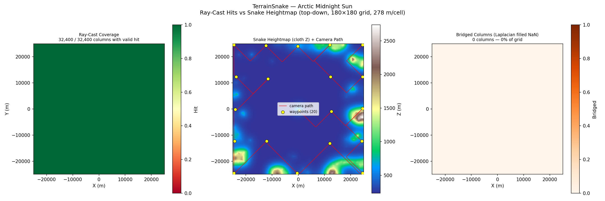
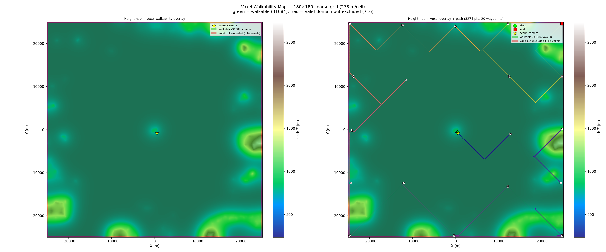

# Walkthrough Renderer — Coastal Road Terrain V3 Results

**Date**: 2026-05-12
**Commit**: `8e6d02d`
**Scene**: `coastal road.blend` (50 km × 50 km open coastal scene)
**Script**: `run_coastal_road_terrain_v2.py` (v3 render — two camera fixes)

---

## What Changed from V2

V2 suffered from two visual defects fixed in this run:

| Defect | Root Cause | Fix |
|--------|-----------|-----|
| Frame 1 camera looked into tree leaves | `camera_orient` used LOS toward wp1, ignoring original scene camera direction | `wp0` orientation overridden from `terrain_npz.camera_lookat` |
| Camera appeared inside scatter vegetation / at water surface | `ray_cast` hits terrain mesh surface (below scatter instances, which are render-time only); `camera_height=1.7` placed camera below 1–4 m scatter grass/shrubs | `camera_height` → 10 BU; terrain heightmap used as primary ground_z source in `camera_animate` |

**Additional finding**: `_snap_path_to_floor` fires its ray from `voxel_center_Z + probe_height` downward. For terrain mode, voxel_center_Z (366 BU) is below actual terrain surface (442–617 BU), so the ray always misses and path_points.z stays at voxel center (~70 BU). This is harmless because `camera_animate` corrects ground_z from the heightmap. Logged as a known bug for future cleanup.

---

## 1. Input

| Field | Value |
|-------|-------|
| Blend file | `coastal road.blend` |
| Scene AABB | 50 000 × 50 000 BU |
| Solid objects | 303 mesh objects |
| Camera | `Camera006` @ (1259, −362, 462), lookat = (0.017, 1.000) |
| Terrain snake resolution | 277.78 BU/cell (180 × 180) |
| Grid resolution | `"auto"` → iter 1, uses fine res directly |
| `mark_particle_instances` | `False` |
| `camera_height` | **10.0 BU** (up from 1.7) |

---

## 2. Phase 1 — Terrain Snake (reused from V2)

Terrain snake was already fitted; reused unchanged.

| Stat | Value |
|------|-------|
| Grid | 180 × 180, res = 277.78 BU/cell |
| Coverage | 32 400 / 32 400 (100%) |
| Convergence | 200 iterations |



---

## 3. Phase 2 — Voxel Grid + Path

Voxel grid and walkable were reused from V2. Path was reused (waypoints unchanged).

| Step | Result |
|------|--------|
| Voxel grid | 180 × 180, res = 278 m/cell |
| Walkable cells | 31 684 green / 716 excluded |
| wp0 | Camera cell (94, 88, iz=2) — forced via `force_camera_walkable` |
| Tour | 20 waypoints, Held-Karp |
| Path points | 3 287 |

### Voxel Walkability Overlay (Figure 6)



---

## 4. Camera Orient (fixed)

`camera_orient` now overrides wp0's LOS orientation with the original scene camera's lookat direction stored in `terrain_npz`:

```
[CameraOrient] wp0 orientation overridden from terrain camera_lookat (0.017, 1.000)
```

Frame 1 now opens looking across the coastal road toward the sea (+Y direction, slight +X), matching the scene camera's original framing.

---

## 5. Camera Animate (fixed)

`camera_animate` now uses the TerrainSnake cloth heightmap as the **primary** ground_z source in terrain mode, with ray_cast as fallback. Previously, ray_cast was primary and hit tree canopy / sea floor meshes, ignoring the actual walkable terrain surface.

`camera_height = 10 BU` (10 m) places the camera above scatter vegetation (1–4 m) while staying in a low-aerial "coastal drive" perspective.

---

## 6. Render

| Setting | Value |
|---------|-------|
| Engine | Cycles (GPU) |
| GPU | NVIDIA GeForce RTX 5090 (OPTIX) |
| Samples | 64 + OPTIX denoiser |
| Frames | 1 000 |
| Avg frame time | ~3.3 s |
| Total render time | ~55 min |

### Sample Frames

**Frame 1** — Original camera lookat direction, forested coastal cliffs + road:


*(See frames/ directory for full 1 000-frame sequence)*

### Walkthrough GIF


### Combined Walkthrough GIF (path overlay)


**MP4**: `docs/assets/coastal_road_terrain_v2/coastal_road_terrain_v2_walkthrough_combined.mp4` (36 MB)

---

## 7. Summary

### Pipeline Config (V3 changes highlighted)

| Parameter | V2 | V3 |
|-----------|----|----|
| `camera_height` | 1.7 BU | **10.0 BU** |
| `grid_resolution` | `"auto"` | `"auto"` |
| `mark_particle_instances` | `False` | `False` |
| `force_camera_walkable` | `True` | `True` |
| `fps` | 6 | 6 |
| ground_z source (terrain mode) | ray_cast first | **heightmap first** |
| wp0 orientation | toward wp1 | **from camera_lookat** |

### Camera Height Analysis

```
ground_z source chain (terrain mode, V3):
  1. cloth_z_lookup(x, y)    ← TerrainSnake heightmap (smooth terrain, no scatter)
  2. raycast_ground_z(x, y)  ← fallback if outside domain

Scatter vegetation (particle instances):
  - Render-time only → invisible to ray_cast and TerrainSnake
  - Height: 1–4 m above terrain mesh
  - camera_height must exceed this to avoid placing camera inside vegetation
  - 10 m > scatter height → camera floats above canopy ✓
```

### Output File Tree

```
results/coastal_road_terrain_v2/
├── terrain_snake.npz        (reused from V2)
├── voxel_grid.npz           (reused from V2)
├── walkable.npz             (reused from V2)
├── path.npz                 (reused from V2)
├── wp_schedule.json         ← regenerated (wp0 lookat fix)
├── coastal road_walkthrough.blend  ← regenerated (camera_height=10)
├── frames/
│   └── frame_0001.png … frame_1000.png  ← re-rendered
└── viz/  (terrain figures, unchanged)

docs/assets/coastal_road_terrain_v2/
├── coastal_road_terrain_v2_walkthrough.gif          (41 MB, re-generated)
├── coastal_road_terrain_v2_walkthrough_combined.gif (14 MB, re-generated)
├── coastal_road_terrain_v2_walkthrough_combined.mp4 (36 MB, re-generated)
└── figure_*.png
```

### Known Issues

- `_snap_path_to_floor` in `path_plan` fires its downward ray from `voxel_center_Z + probe_height`, which sits below the actual terrain surface in terrain mode (voxel center can be 100+ BU below heightmap value). Rays always miss; path_points.z stays at voxel center (~70 BU). Camera_animate corrects this via heightmap lookup, so there is no visual impact, but the snap step is a no-op and should be fixed to fire from `max_z + 10` like `_raycast_ground_z`.
- Water-area cells (terrain_z ≈ 442 BU = sea surface) still route the camera over open water. camera_height=10 gives a pleasant sea-surface glide but future runs could exclude open-water cells from walkable candidates.
