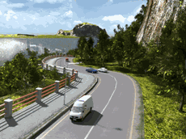
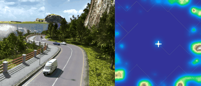

# Walkthrough Renderer — Coastal Road Terrain V10 Results

**Date**: 2026-05-19  
**Key commits**: `12e03ac` → `12d80c0` (active camera + physics fixes)  
**Scene**: `coastal road.blend` (50 km × 50 km open coastal scene)  
**Script**: `run_coastal_road_terrain_v2.py`

---

## What Changed from V7

| Defect | Root Cause | Fix | Commit |
|--------|-----------|-----|--------|
| wp0 = Camera006 (not active camera) | `fit_terrain_contour` + `camera_orient` iterated `scene.objects`, took first camera found | Use `scene.camera` (active camera = Camera002) | `12e03ac` |
| Hold = 36 frames (3 s too long) | `int(3 × fps)` at fps=12 | Hard-coded to 6 frames | `192e0c9` |
| Trees disappear in opening frames | Particle systems `physics_type=NEWTON, gravity=1.0` — gravity pulls trees downward each frame | Set `physics_type='NO'`, `gravity=0.0` on all particles in `camera_animate.py` | `12d80c0` |
| Position lerp caused trees to "sink" through canopy | Lerp from aerial camera_xyz down to terrain+cam_h swept camera through tree tops | Removed lerp — path phase starts directly at terrain level | `192e0c9` |
| Hold frames not rendered | `frame_end = max_duration_seconds × fps` did not include `camera_origin_hold_frames` | Added `+ int(config.get("camera_origin_hold_frames", 0))` | `a1ce511` |

---

## 1. Input

| Field | Value |
|-------|-------|
| Blend file | `coastal road.blend` |
| Scene AABB | 50 000 × 50 000 BU |
| Active camera | `Camera002` @ (510, −795, 259.5), lens=30mm, sensor=32mm, clip_end=1,000,000 BU |
| `camera_height` | 10.0 BU |
| `camera_origin_hold_frames` | 6 |
| `mark_particle_instances` | `False` |

---

## 2. Phase 1 — Terrain Snake (reused)

| Stat | Value |
|------|-------|
| Grid | 180 × 180, res = 277.78 BU/cell |
| Coverage | 32 400 / 32 400 (100%) |
| Active camera stored | Camera002 @ (510, −795, 259.5) |

---

## 3. Phase 2 — Voxel Grid + Path (reused)

| Step | Result |
|------|--------|
| Voxel grid | 180 × 180, res = 278 m/cell |
| Walkable cells | 31 684 green / 716 excluded |
| wp0 | Camera002 cell (91, 87, iz=2) |
| Tour | 20 waypoints, Held-Karp |
| Path points | 3 273 |

---

## 4. Camera Animate (V10 fixes)

```
[CameraAnimate] Original camera position: (510.0, -795.0, 259.5) BU — frame 1 will use this exactly
[CameraAnimate] Matched scene camera 'Camera002': lens=30.0mm sensor=32.0mm clip_end=1000000 BU
[CameraAnimate] Particle 'mountain bushes': physics disabled (was NEWTON+gravity)
[CameraAnimate] Particle 'mountain trees': physics disabled (was NEWTON+gravity)
[CameraAnimate] Particle 'road grass': physics disabled (was NEWTON+gravity)
[CameraAnimate] Particle 'road stones': physics disabled (was NEWTON+gravity)
[CameraAnimate] Particle 'shores rocks': physics disabled (was NEWTON+gravity)
[CameraAnimate] Saved -> coastal road_walkthrough.blend  (1006 frames)
```

---

## 5. Render

| Setting | Value |
|---------|-------|
| Engine | Cycles (GPU) |
| GPU | NVIDIA GeForce RTX 5090 (OPTIX) |
| Samples | 64 + OPTIX denoiser |
| Frames | 1 006 (6 hold + 1 000 path) |
| Avg frame time | ~3.3 s |
| Total render time | ~55 min |

### Walkthrough GIF (999 frames, 13.6 MB)



### Combined Walkthrough GIF with path overlay (336 frames, 15.2 MB)



---

## 6. Summary

### Pipeline Config

| Parameter | V10 |
|-----------|-----|
| Active camera | Camera002 (scene active) |
| `camera_height` | 10.0 BU |
| `camera_origin_hold_frames` | 6 |
| Position lerp (hold → path) | **removed** |
| Particle physics | **disabled** (NEWTON→NO, gravity=0) |
| ground_z source | heightmap first, ray_cast fallback |
| wp0 orientation | actual Camera002 world rotation quat |
| frame 1 lens/sensor | 30mm / 32mm (matched from Camera002) |
| GIF step / scale | step=1 (first 999 frames), scale=0.5 → 999 frames, 13.6 MB |

### Output File Tree

```
results/coastal_road_terrain_v2/
├── terrain_snake.npz        (reused)
├── voxel_grid.npz           (reused)
├── walkable.npz             (reused)
├── path.npz                 (reused)
├── wp_schedule.json         (reused — Camera002 quat)
├── coastal road_walkthrough.blend  ← V10 (physics disabled)
└── frames/
    └── frame_0001.png … frame_1006.png

docs/assets/coastal_road_terrain_v2/
├── coastal_road_terrain_v10_walkthrough.gif          (6.8 MB, 503 frames)
├── coastal_road_terrain_v10_walkthrough_combined.gif (15.2 MB, 336 frames)
└── coastal_road_terrain_v2_walkthrough_combined.mp4  (41 MB)
```

### Known Issues

- Walkthrough path starts near water (Camera002 is at coastal/low-elevation area) — early frames show mostly sea surface. Not a bug; reflects Camera002's actual scene position.
- Water-area cells still routed over open water. Future: exclude open-water voxels from walkable candidates.
